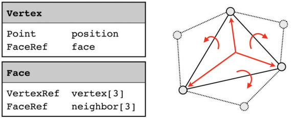

　　本书中提出的几何建模算法的效率和内存消耗很大程度上取决于底层的表面网格数据结构.本章提供文献中描述的各种最常见的数据结构的简要概述.

<!-- more -->

　　选择网格数据结构需要同时考虑拓扑和算法方面的考虑:  

● **拓扑需求**.哪种网格需要用数据结构来表示?我们可以依赖2流形网格?还是需要表示复杂边和单一顶点(见第1.3.3节)?我们是否可以限定为纯三角形网格，或者我们需要表示任意多边形网格?网格是规则的,半规则的,还是不规则的(见第六章)?我们是想要建立一个越来越精细的网格层次结构吗(见第1.3.2节)?  
● **算法需求**.哪种算法将在数据结构上运行?我们只是想渲染网格,还是需要高效地局部近邻的顶点,边和面?网格是静态的,还是几何形状和/或连通性会随时间变化?我们是否需要将额外的数据与网格的顶点,边和面相关联?我们是否在内存消耗方面有特殊要求(即数据集是否庞大)?

　　评估一个数据结构需要度量各种标准,比如需要(a)时间来预处理期间构造它,(b)时间来处理一个特定查询,(c)时间来执行一个特定操作,以及(d)内存消耗和冗余.虽然为特定算法设计专门的数据结构并不少见,但在几何处理中,有许多数据结构是几种算法共同的,我们将在本章中回顾这些数据结构.


# 2.1 基于面的数据结构(Face-based Data Structures)

　　表示曲面网格的最简单方法是存储一组由其顶点位置表示的**独立(Individual)**多边形面(所谓的**面集(face-Set)**).对于三角形网格的简单情况,这需要存储每个面三个顶点位置(见图2.1(左)).使用32位单精度数字来表示顶点坐标,这需要3·3·4 =每个三角形36个字节.根据欧拉公式(公式(1.5)),面数 $𝐹$ 大约是顶点数 $𝑉$ 的两倍,这个数据结构平均每顶点消耗72字节.因为它不代表网格的连通性,所以通常被称为三角形汤多边形汤.一些数据交换格式,如stereolithography(STL),就使用这种表示作为通用标准.

　　然而,这种表示方式对于大多数应用程序来说是不够的:连通性信息不能显式访问,顶点和关联的数据的重复度与顶点的度相同.后一种冗余可以通过所谓的**索引面集(Indexed Face Set)**或**共享顶点(Shared-Vertex)**数据结构来避免,该结构存储一个顶点数组,并将多边形作为一个索引集编码到这个数组中(见图2.1(右)).对于三角形网格,使用32位来存储顶点坐标和面索引,这种表示需要为每个顶点和每个三角形使用12字节,也就是说,它平均消耗12字节/顶点+12字节/面= 36字节/顶点,这只是面集结构的一半.


　　由于其在存储上简单和高效,因此这种表示方式用于很多文件格式中,如OFF,OBJ,以及VRML.类似地,它与一类假设数据为静态的高效渲染算法有关联(OPENGL 顶点数组;见[Shreiner and Khronos OpenGL ARB Working Group 09]).

　　然而,如果没有额外的连通信息,这种数据结构需要高昂的搜索来恢复一个顶点的局部近邻信息,因此对大多数算法来说效率不够.

　　这是大多数算法经常使用的最小操作集:  

● 访问单个顶点,边和面.这包括无序枚举所有元素.  
● 定向遍历一个面的边,这指的是找到一个面的下一条边(或前一条边).例如,通过对顶点的额外访问,可以实现面的渲染.  
● 访问边的关联面.根据方向的不同,在流形的情况下,这是左面还是右面.这样就可以访问相邻的面. 
● 给定一条边,访问其两个端点.   
● 给定一个顶点且至少有一个关联面或边是可访问的.然后,对于流形网格,可以枚举所谓的一个顶点的**单环邻域(One-Ring Neighborhood)**内的所有其他元素(即所有关联的面或边和邻近的顶点).  

这些操作使网格的局部和全局遍历成为可能,通过连通性信息和定向信息将网格的顶点,边和面关联起来.

　　我们现在回顾几种用于快速遍历表面网格的数据结构.

　　标准基于面的三角网格数据结构包含连通性信息,连通性信息包括存储每个面对其三个顶点的引用以及对其相邻三角形的引用.每个顶点除了3D位置外,还存储一个对其关联面的引用(见图2.2).基于这个连通性信息,可以围绕一个顶点循环,以枚举其单环邻域,并执行上面列出的所有其他操作.例如,CGAL [CGAL 09]的2D三角化数据结构就使用了这种表示,它只消耗24字节/面 + 16字节/顶点= 64字节/顶点.



　　但是,这种数据结构也有一些缺点.首先它没有显式地存储边,因此,没有数据可以附属到边上.第二,枚举中心顶点的单环需要做大量的区分(中心顶点是当前三角形的第一个,第二个还是第三个顶点?).最后,如果这种数据结构用于一般的多边形网格,则面的数据类型不再是常量大小,这使得实现起来更加复杂以及效率更低.

# 2.2 基于边的数据结构(Edge-Based Data Structures)

　　般多边形网格的数据结构在逻辑上是基于边的,因为连通性主要与网格边有关.著名的基于边的数据结构有**翼边(Winged-Edge)**数据结构[Baumgart 72]和**四方边(Quad-Edge)**数据结构[Guibas and Stolfi 85]及其变体(见[O'Rourke 94]的例子).

　　翼边结构如图2.3描述所示.每条边分别存储端点的引用以及两个关联面的引用,以及左关联面和右关联面内的下一条边和前一条边的引用.顶点和面存储一个其关联边的引用.总的来说,这导致内存消耗16字节/顶点+32字节/边+4字节/面=120字节/顶点.(由式(1.5)中的欧拉公式得到F≈2V, E≈3V).


　　虽然基于边的数据结构可以表示任意多边形网格,但遍历单环仍然需要做区分(中心顶点是边的第一个顶点还是第二个顶点?)这个问题最终将通过半边数据结构来解决,在下一节中将进行描述.

# 2.3 基于半边的数据结构(Halfedge-Based Data Structure)

　　半边数据结构[Mantyla 88, Kettner 99]通过将每个(无方向的)边分割成两个有方向的半边,避免了基于边的数据结构的单环遍历区分,如图2.4所示.这种数据结构能够表示可定向(组合)2-流形(没有复杂的边和顶点,见图1.6)的子集的任意多边形网格.


　　在半边数据结构中,半边沿每个面和每个边界以一致的逆时针顺序排列.因此在这里,每个边界都可以被看作是潜在高度的空白面.额外地,每个半边指定了一个唯一的角(面中的一个非共享顶点),因此纹理坐标或法线等属性可以存储在每个角上.

　　对于每个半边,我们存储对以下对象的引用:  

● 其指向的顶点  
● 其相邻的面(如果是边界半边,则为零指针)  
● 面或边界的下一个半边(逆时针方向)  
● 面的前一个半边  
● 其对(或逆)半边  

　　注意,如果两个对半边总是成对地分组并存储在后面的数组位置*halfedges[i]*和*halfedges[i+1]*中,则不需要存储对半边.对半边由加上取模2隐式给出.此外,将两条半边组成一对,我们就得到了一个完整边的表示,这在当我们想要将数据与边关联,而不是与半边关联时是很重要的.而一个面中的前一条半边的引用也可以省略,因为这可以通过步进下一个半边引用得到.

　　此外,每个面存储它的其中一个半边的引用,每个顶点存储一个外射的半边.由于半边数 $𝐻$ 大约是是顶点数 $𝑉$ 的6倍,总内存消耗是16字节/顶点+20字节/半边+4字节/面=144字节/顶点.不显式地存储前一个和对边则将内存成本降低到96字节/顶点.

　　半边数据结构使我们能够枚举每个元素(即顶点,边,半边或面)的所有相邻元素.特别是,现在可以列举给定顶点的单环邻域,而不需要低效的区分,如图2.5和下面的伪代码所示.


```sh
void enumerate_one_ring(VertexRef center,Function func)
{
    HalfedgeRef h = outgoing_halfedge(center);
    HalfedgeRef hstop = h;
    do 
    {
        VertexRef v = vertex(h);
        func(v); //process vertex v
        h = next_halfedge( opposite_halfedge(h) );
     } while (h!=hstop );
}
```

　　引用的实现(例如,HalfedgeRef)可以通过使用指针或索引来实现.实际上,索引表示(如2.4节)更加灵活,即使内存访问是间接的:使用索引数据数组支持高效的内存搬迁(和更简单,更紧凑的内存管理)以及顶点所有属性(边,半边,面)可以由相同的索引来标识.

# 2.4 定向边数据结构(Directed-Edge Data Structure)

　　定向边数据结构[Campagna et al.98]是专门为三角形网格设计的一种半边数据结构的节约内存的变体.它基于引用网格中的每个元素(顶点,面或半边)的索引.索引遵循某些规则,隐式编码三角形网格的一些连通性信息.这个数据结构将一个公共三角形的三个半边组合到一起,而不是将对半边组成对(如前一节所述).

　　更准确地说,设 $𝑓$ 是一个面的索引.则其三个半边的索引为:
$$
halfedge(f,i)=3f+i,i=0,1,2 \\
$$
现在设 $ℎ$ 为半边的索引,则它的邻面索引和它在该面内的索引简单地由以下公式给出:
$$
face(h)=h/3,face\_index(h)=h \ mod\  3 \\
$$
$h$的下一个半边的索引可以由 $(h+1)\ mod \ 3$ 得到.连接的其余部分必须显式地存储:每个顶点存储其位置和指向输出半边的索引;每个半边存储对半边的索引及其顶点的索引.这导致内存消耗仅为16字节/顶点+ 8字节/半边=64字节/顶点,这与2.1节中简单的基于面的结构一样多,但定向边数据结构提供了更多的功能.

　　定向边可以表示所有可以用通用半边数据结构表示的三角形网格.但是请注意,边界是由特殊的(如负数)索引处理的,该索引表示对边是无效的.遍历边界循环的开销更大,因为没有枚举下一个边界边的原子操作.对于通用的半边结构,它可以被沿边界的下一个半边有效地访问.

　　虽然我们在这里描述了纯三角形网格的定向边数据结构,但也可以直接适应于纯四边形网格.但是对于混合了四边形和三角形的网格,或是通用多边形网格的表示是不适用的.定向边的主要优点是它的高存储效率.它的缺点是(a)对纯三角形/四边形网格的限制和(b)缺乏边的显式表示.

# 2.5 总结和延伸阅读

　　精心设计的数据结构是基于多边形网格的几何处理算法的核心.对于本书中介绍的大多数算法,我们推荐半边数据结构,或针对三角形网格的特殊情况下使用定向边数据结构.乍一看,实现这样的数据结构可能像一个简单的编程练习,但实际上要在通用性,内存消耗和计算效率之间实现良好的平衡也相当困难.出于这些原因,我们建议使用现有的实现,这些实现提供了大量的通用特性,并且随着时间的推移已经成熟了.一些公开的实现包括[CGAL](https://www.cgal.org/),[OpenMesh](https://www.graphics.rwth-aachen.de/software/openmesh/),和[MeshLab](https://www.meshlab.net/).

　　对于不同网格数据结构的详细概述和比较,读者可以参考[Kettner 99],对于**非流形**网格的数据结构,请参考[Floriani and Hui 03, Floriani and Hui 05].对于延伸阅读,有许多数据结构是专门针对各种任务和数据大小,如处理大规模网格[Isenburg和Lindstrom 05]和大规模网格的视图相关渲染[Cignoni et al.04].最后,我们向读者介绍在低内存消耗和全访问之间进行权衡的数据结构[Kallmann and Thalmann 01,Aleardi et al.08].