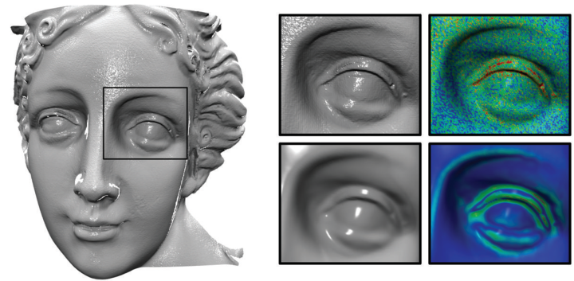
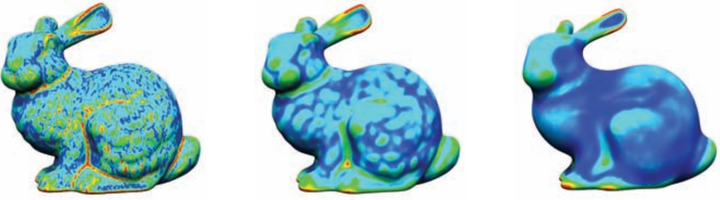
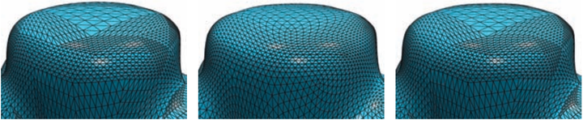
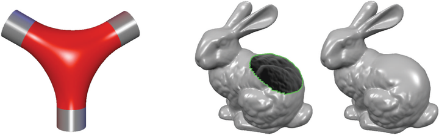

# 《多边形网格处理》第四章:平滑(Smoothing)

　　基于微分几何和第三章中介绍的离散几何的概念,本章我们将介绍**网格平滑(Mesh Smoothing)**.在抽象层面上,网格平滑涉及到三角网格上光滑函数 ${\rm \bf f}:S\rightarrow  {\rm I \!R}^d$ 的设计和计算.由于这个公式非常通用,因此网格平滑是几何处理中的一个基本工具.函数 ${\rm \bf f}$ 可以灵活地选择来描述,例如,顶点位置,纹理坐标,或顶点位移,这样本章中介绍的技术可以用于网格参数化(第5章),各向同性网格重划分(第6章),孔洞填充(第8章)和网格变形(第9章).

　　我们将讨论网格平滑的两个方面:**降噪(Denosing)**和**光顺(Fairing)**.降噪是为了去除函数 ${\rm \bf f}$ 中的高频噪声.由于物理扫描过程可能会受到高频噪声的破坏(见图4.1),因此在大多数情况下, ${\rm \bf f}$ 表示的是顶点位置.去除噪声(高频)和保持整体形状(低频)需要将频率和低通滤波器的概念推广到离散三角形网格的函数上.我们将在第4.1节和第4.2节分别介绍傅里叶变换和扩散滤波器的"网格版本".

　　在4.3节中讨论的网格光顺,不仅仅是为了去除高频噪声而稍微修改函数 ${\rm \bf f}$ .还尽可能地平滑函数,以获得如一个尽可能平滑的表面面片或一个尽可能平滑的形状变形."尽可能平滑"意味着一定的光顺能量必须最小化,通常涉及到曲率或高阶导数.我们将给出网格光顺直接计算迭代降噪过程的极限曲面,这可以阐述这两种方法之间的联系.

# 4.1 傅里叶变换与流形谐波(Fourier Transform and Manifold Harmonics)

　　傅里叶变换是分析信号频谱的经典工具.它允许低通滤波器和更通用的卷积滤波器的有效实现.我们将首先考虑基于傅里叶变换的简单单变量函数 $f(x)$ 的低通滤波,然后将这些概念推广到三角形网格上的信号处理.

## 4.1.1 一维傅里叶变换(1D Fourier Transform)

傅里叶变换将单变量函数 $f:{\rm I \!R} \rightarrow  \mathbb{C}$ 从**空间域(Spatial Domain)**的表示 $f(x)$ 映射到**频域(Frequency Domain)**的表示 $F(ω)$ .这个变换及其逆变换可以写成
$$
\begin{aligned}
F(\omega) &= \int_{-\infty}^{\infty} f(x){\rm e}^{-2\pi {\rm i} \omega x} {\rm d} x  \ \ \ \ \ (4.1)  \\ 
f(x) &= \int_{-\infty}^{\infty} F(\omega){\rm e}^{2\pi {\rm i} \omega x} {\rm d} \omega  \ \ \ \ \ (4.2) 
\end{aligned}
$$
这些方程有直观的几何解释:函数 $𝑓(𝑥)$ 可以认为是某个向量空间(可积复值函数)的一个元素,它具有内积
$$
⟨f, g⟩=\int_{-\infty}^{\infty} f(x) \overline{g(x)} {\rm d}x \\
$$
其中 $\overline{(a+{\rm i}b)}=(a-{\rm i}b)$ 表示复共轭性.复展开式函数
$$
e_{\omega}(x):={\rm e}^{2 \pi {\rm i}\omega x}=\cos(2\pi \omega x)-{\rm i}\sin(2\pi \omega x)
$$
由频率 $𝜔$ 的正弦和余弦函数组成,因此可以认为是频率 $𝜔$ 的复波(Complex Waves).它们建立了向量空间的一个与频率相关的正交基——频域.

　　在这种情况下傅里叶变换只是一个通过"向量" $𝑓$ 在"基向量" $e_{\omega}$ 上的正交投影的基的变换:
$$
f(x)=\sum_{\omega=-\infty}^{\infty}{⟨f,e_{\omega}⟩e_{\omega} }
$$
标量系数 $⟨f,e_{\omega}⟩$ 只不过是方程(4.1)中的 $F(\omega)$ .它描述了 $f$ 中包含了多少的基函数 $e_{\omega}$ ,即信号 $f(x)$ 中包含频率 $𝜔$ 的幅值的多少.由于频率 $𝜔$ 是实数,而不仅仅是整数,所以上式中的和变成了一个积分,从而重现了方程(4.2).

由于坐标 $F(\omega)$ 相对于基 $e_{\omega}$ 直接对应于频率,我们可以实现一个理想的低通滤波器(Low-pass Filter),简单地切断由用户定义的阈值 $\omega_{max}$ 以上的所有频率.这相当于只从较低的频率 $|ω| < ω_{max}$ 重构滤波函数:
$$
\tilde{f}(x)=\int_{-ω_{max} }^{ω_{max} } ⟨f,e_{\omega}⟩e_{\omega}{\rm d}ω \ \ \ \ (4.3)
$$

## 4.1.2 流形谐波(Manifold Harmonics)

　　一维傅里叶框架现在在(离散的)2-流形表面上推广为函数 $f:S\rightarrow{\rm I \!R}$ .方程(4.1)的傅里叶变换不能直接转化为流形上的函数.下面的观测提供了缺失的一环:正弦与余弦函数,以及复波 $e_{\omega}$ ,是拉普拉斯算子的特征函数,即,
$$
\Delta(e^{2\pi {\rm i}\omega x})=\frac{ {\rm d}^2}{ {\rm d}x^2}e^{2\pi {\rm i} \omega x}=-(2\pi \omega)^2e^{2\pi {\rm i}\omega x}
$$
当 $\Delta e_i=\lambda_ie_i$ 时,函数 $e_i$ 是一个特征值为 $\lambda_i$ 的特征函数,类比于矩阵的特征向量 ${\rm \bf A}{\rm \bf e}_i=\lambda_i {\rm \bf e}_i$ .

　　因此,一维傅里叶变换的基函数是拉普拉斯函数的特征函数.所以,自然而然地选择2-流形表面上的拉普拉斯-贝尔特拉米算子的特征函数作为广义上的基函数.因为我们知道如何将拉普拉斯-贝尔特拉米离散化,所以这也提供了将傅里叶变换推广到离散三角形网格的方法.

　　这一思想也与二元表面上的其他频率相关的基函数一致:对于一个2D正方形,拉普拉斯-贝尔特拉米算子的特征函数对应于离散余弦变换的基函数(使用JPEG格式),对于球体,则对应于球谐函数.因此,拉普拉斯-贝尔特拉米的特征函数将这些概念推广到任意的2-流形表面.所以,它们称为**流形谐波(Manifold Harmonics)**.

　　对于一个三角形网格的离散化,我们用 $n$ 个网格顶点的样本值向量来代替连续函数 $f({\rm \bf x})$
$$
f:S\rightarrow {\rm I \!R} \rightarrow f((v_1),...,f(v_n))^T \ \ \ \ (4.4)
$$
之后拉普拉斯-贝尔特拉米算子 $Δ$ 则变成了计算每个顶点拉普拉斯的拉普拉斯-贝尔特拉米矩阵 ${\rm \bf L}$:
$$
\quad 
    \begin{pmatrix} 
    \Delta f(v_1) \\ .\\.\\.\\ \Delta f(v_n) 
    \end{pmatrix} 
\quad 
= {\rm \bf L} 
\quad 
    \begin{pmatrix} 
    f(v_1) \\ .\\.\\.\\ f(v_n) 
    \end{pmatrix} 
\quad
$$
该矩阵在每一行 $𝑖$ 中包含用于离散顶点 $v_i$ 的拉普拉斯矩阵的权重 $w_{ij}$ (参见第3.3节和A.1节):
$$
\Delta f(v_i)=\sum_{v_j\in  {\rm \mathcal N}(v_i)}^{}{w_{ij}(f(v_j)-f(v_i))}\\
$$
这里我们假定权重没有被顶点价或Voronoi面积归一化,而让矩阵 ${\rm \bf L}$ 是对称的,例如,对于均匀拉普拉斯 $w_{ij}=1$ ,或者余切离散化 $w_{ij}=(\cot\alpha_{i,j}+\cot\beta_{i,j})$ (关于更详细的离散化和对称化分析,请参阅[Vallet and Lévy 08]).

　　在连续条件下的拉普拉斯-贝尔特拉米算子的特征函数 $e_{\omega}(x)$ 现在变成了拉普拉斯矩阵的特征向量 ${\rm \bf e}_1$,..., ${\rm \bf e}_n$:$n$ 维的特征向量 ${\rm \bf e}_i$ 可以认为是连续特征函数 ${\rm \bf e}_i({\rm  x})$ 的离散样本 $({\rm \bf e}_i(v_1),...{\rm \bf e}_i(v_n))^T$ ,如方程(4.4)所示. ${\rm \bf e}_i$ 的第 $k$ 项对应到顶点 $v_k$ 处 ${\rm \bf e}_i$ 的波幅;对应的特征值 $\lambda_i$ 决定波频.因此, ${\bf L}$ 的特征向量又称为三角形网格的**固有振动(Natural Vibrations)**,特征值称为**固有频率(Natural Frequencies)**[Taubin 95,Taubin 00].这个叫做**流形谐波基(Manifold Harmonic Basis)**[Vallet and Lévy 08]的一些基函数如图4.2所示,用颜色来表示每个顶点的振幅.

![图 4.2.部分流形谐波基函数.颜色可以看作是网格几何上驻波的振幅.(图片来自于[Vallet and Lévy 08].模型由Pisa Visual Computing Lab提供.)](image-1.png)

　　由于矩阵 ${\bf L}$ 是一个对称且半正定矩阵(见A.1小节),其特征向量建立了 ${\rm I \!R}^n$ 的一个正交基,这样我们可以基于此来精确地表示每一个向量 ${\rm \bf f}=(f_1,...,f_n)^{\rm T}$ :
$$
{\rm \bf f}=\sum_{i=1}^{n}{}⟨{\rm \bf e_i},{\rm \bf f}⟩ \ \ {\rm \bf e}_i
$$
其中 $⟨{\rm \bf e_i},{\rm \bf f}⟩={\rm \bf e}_i^{\rm T}{\rm \bf f}$ .方程(4.3)的低通滤波器的离散模拟只是从低频基函数中重建过滤后的函数 $\tilde{f}$ ,,即从第一个 $m<n$ 的特征向量:
$$
\tilde{ {\rm \bf f} }=\sum_{i=1}^{m}{⟨{\rm \bf e}_i,{\rm \bf f}⟩ \  {\rm e}_i}
$$

　　网格几何的滤波或平滑现在可以通过用所有 $𝑥$ , $𝑦$ 和 $𝑧$ 顶点坐标的 $𝑛$ 维向量替换上述方程中的来实现.图4.3给出了随着越来越多的流形谐波基函数,重构的网格中包含了更多的几何细节.最后,与傅里叶变换一样,通过根据用户定义的传递函数分别衰减或放大频率 $F(ω)$ ,可以很容易地进行常规的卷积滤波,如图4.4所示.
![图 4.3.使用越来越多的流形谐波基函数来重构网格.(图片来自于[Vallet and Lévy 08].模型由Pisa Visual Computing Lab提供.)](image-2.png)
![图 4.4.一旦计算出流形的谐波基和变换,就可以根据用户定义的传递函数进行常规的卷积滤波:低通滤波(左),高通滤波器(中)及增强优化(右).(图片来自于[Vallet and Lévy 08].模型由Pisa Visual Computing Lab提供.)](image-3.png)

　　流形谐波将傅里叶变换自然地推广到任意几何和拓扑的连续和离散2-流形表面. 其允许使用精确截断频率 $ω_{max}$ 进行理想的低通滤波,也允许用于灵活的卷积滤波.遗憾的是,这种方法对许多应用来说开销太大了,因为对潜在的非常大的拉普拉斯矩阵 ${\rm \bf L}$ 所需的特征向量分解在数值上很难计算[Vallet and Lévy 08].

　　扩散流是一种开销更低,因此也更实用的方法,将在下一节讨论. 它相当于一个高频阻尼,方法是将高频与高斯核函数相乘,而不是严格地将高于阈值 $ω_{max}$ 的所有频率截断.由于高斯函数在频域的傅里叶逆变换会产生空间域的高斯函数,因此在这种方法中不需要傅里叶变换,并且可以直接在空间域中计算平滑,即在三角形网格上计算平滑[Taubin 95].

# 4.2 扩散流(Diffusion Flow)

　　扩散流的数学模型很好理解,其用于平滑给定信号 $f({\rm x}, t)$ 的时变过程. 许多物理过程可以用扩散流(如热扩散和布朗运动)来描述.扩散流通过**扩散方程(Diffusion Equation)**来建模
$$
\frac{∂f({\rm x},t)}{∂t}=\lambda\Delta f({\rm x},t) \ \ \ \ (4.5)
$$
这是一个线性2阶偏微分方程(PDE),说明函数 $f$ 随时间变化而变化,由标量扩散系数 $\lambda$ 乘以其空间拉普拉斯函数 $\Delta f$ 组成.例如,如果 $f({\rm x},t)$ 表示某物质点 ${\rm x}$ 在 $t$ 时刻的温度,则该方程描述了物体在时间上的热扩散,因此也被称为**热方程(Heat Equation)**.我们可以利用扩散方程在流形表面 $S$ 上平滑任意函数 ${\rm \bf f}:S\rightarrow  {\rm I \!R}$ ,只需用流形拉普拉斯-贝尔特拉米替换正则拉普拉斯算子即可.由于方程(4.5)是一个连续时变的PDE,因此我们必须要在空间上和时间上对它进行离散化操作.

　　对于空间离散我们再次将函数 $f$ 替换为其网格上的顶点 $(f(v_1,t),...,f(v_n,t))^T$ 且使用均匀离散或者余切离散来计算拉普拉斯-贝尔特拉米离散(第3.3小节).这就得到了每个顶点函数值的演化方程,
$$
\frac{∂}{∂t}f(v_i,t)=\lambda\Delta f(v_i,t), \ \ \ \ i=1,...,n \ \ \ \ \ (4.6)
$$
使用在A.1小节中讨论的拉普拉斯矩阵形式可以将上述方程写成如 $∂{\rm \bf f}(t)/∂t=\lambda {\rm \bf Lf}(t)$ 的矩阵表示形式.

对于时间离散我们将时间轴分割成尺寸为 $h$ 的规则间隔,得到时步 $\{t,t+h,t+2h,...\}$ .使用有限差分来逼近时间导数
$$
\frac{∂{\rm \bf f}(t)}{∂t}\approx \frac{ {\rm \bf f}(t+h)-{\rm \bf f}(t)}{h} 
$$
以及求解 ${\rm \bf f}(t+h)$ 得到其**显式欧拉积分(Explicit Euler Integration)**:
$$
{\rm \bf f}(t+h)={\rm \bf f}(t)+h\frac{∂{\rm \bf f}(t)}{∂t}={\rm \bf f}(t)+h\lambda{\rm \bf Lf}(t)
$$
注意为了数值积分的稳定性,必须选择一个足够小的时步 $h$ .应该使用隐式时间积分来保证即使是大时步情况下的无条件稳定性[Desbrunet al. 99].在下一个时步 $(t+h)$ 而不是当前时间 $t$ 计算拉普拉斯 $∆{\rm \bf f}$ ,将得到隐式欧拉积分:
$$
{\rm \bf f}(t+h)={\rm \bf f}(t)+h\lambda{\rm \bf Lf}(t) \ \ \ \  \Leftrightarrow \ \ \ \ ({\rm \bf Id}-h\lambda {\rm \bf L}){\rm \bf f}(t+h)={\rm\bf f}(t) \\
$$
注意现在必须要为函数值 ${\rm \bf f}(t+h)$ 求解一个稀疏 $(n\times n)$ 线性系统.附录给出了更多关于线性系统的构造和潜在解决方法的细节.即使使用高效的求解器,隐式积分也比显式积分复杂得多,但与之相比又保证了数值稳定性.

　　为了平滑网格几何 ${\rm \bf x}$ 而不是任意函数 ${\rm \bf f}$ ,我们简单地将上述更新规则应用到顶点位置 $({\rm\bf x}_1,...,{\rm\bf x}_n)^T$ .所得到的所谓拉普拉斯平滑(Laplacian Smoothing)的显式逐顶点更新为
$$
{\rm \bf x}_i\leftarrow{\rm \bf x}_i+h\lambda\Delta {\rm\bf x}_i
$$
由于顶点位置的拉普拉斯-贝尔特拉米对应到平均曲率法线( $\Delta {\rm \bf x}=-2H{\rm \bf n}$ ,方程(3.7)),因此所有顶点向法线方向移动的量由平均曲率 $H$ 决定.因此,上述流动方程也被称为平均曲率流(Mean Curvature Flow)[Desbrun et al. 99].图4.1和图4.5中描述了一些示例.

　　然而,法线方向的移动仅(近似)适用于余切拉普拉斯.其对均匀拉普拉斯不成立(见方程(3.10)),因为后者没有考虑网格几何,因此对于真正的拉普拉斯-贝尔特拉米来说是一个相当不准确的离散化.均匀拉普拉斯平滑法试图将每个顶点移动到其单环相邻顶点的重心上.这会平滑网格几何的同时也会导致三角剖分的切向松弛(见图4.6).对于不同的应用,这可能是一个符合期望的特性(如,第六章中的各向同性网格重划分),也可能是一个缺点.

　　最后,请注意高阶拉普拉斯流 $∂{\rm \bf f}/∂t = \lambda \Delta ^{k}{\rm\bf f}$ 也可用于递归计算高阶拉普拉斯离散为 $∆^kf =∆(∆^{k-1}f)$ 的部分(见A.1小节). 高阶流的计算成本更高,因为它们依赖于更大的顶点模板,但它们提供了更好的低通滤波特性[Desbrun et al. 99].在实践中,双拉普拉斯平滑 $(k = 2)$ 是计算效率和平滑质量之间的一个很好的权衡. 当只在局部应用平滑时,双拉普拉斯平滑会使平滑区域和固定区域之间的 $C^1$ 平滑混合,而拉普拉斯平滑只会实现 $C^0$ 边界平滑.

# 4.3 光顺(Fairing)

　　扩散流的主要应用是去除信号中的高频噪声,同时保留其低频. 相比之下,表面光顺的目标是计算尽可能平滑的形状.如何实际测量平滑度或光顺度显然取决于应用,但一般来说,光顺表面应该遵循**最简形状原则(Principle Of Simplest Shape)**:表面应该没有任何不必要的细节或振荡[Moreton and Séquin 92,Welch and Witkin 92].

　　这可以通过适当的能量来惩罚表面的非美学行为来建模. 在用户定义的约束下极小化光顺能量,最终得到所需的形状.示例应用包括构建光滑的混合表面以及用光滑面片填充表面孔洞,如图4.7所示.

　　让我们对光滑参数表面 $x: \Omega\rightarrow S$ 进行如下推导,然后讨论离散三角形网格的情况.一个常用的光顺泛函是膜能量函数
$$
E_M({\rm \bf x})=\int\int_{\Omega}\sqrt[]{ {\rm det({\rm \bf I})} }{\rm d}u {\rm d}v \ \ \ \ (4.7) \\
$$
这可以用来测量表面 $S$ 的面积(见方程(3.3)).该能量在用户定义的约束下最小化,通常会将位置 ${\rm \bf x}(u,v)$ 固定在表面边界 $∂\Omega$ 上.所得到的最小面积表面对应于一个夹紧的肥皂泡,称为**膜表面(Membrane Surface)**或**最小表面(Minimal Surface)**.

　　不幸的是,方程(4.7)的能是高度非线性的,包含了(已经非线性的)第一基本形式行列式的平方根. 使得这种能量的有效和稳定最小化在数值表示上非常困难. 因此,我们通过用一阶偏导数取代第一基本形式来线性化膜能量,从而得到**狄利克雷能量(Dirichlet Energy)**
$$
\tilde{E}_M({\rm \bf x})=\int\int_{\Omega}||{\rm \bf x}_u||^2+||{\rm \bf x}_v||^2{\rm d}u{\rm d}v \ \ \ \ (4.8)
$$
其中我们使用缩写符号 ${\rm \bf x}_u=∂{\rm \bf x}/∂u$ 和 ${\rm \bf x}_v=∂{\rm \bf x}/∂v$ .由于偏导数是一个线性算子,该能量是 ${\rm \bf x}$ 的二次函数.

　　为了最小化上述线性化能量,我们在方程(4.8)的一维版本中引入变分法(Calculus of Variations)[Gelfand and Fomin 00, Kobbelt 97].我们正在寻找一个函数 $f: [a, b] \rightarrow {\rm I \!R}$ ,使一维膜能量最小化
$$
E(f)=\int_{a}^{b}(f_x)^2 {\rm d}x
$$
受固定边界 $f(a)$ 和 $f(b)$ 的约束.我们假设 $f$ 实际上是 $E(f)$ 的最小值.如果我们选择任意一个函数 $u(x)$ 且 $u(a)=u(b)=0$ ,我们得到 $E(f)<E(f+u)$ .如果我们进一步考虑 $E(f + λu)$ 作为标量参数 $𝜆$ 的函数,则该函数在 $λ=0$ 处有一个最小值. 因此,它对 $𝜆$ 的导数必须在 $λ = 0$ 处消失:
$$
\frac{∂E(f+\lambda u)}{∂\lambda}\bigg|_{\lambda = 0}=\int_{a}^{b}2f_xu_x=0
$$
通过分部积分并且利用 $u(a) = u(b) = 0$ 把这个转化为 $-\int_{a}^{b}f_{xx}u=0$ .注意这表示对于**任何任意的$u$**只要满足 $u(a) = u(b) = 0$ , $\int_{a}^{b}f_{xx}u$ 都必须变为0,然而这只有满足以下条件时才有可能发生
$$
f_{xx}=\Delta f=0
$$
这就是叫做极小化问题 $E(f)\rightarrow min$ 的**欧拉-拉格朗日方程(Euler-Lagrange Equation)**.直观地说,在 $f$ 的极小值处 $E(f)$ 对 $f$ 的一阶导数是消失的.因为 $E(f)$ 是一个泛函(函数的函数),因此得到的方程是一个偏微分方程(PDE).基于这一观察,我们可以通过求解欧拉-拉格朗日偏微分方程来找到极小值 $𝑓$ ,而不是数值最小化 $E(f)$ .

　　同样的机制可以应用于方程(4.8)的极小化,但它需要使用更复杂的边界约束,以及使用散度定理而不是分布积分.我们可得到欧拉-拉格朗日方程
$$
\tilde{E}_M({\rm \bf x}) \rightarrow min \Leftrightarrow \Delta {\rm \bf x}(u,v)=0,(u,v)\in \Omega
$$
这同样受 $∂Ω$ 的边界限制.

　　通过(1)用顶点坐标 ${\rm x}=({\rm x}_1,...{\rm x}_n)^T$ 的向量来替换连续坐标函数 ${\rm \bf x}(u,v)$ ,以及(2)用拉普拉斯-贝尔特拉米算子,我们最终可以将这种连续的公式转换为离散的三角形网格.这可以得到一盒线性拉普拉斯系统
$$
{\rm \bf L}{\rm x}={\rm \bf 0}
$$
这就是最优顶点位置 ${\rm \bf x}$ 的解(有关数值解的详细信息,请参阅附录).图4.8(左)给出了一个离散膜表面的例子.

![图 4.8.蓝色区域由极小化光顺泛函决定:膜表面( $\Delta{\rm \bf x}=0$ ,左),薄板表面( $\Delta^2{\rm \bf x}=0$, 中),以及最小变化表面( $\Delta^3{\rm \bf x}=0$ ,右).欧拉-拉格朗日方程 $\Delta^k{\rm x}=0$ 的第 $k$ 阶决定了边界处最大平滑 $C^{k-1}$ .(图片来自[Botsch and Kobbelt 04a].)](image-7.png)

如果目标不是表面积而是最小化曲率,则我们可以从**非线性薄板能量(Thin-Plate Energy)**开始
$$
E_{ {\rm TP} }({\rm \bf x})=\int\int_{\Omega}κ_1^2+κ_2^2{\rm d}u{\rm d}v 
$$
其中 $κ_1$ 和 $κ_2$ 表示主曲率.线性化用二阶导数代替曲率，得到
$$
\tilde{E}_{ {\rm TP} }({\rm \bf x})=\int\int_{\Omega}\Vert{\rm \bf x}_{uu}\Vert^2+2 \Vert{\rm \bf x}_{uv}\Vert^2+ \Vert{\rm \bf x}_{vv}\Vert^2 {\rm d}u{\rm d}v
$$
对应的欧拉-拉格朗日方程在 $\Omega$ 为 $\Delta^2{\rm \bf x}(u,v)=0$ ,适当的 $C^1$ 边界约束规定了位置 ${\rm \bf x}(u, v)$ 和 $∂Ω$ 上的法线 ${\rm \bf n}(u, v)$ .将其转化为一个离散的三角形网格,得到了一个线性的双拉普拉斯系统.
$$
{\rm \bf L}^{ \ 2}{\rm \bf x}={\rm \bf 0}
$$
在离散情况下,固定两个边界顶点环的位置通常比规定一个边界顶点环的位置和法线更容易[Kobbelt rt al.98b].虽然这两种边界约束都会得到 $C^1$ 边界平滑(近似),如图4.8所示(中).

![图4.8.求解 $\Delta^2{\rm \bf x}=0$ 时不同拉普拉斯-贝尔特拉米离散化方法的比较:不规则输入三角网格(左),均匀拉普拉斯网格(中),余切拉普拉斯网格(右).比较小的图片显示各自的平均曲率.(模型由Cyberware提供.图片来自[Botsch and Sorkine 08].)](image-8.png)

　　甚至更高阶的光顺可以通过极小化曲率而不是曲率变化来实现
$$
\int\int_{\Omega}
\left(
    \frac{∂κ_1}{∂{\rm \bf t}_1}
\right)^2
+
\left(
    \frac{∂κ_2}{∂{\rm \bf t}_1}
\right)^2 
{\rm d}u{\rm d}v \ \ \ \ (4.9)
$$
其中 $κ_1$ , $κ_2$ 表示主曲率, ${\rm\bf t}_1$ , ${\rm\bf t}_2$ 为对应的主曲率方向.这些叫做**最小变化表面(Minimum Variation Surfaces)**[Moreton and Séquin 92]的离散逼近可以通过六阶PDE $\Delta^3{\rm x}=0$ 计算得到(见图4.8(右)).

　　我们已经看到我们可以通过计算一阶,二阶和三阶的线性拉普拉斯系统分别计算出膜表面,薄板表面以及最小最小变化表面.图4.9显示了拉普拉斯-贝尔特拉米算子不同离散化对薄板能量最小化的影响.均匀拉普拉斯在不同的高顶点密度区域中会产生瑕疵,而余切离散则有比较好的预期结果.

　　表面光顺和扩散流之间有一个有趣的联系:对于上述讨论的光顺表面,第 $𝑘$ 阶拉普拉斯会在整个表面上消失(通过构造).由于第 $𝑘$ 阶拉普拉斯同样也是第 $𝑘$ 阶拉普拉斯流的更新向量,所以这些表面是 $∂{\rm \bf x}/ ∂t =\Delta^k{\rm \bf x}$ 流的稳态. 这证实了光顺表面确实是越来越光滑.此外,对于求解线性系统 $\Delta^k{\rm \bf x}={\rm \bf 0}$ (见附录),第 $𝑘$ 阶拉普拉斯流的一个显式时步相当于一个(衰减的)雅可比迭代.计算无限步长 $h =∞$ 的隐式时步直接得到 $\Delta^k{\rm \bf x} = {\rm \bf 0}$ .因此,拉普拉斯流会收敛到光顺表面.

　　最后请注意,完全相同的框架也可以用来构造一般的函数 $f: S \rightarrow {\rm I \!R}^d$ ,这相当于将坐标函数 ${\rm \bf x}$ 替换为 ${\rm \bf f}$ .在计算最小畸变参数化( $\Delta {\rm \bf u}={\rm \bf 0}$ ,见第5章),最小化拉伸和弯曲变形( $k_s\Delta {\rm \bf d} + k_b \Delta^2 {\rm \bf d} ={\rm \bf 0}$ ,见第9章)和孔洞填充的平滑面片( $\Delta^2{\rm \bf x} ={\rm \bf 0}$ ,参见第8章)时,我们将再次看到这些概念.

# 4.4 总结和延伸阅读

　　在本章中,我们介绍了三种不同但密切相关的方法来平滑2-流形表面和三角形表面.流形谐波提供了一个优雅的从傅里叶变换到表面网格的推广,但该方法对于多数应用来说计算代价太大.扩散流和高阶拉普拉斯流易于实现,是去除高频噪声的有效工具.表面光顺计算的是尽可能光滑的表面,这些表面是对应平滑流的极限表面.

　　我们的讨论限制在在**各向同性(Isotropic)**和**线性(Linear)**平滑技术,因为它们在大多数情况下更容易理解同时也够用了.对于替代技术,我们建议读者参考下面提到的更复杂的方法.

● **各向异性扩散流(Anisotropic Diffusion Flow)**.正如我们目前所讨论,扩散流是一种各向同性的平滑方案,因为它向所有方向均匀地扩散高频噪声.不过这一过程也不可避免地模糊了诸如如尖锐的边缘之类的几何特征.相反,各向异性扩散试图通过调整扩散方向来保留特征,这样顺着几何特征来进行平滑,而不是越过特征来平滑.为此,利用与数据相关的扩散张量 ${\rm \bf D}({\rm \bf x})$ 对各向同性拉普拉斯算子 $ ∆ f ={\rm div} ∇ f$ 进行扩展,得到了各向异性扩散流方程 $ ∂f/∂t ={\rm div} {\rm \bf D} ∇f$ [Perona and Malik 90].各向异性表面平滑的例子可以在[Bajaj and Xu 03,Clarenz et al. 00,Desbrun et al. 00,Hildebrandt and Polthier 04]中找到.  
● **双边滤波(Bilateral Filtering)**.图像的双边滤波[Tomasi and Manduchi 98]通过同时考虑图像域(如经典的滤波)和它的范围(颜色值)来保持特征:每个像素作为其空间邻域内具有相似颜色值的像素的加权平均值.双边滤波[Fleishman et al. 03, Jones et al. 03]用于表面降噪,其考虑了空间距离(图像域)以及法向量的局部变化(范围域).  
● 非线性平滑(Nonlinear Smoothing).对于表面光顺,我们用一阶和二阶偏导数替换了非线性的内蕴性质(例如,基本形式和主曲率),这最终使得可以用一个简单的线性系统来解决表面光顺. 非线性平滑方法解决了真正的非线性极小化问题,由于它们不太依赖初始三角剖分或参数化,这会在数值计算上更加困难,但同时也提供了更高质量的表面.[Moreton and Séquin 92].例如,Schneider等人[Schneider and Kobbelt 01, Schneider and Kobbelt 00]解非线性方程 $\Delta H = 0$ ,Bobenko与Schröder使离散的Willmore流最小化[Bobenko and Schröder 05].Eigensatz等人直接在离散平均曲率函数上应用双边滤波,并重建一个最接近滤波曲率值的三角形网格[Eigensatz等人08].