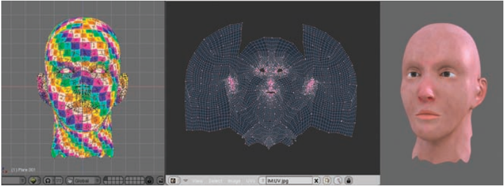
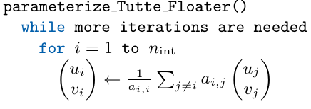
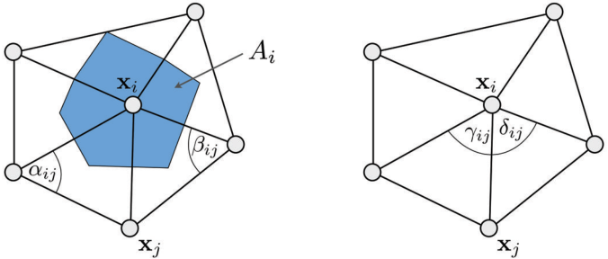
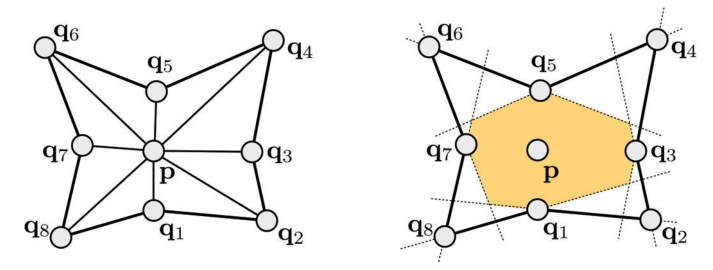
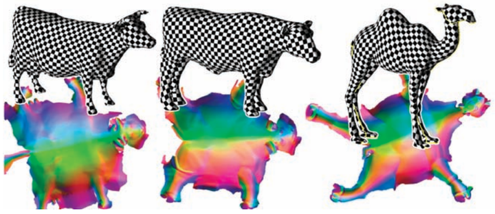

# 《多边形网格处理》第五章:参数化(Parameterization)

　　用来编码三维物体的几何形状可以有不同的表示(见第1章). 选择哪一种表示方式取决于上游的数据获取过程和下游的应用程序.然而,最容易重构的表示方式在大多数情况下对应用程序都不是最优的.参数化的概念是将一个几何坐标系附加到对象上(参见第3章).本章介绍了计算给定多边形网格的参数表示的方法.这有助于从一种表示转换为另一种表示.例如,可以将网格模型转换为分段双三次样条表面,这是计算机辅助设计(CAD)包中使用的表示类型. 在某种意义上,这可以重新获得几何的"方程",或构建几何的抽象:一旦几何被抽象,将其重新实例化为可选的表示就变得更容易了.

　　我们首先列出网格参数化的一些重要应用来作为初始动机.然后,我们提出了一种基于重心映射的方法来确定凸多边形的固定边界.然后我们研究共形和不需要固定边界的共形映射方法.我们还回顾了基于第三章中微分几何概念的方法(各向异性椭圆和畸变分析).注意,本章仅限于磁盘拓扑对象的参数化方法.更普遍的拓扑对象的参数化方法(全局参数化方法)不在本文讨论范围内.

# 5.1 总体目标(General Goals)

　　计算对象的参数化意味着给它附加一个坐标系.这样的坐标系可能有许多应用.网格参数化的一个主要应用就是**纹理映射(Texture Mapping)**.图5.1给出了在Blender开源建模器中实现的参数化示例.参数化用于将表面与存储在2D域中的图像进行一对一对应.可以将现有的图像映射到3D模型上,也可以通过直接绘制模型来定义参数空间图像.

　　随着可编程图形硬件的出现,纹理映射现在可以用于将更复杂的属性映射到表面上.图5.2所示的示例演示了一种叫做**法线映射(Normal Mapping)**的技术(如[Sander et al. 01]).初始对象可以用一个明显简化的版本代替(见第七章).通过在纹理中编码原始的高分辨率法向量,并用片元着色器在保留整体视觉外观的同时计算光照,它的视觉外观可以准确地保存下来.由于在纹理图像中可以存储的细节比使用大量的三角形的方式更紧凑,因此法线映射是实时绘制的一项重要技术.

　　另一类应用涉及网格重划分算法(见第6章).最后,参数化所定义的坐标系有助于将网格表示转换为另一种表示形式.这对于建模和仿真任务是至关重要的,这些任务使用的表示方式完全不同于由3D扫描仪及其配套重建软件构建的密集三角网格.更具体地说,这些应用需要参数表示(参见第1章).例如，图5.3显示了使用参数化将一个网格转换为参数表示.这填补了数据采集和CAD/有限元模拟应用之间的空白.

![图 5.3.在网格(左)上,参数化(中)定义了一个可以将输入网格转换为参数化表面(右)的坐标系统.(图片来自[Hormann et al. 07].)](image-1.png)

　　总而言之在:形式上,三维表面的参数化是一个将表面与二维域一一对应的函数.这一概念在几何处理中扮演着重要的角色,因为它可以将复杂的3D建模问题转化到更容易解决的2D空间中.下一节将参数化的概念离散化为分段线性三角形网格.

# 5.2 三角表面参数化(Parameterization of a Triangulated Surface)

　　在第二章定义的由顶点 $v_1,...v_n\in {\mathcal V}$ ,位置 ${\rm \bf p}_1,...,{\rm \bf p}_n$ (或者 ${\rm \bf x}_1,...,{\rm \bf x}_n$ ),以及三角形集合 ${\mathcal F}$ 所定义的三角化表面很自然而然地使用分段线性函数参数化,分段线性函数对应于表面的三角形.因此,可以通过与每个顶点 $(x_i, y_i, z_i)$ 相关的所有 $(u_i, v_i)$ 坐标的集合来表示参数化.图5.4显示了一个在 $(u, v)$ 参数空间中的参数化三角表面的例子.

　　请注意,在微分几何的背景下(第三章),我们考虑一个现有的参数化,而本章考虑的问题是如何构造一个现有表面的参数化.因此,与微分几何的惯例不同,我们更自然地考虑将(已知的)三维空间映射为(未知的)二维参数空间,分别如图5.4的左,右所示.当我们解释基于畸变分析的方法的构想和行为时,我们将看到这种"交换"的更基本的含义. 

![图5.4.三维空间(左)和 $(𝑢,𝑣)$ 参数空间(右)中的参数化三角表面.三角形表的参数化可以用分段线性函数来定义,由每个顶点 $(𝑥_𝑖,𝑦_𝑖,𝑧_𝑖)$ 的坐标 $(𝑢_𝑖,𝑣_𝑖)$ 决定.(图片来自于[Hormann et al. 07].)](image-2.png)

　　在参数空间 $Ω$ 的一个给定点 $(𝑢,𝑣)$ ,参数化 ${\rm \bf x}$ 为
$$
{\rm \bf x}(u,v)=\alpha {\rm \bf p}_i+\beta {\rm \bf p}_j+\gamma{\rm \bf p}_k
$$
其中 $(i, j, k)$ 表示索引三元组,以便三角形 $[(u_i, v_i),(u_j, v_j),(u_k, v_k)]$ 在参数空间中包含点 $(u, v)$ .三元组 $(\alpha,\beta,\gamma)$ 表示三角形中点 $(u,v)$ 的重心坐标.见方程(1.3)和(1.4).

　　总之,构造三角表面的参数化表示找到与每个顶点 $𝑖$ 相关的一组坐标 $(𝑢_𝑖,𝑣_𝑖)$.此外,这些坐标必须保证表面在参数空间中的图像不会自相交.这表示参数空间中任意两个三角形的相交要么是一条公共边,要么是一个公共顶点,要么没有相交.在下面的文章中,我们将讨论给顶点分配 $(𝑢,𝑣)$ 坐标的不同解决方案.

# 5.3 重心映射(Barycentric Mapping)

　　重心映射是构造三角表面参数化最广泛使用的方法之一.该方法基于图论中Tutte的重心映射定理[Tutte 60],其表明:

> 给定一个与圆盘同胚的三角曲面,如果边界顶点的 $(u,v)$ 坐标位于凸多边形上,且内部顶点的坐标是其相邻顶点的凸组合,则 $(u,v)$ 坐标组成一个有效的参数化(无自交).

假设这些顶点是有序的,索引 $\{1,...n_{ {\rm int} }\}$ 对应内部顶点以及索引 $\{n_{ {\rm int} }+1,...,n\}$ 对应边界顶点,定理的第二个条件可以写成
$$
\forall \in \{1,...n_{ {\rm int} }\}:\ \ -a_{i,i}  
\begin{pmatrix}     
    u_i \\     
    v_i 
\end{pmatrix} 
=
\sum_{j\ne i}{a_{i,j} } 
\begin{pmatrix}     
    u_j \\     
    v_j 
\end{pmatrix} 
$$
其中系数 $a_{i,j}$ 是这样的 $\forall i\in\{1,...,n\}$
$$
\left 
\{ 
    \begin{aligned} 
        a_{i,j} & >  0 , \ \ \ \ v_i和v_j通过一条边连接 \\ 
        a_{i,i} & =  \sum_{j\ne i}^{}{a_{i,j} }, \ \ \ \ \ \ \ \ \ \ \ \ \ \ \ \ \ \ \ \ \ \ \ \ \ \ \ \ \ \ \ \ \ \ \ \ \ \ \ \ \ \ \ \ \ \ \ \ \ \  (5.1) \\
        a_{i,j} & =0 \ \ \ \ \ \ \ 其他情况 
    \end{aligned} 
\right.
$$
　　Tutte [Tutte 60]最初的证明使用了来自图论的复杂概念.Colin de Verdière建立了一个更简单的证明[de Verdiere 90].最后,[Gortler et al. 06]基于离散形式的概念建立了一个证明.由于它使用了简单的计数参数,所以后一种证明是比较易懂的,而不需要其他两种证明所涉及的重要图论背景知识.

　　这个定理描述了一系列有效的参数化,可以用来代替构造参数化的方法[Floater 97].该思想包括首先在凸多边形的边界上确定顶点.之后通过求解方程(5.1)来找到内部顶点的坐标.这意味着要解决两个线性系统,维度为 $n_{ {\rm int} }$ 的 ${ \rm \bf Au = \bar{u} }$ 和 ${ \rm \bf Av = \bar{v} }$ ,其中向量 ${\rm \bf u}$ 和 ${\rm \bf v}$ 集合了内部顶点的所有 $u$ 和 $v$ 坐标,右边的 ${\rm \bf \bar{u} }$ (与之对应 ${\rm \bf \bar{v} }$ )包含了边界上顶点的加权坐标:
$$
\forall i\in\{ 1,...,n_{ {\rm int} }\}: \ \ \  
\left\{ 
    \begin{aligned}    
        \sum_{j=1}^{n_{\rm int} }{a_{i,j}u_j=\bar u_i=-\sum_{j=n_{\rm int}+1}^{n}{a_{i,j}u_j} }, \\ 
        \sum_{j=1}^{n_{\rm int} }{a_{i,j}v_j=\bar v_i=-\sum_{j=n_{\rm int}+1}^{n}{a_{i,j}v_j} }. 
    \end{aligned} 
\right.  (5.2)
$$
　　方程(5.2)有多种解法.对于大型网格,最有效的方法包括稀疏迭代和稀疏直接法,这在附录中有讨论.对于相当小的网格(最多5K个顶点),也可以使用一个简单的Gauss-Seidel求解器(参见附录).在实践中,这意味着不断地将所有顶点移动到相邻顶点的的重心:

当 $(𝑢,𝑣)$ 更新小于用户指定的阈值或到达给定的最大迭代次数之后,迭代将停止.矩阵 ${\rm \bf A}$ 有一个足以保证Gauss-Seidel迭代收敛到解的属性(A是一个M-matrix,见[Golub and Loan 89]).图5.5给出了使用该方法计算的参数化示例(更细致地使用权重 $a_{i,j}$ ).

![图 5.5. 使用Floater方法的参数化.表面边界上的参数坐标固定在凸多边形上,内部坐标通过求解线性方程组得到.(图片来自于[Hormann et al. 07].)](image-4.png)

　　对于 $a_{i,j}$ 的一个可能有效的选择是当 $𝑖$ 和 $𝑗$ 通过一条边连接起来时 $a_{i,j}=1$ ,以及 $a_{i,i}=- \vert {\mathcal N}_i \vert$ ,其中 $\vert {\mathcal N}_i \vert$ 表示顶点 $𝑖$ 的单环相邻数(即,顶点 $𝑖$ 的价).然而,这些权重没有考虑网格的几何形状(如边长或三角形角度),因此会引入大多数应用都必须避免的畸变.因此,下一节将介绍一种选择这些权重的方法,以尽量减少一些畸变.

## 5.3.1 离散拉普拉斯(Discrete laplacian)

　　拉普拉斯,或者叫拉普拉斯算子,是多元函数二阶导数的推广.在平坦的2D空间中,这个算子由下面方程定义
$$
\Delta f=\frac{∂^2f}{∂x_2}+\frac{∂^2f}{∂y^2}
$$
拉普拉斯算子用于测量函数的规则性(或不规则性).例如,对于线性函数的拉普拉斯为零.因此,最小化 $𝑢$ 和 $𝑣$ 的拉普拉斯会得到平滑的参数坐标;换句话说,这同时也最小化参数化的畸变.拉普拉斯算子可以推广到表面上,这种推广形式称为拉普拉斯-贝尔特拉米算子.在第三章中,推导了方程(3.11),该算子的散版本为:
$$
a_{i,j}=\frac{1}{2A_i}(\cot \alpha_{i,j}+\cot\beta_{i,j}) \\ 
a_{i,i}=-\sum_{j\ne i}{}a_{i,j} 
$$
其中 $\alpha_{i,j}$ 和 $\beta_{i,j}$ 如图5.6(左所示), $A_i$ 对应顶点 $v_i$ 的Voronoi面积.这样定义的离散拉普拉斯算子是一个矩阵 $(a_{i,j})$ ,其非零模式对应于网格的连通性,并满足 $a_{i,i}=-\sum_{j\ne i}{}a_{i,j}$ .因此,可以使用离散拉普拉斯来定义Floater方法中使用的系数 $a_{i,j}$ ,如[Eck et al. 95]中所示.在第5.4.3节中,我们进一步阐述了离散拉普拉斯算子和参数畸变之间的联系.

　　如第3章所述,对于钝角网格,离散拉普拉斯算子的系数可能为负数.这违反了Tutte定理的要求,使得映射的有效性不再能得到保证.可以通过细分初始网格来去除钝角[Rivara 84].另一种方法可能是使用权重的不同定义,基于[Floater 03]中引入的均值定理(而不是Stokes定理):
$$
a_{i,j}
=
\frac{1}{\vert\vert{\rm\bf x}_i-{\rm\bf x}_j\vert\vert}(\tan(\frac{δ_{i,j} }{2})
+
\tan(\frac{\gamma_{i,j} }{2})), \ \ \ \ a_{i,i}=-\sum_{j\ne i}{}a_{i,j}
$$
其中 $\delta_{i,j}$ 和 $\gamma_{i,j}$ 为图5.6中的角(右).这样定义的**均值权重(Mean Value Weights)**总是正的,因此可以证明生成一对一的映射.

　　因此,结合均值权重的Tutte定理为构造类圆盘表面的有效参数化提供了一种可证明的正确方法.然而,对于某些曲面来说,在凸多边形上固定边界的必要性可能是有问题的(见图5.7),有以下原因:(1)一般来说,在凸多边形上找到一种“自然”的固定边界的方法比较困难,(2)对于一些表面,其边界并非凸面.因此得到的参数化高度畸变.即使人们可以想象用不同的方法来改进结果,但这样得到的参数化可能不会像图5.7(右)的那样好,它更好地匹配制革工人对这样一个网格的期望.下一节学习基于共形映射的概念来构造带有自由边界的参数化的方法.

# 5.4 共形映射(Conformal Mapping)

　　共形映射与复分析的形式化有关.其依赖于共形条件,为了计算自然边界,该条件定义了一个足够硬性的标准,提供了良好的外推能力.对这种形式化感兴趣的读者可以参考[Needham 94].

　　第3.2.2节介绍的各向异性椭圆在(非失真)参数化方法的定义中起着核心作用.我们现在专注于一组称为**共形映射(Conformal Maps)**的特殊参数化,其表面上所有点的各向异性椭圆是一个圆.如图5.8所示,这也表示两个梯度向量向量 ${\rm \bf x}_u$ 和 ${\rm \bf x}_v$ 是正交的且具有相同的范数.也可写成 ${\rm \bf x}_v={\rm \bf n} \times {\rm \bf x}_u$ ,其中 ${\rm \bf n}$ 为法向量.值得注意的是如果参数化是共形的,那么其反函数也同样是共形的(因为反函数的雅可比矩阵等于雅可比矩阵的逆矩阵).为了理解这一点,我们也可以说,如果等参数曲线 $𝑢$ (iso- $𝑢$ )和等参数曲线 $𝑣$ (iso- $𝑣$ )是正交的,则它们在切平面上的法线也是正交的.最后,共形还意味着雅可比矩阵只由旋转和缩放组成(即**相似变换(Similarity Transform)**).因此,共形映射局部保持相似.我们现在来回顾下计共形参数化的各种方法.

![图 5.8.共形映射将一个小圆变换为另一个小圆,即在局部是一个相似变换.(图片来自于[Hormannet al. 07].)](image-6.png)

## 5.4.1 三角形的梯度(Gradient in a Triangle)

　　共形可以表示为参数化梯度之间的关系.因此,可以使用第3.3节中给出的梯度表达式以便将共形映射的定义移植到分段线性三角表面的背景中.  

　　然而,我们需要再次强调的是,我们的背景与第三章中的略有不同.在我们的例子中,三维曲面是给定的,我们的目标是构造参数化.在这种情况下,描述参数化的逆运算似乎更自然,即从三维表面 $𝑆$ (已知)到参数空间 $Ω$ (未知)的函数.这个函数也是分段线性的.在这种配置中,为了定义梯度,可以为每个三角形提供标准正交基 $𝑋,𝑌$,如图5.9所示(我们可以使用三角形的其中一个顶点 $𝑥_𝑖$ 作为原点).在此基础上,我们可以研究参数化的逆函数——也就是说,将三角形中的一个点($𝑋,𝑌$)映射到参数空间中的一个点($𝑢,𝑣$)的函数.该函数的梯度由以下给出:
$$
∇u=
\begin{bmatrix}     
    ∂u/∂X\\     
    ∂v/∂Y 
\end{bmatrix}
=
\underbrace{ \frac{1}{2A_T} 
\begin{bmatrix}     
    Y_j-Y_k && Y_k-Y_i&&Y_i-Y_j\\     
    X_k-X_j&& X_i-X_k && X_j-X_i 
\end{bmatrix} }_{={\rm \bf M}_T}\begin{pmatrix}     u_i \\    u_j\\ u_k \end{pmatrix} \ \ \ (5.3)
$$

其中矩阵 ${\rm \bf M}_T$ 在三角形 $𝑇$ 中是常数,以及 $A_T$ 表示三角形 $𝑇$ 的面积.注意这些梯度与在3.2.2小节中操作的函数 $S\rightarrow \Omega$ 的梯度不同(但强相关): $𝑢$ 的梯度(与之对应 $𝑣$)与等参数曲线 $𝑢$ (iso-$𝑢$)(与之对应等参数曲线 $𝑣$ (iso-$𝑣$))相交成直角(而不是相切),其范数是3.3小节中计算得到的范数的倒数.由于共形映射的逆也是共形映射,对于三角表面,共形条件可以写成:
$$
∇ v={\rm \bf n} \times ∇ u
$$

## 5.4.2 最小二乘保角映射(Least Squares Conformal Maps)

　　与最初论文[Lévy et al. 02]的阐述相反,我们根据前一小节中计算的梯度之间的简单几何关系,提出了最小二乘共形映射(LSCM)法.之后我们阐述复分析的形式化并与其他方法建立联系.

　　LSCM法简单地表示将表面映射到参数空间的函数的共形条件.我们现在考虑表面上的一个三角形,它的支撑平面(见5.4.1小节)有一个标准正交基 $(𝑋,𝑌)$.在这种情况下,共形可写成
$$
∇u=(∇u)^\bot =  
\begin{bmatrix}    
    0 \ \ \ -1 \\ 
    1 \ \ \  0  
\end{bmatrix} 
∇u \ \ \ \ (5.4)
$$
其中 $(\cdot)^\bot$ 表示沿着法线 ${\rm \bf n}$ 逆时针旋转90度.

　　用方程(5.3)表示三角形的梯度,方程5.4表示分段线性共形映射,则
$$
{\rm\bf M}_T
\begin{pmatrix}     
    v_i\\
    v_j\\ 
    v_k 
\end{pmatrix} 
- 
\begin{bmatrix}    
    0 \ \ \ -1 \\ 
    1 \ \ \  0  
\end{bmatrix} 
{\rm\bf M}_T 
\begin{pmatrix}     
    u_i\\ 
    u_j\\ 
    u_k 
\end{pmatrix}
=
\begin{pmatrix}     
    0 \\
    0 
\end{pmatrix}
$$

　　在连续条件下,黎曼定理指出任何表面都有一个共形参数化(见如[Berger 07]).然而,在分段线性函数的特定情况下,只有可展开表面允许共形参数化.对于一般的(不可展开的)表面,LSCM最小化了与应用的"非共形"相对应的能量 $E_{LSCM}$ ,并由**共形能量(Conformal Energy)**表示:
$$
E_{LSCM}
=
\sum_{T=(i,j,k)}
{A_T   
\bigg| \bigg|     
{\rm\bf M}_T
\begin{pmatrix}     
    v_i\\ 
    v_j\\ 
    v_k 
\end{pmatrix} 
- 
\begin{bmatrix}    
    0 \ \ \ -1 \\
    1 \ \ \  0  
\end{bmatrix} 
{\rm\bf M}_T 
\begin{pmatrix}     
    u_i\\ 
    u_j\\ 
    u_k 
\end{pmatrix}  
}  
\bigg| \bigg|^2
$$
注意, $E_{LSCM}$ 对于应用于参数空间中的任意平移和旋转是不变的.因此, $E_{LSCM}$ 没有唯一的最小化.为了有一个定义良好的优化问题,需要通过固定至少两个顶点的 $(𝑢,𝑣)$ 坐标来降低自由度.

　　我们从梯度的角度考虑了共形映射.下一节,展示了共形映射和谐波函数之间的关系,可以在第一次阅读中跳过.这也表明了与Floater的重心映射方法及其推广的一些联系.

## 5.4.3 共形映射和谐波映射(Conformal Maps and Harmonic Maps)

　　共形映射在复分析和黎曼几何中起着特殊的作用.下面的方程组,被称为**柯西-黎曼方程(Cauchy-Riemann Equations)**,描述了共形映射:
$$
\begin{aligned}
\frac{∂v}{∂x} &= -\frac{∂u}{∂y}\\
\frac{∂v}{∂y} &= \frac{∂u}{∂x} \\
\end{aligned}
$$
它们在复分析中起着核心作用,因为它们描述了不同的复函数(也称为分析函数).

　　复可微函数的另一个有趣性质是它们的一阶可微性使得它们在任何阶上都可微.再次对柯西-黎曼方程中的 $𝑢$ 和 $𝑣$ 求导,揭示了其与拉普拉斯方程的有趣关系(见第5.3.1节):
$$
\begin{aligned}
∆u &= \frac{∂^2u}{∂x^2}+\frac{^2u}{∂y^2}=0, \\ 
∆v &= \frac{∂^2v}{∂x^2}+\frac{^2v}{∂y^2}=0. \\
\end{aligned}
$$

　　换句话说,共形映射的实部和虚部是两个谐波函数(即,两个零拉普拉斯函数).这证明了使用离散拉普拉斯来定义前一节中提到的Floater权重的想法是正确的.这是Desbrun等人发展共形参数化方法时采用的观点[Desbrun et al. 02],相当于LSCM法.因此,Desbrun等人计算了两个谐波函数并同时让边界演化.在边界上,一组约束强制参数化的共形性,并在 $𝑢$ 坐标和 $𝑣$ 坐标之间引入耦合项.

　　Pinkall和Polthier[Pinkall and Polthier 93]提到的另一种结合这两种方法的方法,由Plateau问题[Plateau 73, Meeks 81]给出的.在给定一条闭合曲线的条件下,这个问题涉及到存在一个面积最小的表面,使得表面的边界与闭合曲线相吻合.为了使表面面积最小化,Douglas [Douglas 31]和Rado [Rado 30],以及后来的Courant [Courant 50]认为狄利克雷能量(即梯度的平方范数的积分,见方程(4.8))更容易操作.Pinkall和Polthier[Pinkall and Polthier 93]提出该能量的离散化的目的是在离散情况下给出Plateau问题的实际解决方案.狄利克雷能量不同于表面的面积.其差异在于多了一个依赖于参数化的项,叫**共形能量(Conformal Energy)**,如果参数化是共形的话则为零.下面解释这三个量之间的关系:
$$
\underbrace{\int_{\Omega}\sqrt{\det(\bf I)}{\rm d}A}_{表面面积}
=
\underbrace{\frac{1}{2}\int_{\Omega}||{\rm x}_u||^2+||{\rm x}_v||^2 {\rm d}A}_{狄利克雷能量}
-
\underbrace{\frac{1}{2}\int_{\Omega}||{\rm x}_v-({\rm x}_u)^\bot||^2 {\rm d}A}_{共形能量}
$$
其中 ${\bf I}$ 为第一基本形式.这个关系式很容易通过展开积分项来证明.因此,LSCM使共形能量最小化,Desbrun等人的方法使狄利克雷能量最小化.由于这两个量在表面面积(常数)上是等价的,因此这两种方法是等效的.

　　上述共形映射方法基于参数化梯度之间的关系.我们还请读者参考[Zayer et al. 05c],它提供了另一种"设置自由边界"的方法,将计算分为包含简单(线性)计算的几个步骤.导数的概念及其与几何(或微分几何)的关联在上面提到的共形映射方法中起着重要作用.因此,这些方法可以称为**解析(Analytical)**方法.在下一节中,我们将重点讨论考虑三角形形状的**几何(Geometric)**方法.

## 5.4.4 共形映射的几何方法(Geometric Methods for Conformal Mapping)

　　解析方法相当容易实现,因为它们表示着最小化二次形式.因此,它广泛应用于学术界和工业界.但是,如果输入表面有着较高的高斯曲率的话,固定两个顶点必然会产生不平衡的失真(见图5.10).

![图 5.10. 对于较高高斯曲率的表面来说,共形方法会产生高失真结果,可能与用户期望结果不同(图左).ABF法及其变体更好地平衡了失真以及给出更好的结果(右).(图片来自于[Hormann et al. 07].)](image-7.png)

　　现在我们介绍几何方法,它不受这些问题的困扰.我们将回顾**基于角的展开(Angle-Based Flattening,ABF)**法.注意人们也会将圆填充(Circle Packings)[Bobenko and Hoffmann 01]和圆模式(Circle Patterns)[Bobenko et al. 06]分类到该类别中,但是这里不包括这些方法.

　　由Sheffer等人[Sheffer and de Sturler 01]开发的ABF法基于以下观测:参数空间是一个二维三角剖分,由三角形角上的所有夹角唯一定义(对参数空间中的相似变换取模).这个简单的注释引出参数化问题的重新表述——找出由夹角所表示的 $(u_i,v_i)$ 坐标,也就是找出夹角 $\alpha_i^T$ ,其中 $\alpha_i^T$ 表示三角形 $𝑇$ 的角与顶点 $𝑖$ 的夹角.

　　ABF的最小化能量如下
$$
E_{ {\rm ABF} }({\bf \alpha})=\sum_{T\in {\mathcal F} }\sum_{ {\mathcal k}=1}^{3}{\frac{(\alpha_{\mathcal k}^T-\beta_{\mathcal k}^T)}{\beta_{\mathcal k}^T} }^2
$$
其对所有三角形 $𝑇$ 进行求和,能量测量未知二维角度 $\alpha_k^T$ 与在三维网格上测量的"最佳"角度 $\beta_k^T$ 的相对偏差.

　　为了确保二维角度所定义的三角剖分是有效的,需要满足一组约束.这可以用拉格朗日算子合并到能量最小化中:

▶  三角形的三个角之和等于 $𝜋$ :  
$$
∀ T\in {\mathcal F}:\ \ \ \ \alpha_1^T+\alpha_2^T+\alpha_3^T=\pi
$$

▶ 对于每个内部顶点,入射角之和必须为 $2𝜋$ (因为它是平面二维结构):  
$$
∀v\in {\mathcal V}_{int}:\sum_{(T,k)\in v^*}{\alpha_k^T} = 2\pi
$$
其中 $ {\mathcal V}_{int}$  表示内部顶点的集合, $v^*$ 表示与顶点 $𝑣$ 相关的角的集合.  

▶ 重构约束保证了顶点周围的边长和角的关系是一致的:
$$
∀v\in {\mathcal V}_{int}:\prod_{(T,k)\in v^*}\sin \alpha_{k\oplus 1}^T=\prod_{(T,k)\in v^*}\sin \alpha_{k\ominus 1}^T \\
$$

索引 $k\oplus1$ 以及 $k\ominus1$ 分别表示三角形中的下一个角和上一个角.为了理解这个约束,注意点积 $\sin \alpha^T_{k⊕1} \cdot \sin \alpha ^T_{k⊖1}$ 对应于顶点 $𝑘$ 周围两条连续边的长度之比的点积.如果它们不匹配,那么就有可能在不"降落"在起点的情况下"翻转"顶点 $k$ .Sheffer和de Sturler [Sheffer and de Sturler 01]用牛顿法计算了约束二次优化问题的拉格朗日平衡点.[Sheffer et al. 05]已经提出了一种改进的数值求解机制.为了加快计算速度,Zayer等人提出了一种线性化的近似方法来解决近似误差[Zayer et al.07].对偶公式引发最小范数问题,这意味着求解一个线性方程组.

# 5.5 基于失真分析的方法(Methods Based on Distortion Analysis)

　　对于纹理映射应用程序,将失真最小化是很重要的.特别是,在3.2.2节和5.4.1节中介绍的失真分析形式允许我们描述存储在纹理中的信号映射到表面时是如何失真的.在建立形式体系之后,我们将从更简单的方法开始,然后详细说明最适合纹理映射的信号专用参数化.

　　在进一步讨论之前,我们需要再次提醒读者注意文献中可能引起混淆的一个来源:

▶ 一半的方法研究从表面 $𝑆$ 到参数空间 $Ω$ 的函数(如第5.3节所示).这是因为 $(𝑢,𝑣)$ 坐标是未知的.因此,从已知世界(表面)到未知世界(参数空间)是比较自然的;  
▶ 另一半方法使用逆约定并研究从参数空间 $Ω$ 到曲面 $𝑆$ 的函数(如第三章).这是合理的,因为它使形式体系与使用这种约定的经典微分几何书籍[do Carmo 76]兼容.  

让我们首先重新考虑3.2.2节的连续失真分析,并识别 $Ω→S$ 映射的一些常见失真类型:

▶ 当把点 ${\bf u}\in\Omega$ 的两个切线方向 $\bar{\bf w}_1$ , $\bar{\bf w}_2$ 映射到表面 $𝑆$ 时,它们的图像 ${\bf w}_1$ , ${\bf w}_2$ 可以通过(归一化)内积计算得到
$$
\frac{ {\bf w}_1^T{\bf w}_2}{\sqrt{ {\bf w}_1^T{\bf w}_1}\cdot\sqrt{ {\bf w}_2^T{\bf w}_2} } 
=
\frac{\bar{\bf w}_1^T {\bf I}({\bf u}) \bar{\bf w}_2}{\sqrt{\bar{\bf w}_1^T{\bf I}({\bf u}) \bar{\bf w}_1}\cdot\sqrt{\bar{\bf w}_2^T {\bf I}({\bf u}) \bar{\bf w}_2} }
$$
因此,如果第一种基本形式是单位元的倍数,即 ${\bf I }({\bf u})= η({\bf u}){\bf Id}$ ,或者等价地,如果 ${\bf I}$ 的奇异值相等: $σ_1 = σ_2$ ,则角保持不变.如果这对所有的点 ${\bf u}\in\Omega$ 都成立,我们得到**保角(Angle-Preserving)**或**共形(Conformal)**参数化,这在5.4节中已经讨论过了.初等圆被映射到初等圆,但它们的半径可能会改变.

▶ 由于映射面片 ${\bf x}(U),U\subset \Omega$ 的面积计算为 $\int_{U}\sqrt{\det({\bf I})}{\rm d}A$ ,对于所有的点 ${\bf u}\in\Omega$ ,当 $\det {\bf I}=1$ ,或等价于 $σ_1σ_2 = 1$ ,参数化是**保面积(Area-Preserving)**的或者**等面积的(Equiareal)**.初等圆映射到相同面积的初等椭圆.  
▶ 最后,如果一个参数化既共形又等面积,那么它就是**保长(Length-Preserving)**或**等距(Isometric)**的.这种情况下,第一基本形式是恒等式,即 $σ_1 = σ_2 = 1$ .初等圆被映射到具有相同半径的初等圆.

虽然等距参数化在不扭曲角度和面积的意义上是理想的,但只有特定类型的表面(称为**可展表面(Developable Surfaces)**)才允许等距参数化.这些曲面处处具有零高斯曲率,这是由于第一种基本形式是恒等式和高斯曲率只依赖于第一种基本形式(**高斯绝妙定理(Gauss' Theorema Egregium)**)的结果.

　　在本节的剩余部分,我们使用 $S→Ω$ 约定,所有度量属性 ${\bf J}_T$ , ${\bf I}_T$ , $σ_1$ , $σ_2$ ,都是关于这个函数的(这是与第三章相反的方向).注意现在对于每一个三角形 $𝑇$ 都是常数.基于这些度量性质,我们将回顾几种方法,并用一种常见的形式表示它们.对于每种方法,我们将留意辨别初始引用中使用的是 $S→Ω$ 函数还是 $Ω→S$ 函数.

## 5.5.1 分段线性表面的度量属性(Metric Properties of Piecewise Linear Surfaces)

　　现在我们计算度量属性来描述从局部三角形坐标 $(𝑋,𝑌)$ 映射到参数空间 $(𝑢,𝑣)$ 的函数.利用方程(5.3)给出的梯度表达式,我们计算雅可比矩阵
$$
{\bf J}_T=
\begin{bmatrix}     
    ∂u/∂X \ \ \ \ \ ∂v/∂X \\      
    ∂u/∂Y \ \ \ \ \ ∂v/∂Y 
\end{bmatrix} 
= 
\begin{bmatrix}     
    {\bf u}_X,{\bf u}_Y 
\end{bmatrix}
$$
这对于每个三角形来说都是常数.从雅可比矩阵中我们计算基本形式 ${\bf I}_T$ (在三角形 $𝑇$ 中也是常数):
$$
{\bf I}_T
=
{\bf J}_T^T{\bf J}_T
=
\begin{bmatrix}  
    E \ \ \ \ F \\ 
    F \ \ \ \ G \\ 
\end{bmatrix} 
= 
\begin{bmatrix}  
    {\bf u}_X^T{\bf u}_X \ \ \ \ {\bf u}_X^T{\bf u}_Y \\ 
    {\bf u}_X^T{\bf u}_Y \ \ \ \ {\bf u}_Y^T{\bf u}_Y 
\end{bmatrix}
$$

　　各向异性椭圆的轴长度 $σ_1$ 和 $σ_2$ (见第3.2.2节)为
$$
\begin{aligned}
σ_1&=\sqrt{1/2(E+G)+\sqrt{(E-G)^2+4F^2} } \\
σ_2&=\sqrt{1/2(E+G)-\sqrt{(E-G)^2+4F^2} }
\end{aligned}
$$

　　在调用这些方法之前,我们再给出两个精度:

▶ 为了避免三角形翻转,一些方法约束每个顶点 ${\bf p}$ 保持在由其相邻顶点 ${\bf q}_i$ 定义的多边形的核中.图5.11说明了这个     概念.为了计算多边形的核,例如,可以将Sutherland和Hogdman的重入多边形剪切算法应用于多边形(由它自己剪切).该算法在大多数通用计算机图形学书籍中都有描述[Foley et al. 90].

▶ 由于它们是基于第一基本形式的特征值,失真分析中涉及的目标函数通常是非线性的,因此难以有效地最小化.为了加速计算,一种基于Hoppe的渐进式网格数据结构[Hoppe 96]的常用技术是以多分辨率的方式表示表面.该算法首先优化对象的简化版本,然后引入额外的顶点,并通过迭代细化来优化它们.

　　现在我们已经看到了与失真分析相关的一般概念以及涉及失真分析的目标函数优化的特定方面,我们可以回顾一下属于这一类的几种经典方法.

## 5.5.2 格林-拉格朗日形变张量(Green-Lagrange Deformation Tensor)

　　为了最小化参数化的失真,最早开发的方法之一是最小化格林-拉格朗日形变张量 ${\bf L}$ 的矩阵范数[Maillot et al. 93].这个概念来自力学,它测量材料的形变.显然,如果度量张量 ${\bf I}$ 等于单位矩阵 ${\bf Id}$ ,那么一个初等圆就被转换成一个具有相同半径的初等圆(见3.2.2节),这种参数化被称为等距化.如上所述,只有可展表面才允许等距参数化.在一般情况下,对于具有参数化的给定表面(可能是不可展开的),格林-拉格朗日形变张量由 ${\bf L} ={\bf I}−{\bf Id}$ 给出,并测量参数化的"非等距".然而,最小化 ${\bf L}$ 的矩阵范数是非常困难的,因为函数是高度非线性的,有许多局部极小值.

## 5.5.3 表面最等距参数化(MIPS)

　　**MIPS法(Most Isometric Parameterization of Surfaces)**[Hormann and Greiner 00]是第一个计算自然边界的网格参数化方法.该方法基于各向异性椭圆的两个轴线长度 $σ_1$ 和 $σ_2$ 之比的最小化.这对应于雅可比矩阵的2范数:
$$
E_2({\bf J}_T)=||{\bf J}_T||_2||{\bf J_T^{-1} }||_2=σ_1/σ_2
$$
因为最小化能量是一个困难的数值问题,Hormann和Greiner用Frobenius范数 $||\cdot||_F$ 来替换2范数 $||\cdot||_2$ ,即奇异值的平方和的平方根:
$$
E_{ {\rm MIPS} }({\bf J}_T)=||{\bf J}_T||_F||{\bf J}_T^{-1}||_F=\frac{ {\rm trace}({\bf I}_T)}{\det({\bf J}_T)}
$$
从这个方程中可以看出,消去项最终得到一个更简单的表达式.最后的表达式对应于第一基本形式的迹与雅可比矩阵行列式之间的比值.如原文所述,该值也可以解释为**逐参数空间面积的狄利克雷能量(Dirichlet Energy Per Parameter-Space Area)**:迹 $({\bf I}_T)$ 对应狄利克雷能量,雅可比 $\det({\bf J}_T)$ 对应三角形在三维空间面积与参数空间面积之比(有关狄利克雷能量的详细信息,请参见5.4.3共形映射章节).Degenerer等人在[degenerer et al. 03]中描述了一种类似的方法,对定义的(高度非线性)能量泛函的求解器进行了更有效的实现.

## 5.5.4 专用信号参数化(Signal-Specialized Parameterization)

　　受纹理映射应用的启发,Sander等人研究了存储在参数空间中的信号在纹理映射到表面时(通过应用参数化)是如何失真的[Sander et al.01].出于这个原因,它们的形式化使用函数 $Ω→S$ 将参数空间映射到表面上(第三章使用了相同的约定).为了将这种方法与本章中采用的惯例联系起来,即 $S→Ω$ 函数的度量属性,可以知道这仅仅在计算中将 $σ_1$ 替换为 $1/σ_2$ (将 $σ_2$ 替换为 $1/σ_2$ ).

　　描述纹理失真的其中一种方法是考虑参数空间中的一个点和一个方向,并分析纹理如何沿着该方向失真.Sander等人将此值称为拉伸值(Stretch).这正好与3.2.2节中介绍的方向导数的概念相对应.对于三角形 $𝑇$ ,他们定义了一个能量对应于所有方向拉伸的平均值:
$$
E_{ {\rm stretch} }(T)=\sqrt{((1/σ_1)^2+(1/σ_2)^2)/2}
$$
每个三角形 $𝑇$ 的局部能量被组合成一个全局能量
$$
E_{(\rm stretch)}({\it S})=\sqrt{\frac{\sum_{T}{A_TE_{ {\rm stretch}(T)} }}{\sum_{T}A_T} }
$$
其中 $𝐴_𝑇$ 再次表示三角形 $𝑇$ 的面积.

　　图5.12 给出了用这方法计算的一些结果.这种形式特别适合于纹理映射应用程序,因为它最大限度地减少了这种类型的应用程序想要避免的视觉上的失真.此外,对该方法的一个简单修改允许考虑纹理的内容,因此定义了一个自适应信号的参数化[Sander et al. 02].

# 5.6 总结和延伸阅读

　　在本章中,我们介绍了网格参数化的概念,并推导了基于度量张量概念的失真分析的基本工具.然后我们在这些基础上建立了经典的固定边界重心方法,然后是自由边界二次方法,最后是非线性方法.这些方法可以用于许多应用程序,包括纹理映射,逆向工程和不同表示之间的转换.可以在公开可用的软件包CGAL,OpenMesh,OpenNL,Graphiten和Meshlab中找到实现代码.

　　在本章中,我们限制在计算具有磁盘拓扑的对象参数化的方法上.特别地,我们没有讨论全局参数化方法.读者可参考[Gu and Yau 03, Gu and Yau 04, Steiner and Fischer 05, Kälberer et al. 05, Ray et al. 06,Tong et al. 06]以了解更多细节.

　　作为延伸阅读,我们提到网格参数化的基本方面涉及微分几何,更具体地说是黎曼几何.读者可参考[Berger 07]中的广泛调查.黎曼几何与复分析有很强的联系,这些联系在[Needham 94]中有很好的解释.我们还建议读者参考基于曲率和度量之间关系的参数化方法[Ben-Chen et al. 08, Yang et al. 08, Springborn et al. 08].

　　最后,我们还推荐网格参数化的调查[Floater and Hormann 05]和详细的课程笔记[Hormann et al. 07].