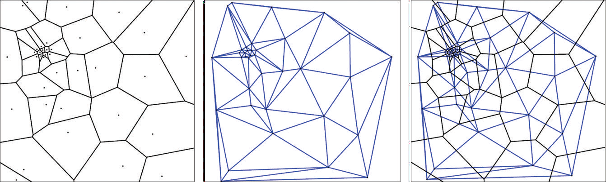

# 《多边形网格处理》第六章:网格重划分(Remeshing)

　　在许多工业应用中,如数值模拟和几何建模(如形状编辑,动画,变形),网格重划分是提高网格质量的关键技术.因此,近年来它受到了相当大的关注,并开发了大量的网格重划分算法.在本章中,我们专注于表面网格重划分,而不考虑体网格重划分.表面网格重划分的第一个目标是在一定的质量标准下降低输入表面网格的复杂性.这个过程通常被称为**网格简化(Mesh Simplification)**,这个主题将在第7章中介绍.网格重划分的第二个目标是提高网格的质量,这样它就可以用作各种下游应用程序的输入.不同的应用有着不同的质量标准和要求.为了更全面地了解该主题,我们建议读者参考一项调查[Alliez et al. 07],该调查提出了网格重划分的定义:"给定一个3D网格,计算另一个网格,其单元满足一些质量要求,同时合理地近似于输入."在这里,**近似(Approximation)**一词既可以理解为关于位置,也可以理解为关于法线或高阶微分性质.

　　与一般的网格修复(参见第8章)相反,网格重划分算法的输入通常假设已经是一个流形三角形网格或它的一部分.因此,术语**网格质量(Mesh Quality)**是指非拓扑属性,如采样密度,规则性,尺寸,方向,对齐和网格单元的形状.本章讨论网格重划分的后两个方面,并提出实现这一目标的各种方法.我们通过构建不同类型的网格重划分算法和澄清重网格文献中常用的一些概念来开始我们的讨论.从6.4节开始,我们将讨论几种重网格方法,重点关注每种方法背后的关键范例.

## 6.1 局部结构(Local Structure)

　　网格的局部结构由网格单元的类型,形状,方向和分布来描述.

▶ **单元类型(Element Type)**.最常见的目标单元类型是**三角形(Triangles)**和**四边形(Quadrangles)**.三角形网格通常更容易生成,而在四边形网格中,人们通常不得不满足于只有**四边形主导(Quad-Dominant)**的结果.请注意,原则上任何四边形网格都可以通过在每个四边形中插入一条对角线来轻松地转换为三角形网格.将三角形网格转换为四边形网格可以通过重心细分(通过插入其重心并将其连接到边缘中点将每个三角形划分为三个四边形)或通过将每个三角形的重心划分为三个新三角形(一对三分割)并丢弃原始网格边缘来执行.  
▶ **单元形状(Element Shape)**.单元可分为**各向同性(Isotropic)**和**各向异性(Anisotropic)**.各向同性单元的形状在所有方向上都是局部均匀的.理想情况下,如果三角形/四边形接近等边三角形/正方形,那么它就是各向同性的(见图6.1).
![图 6.1.各向同性:低(左)vs高(右).(图片来自于[Botsch et al. 06b].)](image.png)

对于三角形来说,这种圆度可以用其圆周半径与最短边的长度之比来测量(见[Shewchuk 97]).各向同性单元在数值应用(FEM或几何处理)中更受青睐,因为其单元的局部均匀形状通常对目标系统来说会更好调节(见[Shewchuk 02]中更详细的讨论).各向异性单元的形状局部根据表面上的方向而变化.当仔细对齐和定向时(参见下面的"单元对齐和定向"),各向异性网格更适用于形状逼近,因为它们通常需要比各向同性网格更少的单元来达到相同的逼近质量.各向异性元通常以表面的主曲率方向为取向(见第3章).此外,各向异性单元更好地表达了许多技术模型中固有的几何图元(柱体,锥体等)结构.

▶ **单元密度(Element Density)**.在**均匀(Uniform)**分布中,网格单元均匀地分布在整个模型中.在**非均匀(NonUnoform)**或**自适应(Adaptive)**分布中,单元的数量是变化的,例如,较小的单元被分配到高曲率的区域.当仔细设计时,自适应网格需要更少的单元来达到与均匀网格相当的近似质量.  
▶ **单元对齐和定向(Element Alignment and Orientation)**.将一个近似于分段光滑表面的网格转换成一个新的网格对应于一个重采样过程.因此,网格的尖锐特征可能会受走样现象的影响.为了防止这种情况,单元应该与尖锐的特征对齐,以便它们正确地表示切线不连续.此外,各向异性元素的定向在如实的形状逼近中起着至关重要的作用[Nadler 86].

## 6.2 全局结构(Global Structure)

　　三角形网格中的顶点如果其为内部顶点且价(即其相邻顶点的数量)为6或其为边界顶点且价为4则称为**正则(Regular)**顶点.在四边形网格中,规则价分别为4和3.其余顶点称为**不规则(Irregular)**顶点或**非规则(Extraordinary)**顶点.网格的整体结构可以分为**不规则(Irregular)**,**半规则(Semiregular)**,**高度规则(Highly Regular)**和**规则(Regular)**(见图6.2):  
▶ **不规则(Irregular)**网格在连通性上不表现出任何规律性.  
▶ **半规则(Semiregular)**网格是通过对粗初始网格进行规则细分而生成的.因此,在均匀细化下,半规则网格中的非规则顶点数量很少且恒定.[Eck et al. 95,Guskov et al. 00, Lee et al. 98,Kobbelt et al. 99a].  
▶ **高度规则(Highly Regular)**网格中的大多数顶点都是规则的.与半规则网格相比,高度规则网格不需要细分处理.[Szymczak et al. 02,Surazhsky and Gotsman 03,Alliez et al. 02,Surazhsky et al. 03].  
▶ **规则(Regular)**网格中所有的顶点都是规则的.规则的网格可以简洁地表示成一个二维数组,可用于高效的渲染(又称几何图像(Geometry Image))[Gu et al. 02,Sander et al. 03,Losasso et al. 03].

　　除了这种拓扑特征之外,网格重划分算法的适用性通常取决于其将元素组与主要几何特征对齐来捕获输入几何形状的全局结构的能力.由于这对应于整个子网格的对齐,例如几何基元的全局曲率线,因此它与网格分割技术密切相关[Marinov and Kobbelt 06].

　　完全规则网格只能为非常有限的输入模型生成,即拓扑上是(一部分)环面的模型.在处理之前,所有其他模型都必须切割成一个或多个拓扑磁盘(然后在接缝处破坏全局规则).此外,必须特别注意正确识别和处理因切割而产生的接缝.半规则网格特别适合于多分辨率分析和建模[Zorin et al. 97,Guskov et al. 00].它们在粗糙的基础网格上定义了模型的合理参数化.高度规则的网格需要不同的技术来进行多分辨率分析,它们非常适合于数值模拟.特别是,网格压缩算法可以利用均价分布并产生非常有效的连通性编码[Touma and Gotsman 98,Alliez and Desbrun 01,Kälberer et al. 05].

## 6.3 对应关系(Correspondences)

所有的网格重划分算法都计算原始表面上或附近点的位置.而且大多数算法反复重定位网格顶点来提高网格质量.因此,所有网格重划分算法中的一个关键问题是计算或维护生成网格上的点 $\textbf{p}$ 与输入网格上的对应点 $\phi(\textbf{p})$ 之间的对应关系.该问题有多种解决方法:  
▶ **全局参数化(Global Parameterization)**.将输入模型全局参数化到二维域(见第5章).然后可以很容易地在二维域中分布和重定位采样点,之后将其提升到三维中[Alliez et al. 03b,Alliez et al. 03a].  
▶ **局部参数化(Local Parameterization)**.该算法保持 $\phi(\textbf{p})$ 附近局部测地线邻域的参数化.当一个样本离开这个邻域时,需要计算一个新的邻域[Surazhsky et al. 03].  
▶ **投影(Projection)**.将采样点投影到输入模型最近的元素(点,边或三角形)上.

　　通常来说,全局参数化开销昂贵,并且当网格需要切割成拓扑磁盘时,可能会受到参数失真或不连续的影响.如果点离表面太远,原始的直接投影可能会产生局部和全局折叠.然而,在实际中,可以通过约束样本点在切平面上的移动来稳定投影算子.虽然没有理论上的保证,但这可以确保样本不会远离表面,从而可以安全地评估投影.局部参数化方法稳定且能产生高质量的结果.然而,它需要昂贵的统计来跟踪,缓存和重新参数化本地邻域.

## 6.4 Voronoi图和Delaunay三角剖分(Voronoi Diagrams and Delaunay Triangulations)

Voronoi图和Delaunay三角剖分是网格划分和网格重划分的重要几何数据结构.我们现在提供了任意维度的Voronoi图和Delaunay三角剖分的定义,尽管它们以后只会在二维和三维中使用.

　　设 $\mathcal{P}=\{\textbf{p}_1,...,\textbf{p}_n\}$ 为 ${\rm I \!R}^d$ 中的一组点(**所谓的站点(Sites)**).我们将每个站点 $\textbf{p}_i$ 以及其**Voronoi区域(Voronoi region)**关联起来使得
$$
V(\textbf{p}_i) = \{\textbf{x} \in {\rm I \!R}^d: || \textbf{x} - \textbf{p}_i || \leq  || \textbf{x} - \textbf{p}_j || , \forall j \ne i \}
$$

非空Voronoi区域的集合和它们的面,以及它们的关联关系,构成了一个称为 $\mathcal{P}$ 的**Voronoi图(Voronoi Diagram)**的单元复合体.参见图6.3(左)中的二维示例. $\mathcal{P}$ 的Voronoi图是 ${\rm I \!R}^d$ 的划分因为 ${\rm I \!R}^d$ 中任意一点都至少属于一个Voronoi区域.等距两个站点 $\textbf{p}_i$ 和 $\textbf{p}_j$ 的轨迹称为平分线,所有平分线都是 ${\rm I \!R}^d$ 的仿射子空间(二维是直线,三维是平面).站点 $\textbf{p}_i$ 的Voronoi单元也定义为由等分线包围的封闭半空间的交点.这意味着所有Voronoi单元都是凸的,因为凸集的交集仍然是凸的.注意,一些带无界等分线的Voronoi单元可能是无界的.当一个站点 $\textbf{p}_i$ 在 $\mathcal{P}$ 的凸包边界时,就会出现这种情况.Voronoi单元有不同维度的**面(Faces)**.在二维中,$k$ 维的面是3−$k$个Voronoi单元的交集.Voronoi顶点通常与三个点等距,且Voronoi边与两个点等距.如果 $1≤k≤d$ 的任意 $k$ 个点的集合的仿射包同胚于 ${\rm I \!R}^{k-1}$,且没有 $d+2$ 个点是共球的,则点集 $\mathcal{P}⊂{\rm I \!R}^d $ 是泛型或非简并的[Dey 06].我们建议读者参考[Okabe et al. 92, Boissonnat and Yvinec 98]了解有关Voronoi图的更多细节.

　　Voronoi图的双重结构称为**Delaunay三角剖分( Delaunay Triangulation)**;见图(6.3)(中).更具体地说,一组站点集 $\mathcal{P}$ 的三角剖分是一个单纯复形,如果 $k+1$ 个点在 $\mathcal{P}$ 中且他们的Voronoi单元有非空交集,则它们就形成一个Delaunay单纯形.在二维空间中,每个Delaunay三角形 $({\rm \bf p,q,r})$与一个Voronoi顶点对偶,其中 $V({\rm\bf p})$ , $V({\rm\bf q})$ , $V({\rm\bf r})$ 相交;每一个Delaunay边 $({\rm \bf p,q})$ 与一个Voronoi边对偶,其中 $V({\rm \bf p})$ 与 $V({\rm \bf q})$ 相交;以及每一个Delaunay顶点 $({\rm \bf p})$ 与其Voronoi面 ${V({\rm \bf p})}$ 对偶.点集 ${\mathcal P}$ 的Delaunay三角剖分覆盖了 ${\mathcal P}$ 的凸包.

　　由于与Voronoi图的对偶性,Delaunay三角剖分具有一些局部和全局性质.其中一个局部性质叫**空球性质(Empty Sphere Property)**.一个点集 ${\mathcal P}$ 的三角剖分 ${\mathcal T}$ 使得 ${\mathcal T}$ 的任意 $d$-单纯形都有一个不包围 ${\mathcal P}$ 的任何点的外接球,此为 ${\mathcal P}$ 的Delaunay三角剖分.相反,任何顶点在 ${\mathcal P}$ 中的 $k$ -单纯形,如果可以被一个不包围 ${\mathcal P}$ 的任何点的超球所限定,则是 ${\mathcal P}$ 的Delaunay三角剖分的一个面.在二维中,一个全局属性与最小的三角形角有关:点集 ${\mathcal P}$ 的Delaunay三角剖分是使最小角最大化的 ${\mathcal P}$ 的三角剖分.另一个更强的全局性是:对于字典顺序来说角向量(所有三角形角的集合)最大的 ${\mathcal P}$ 的三角剖分是 ${\mathcal P}$ 的Delaunay三角剖分.后两个性质解释了Delaunay三角剖分在网格生成中的成功,因为小角度会导致有限元方法中的数值问题.

　　在基于Delaunay表面网格划分算法中使用的另一个关键概念是**有限Delaunay三角剖分(Restricted Delaunay Triangulation)**.假设 $X$ 表示 ${\rm I \!R}^d$ 的子集; 