立方体纹理就是包含6个2D纹理的纹理.6个纹理有序排列在立方体的6个面.其可以通过方向向量采样立方体纹理上的纹素.

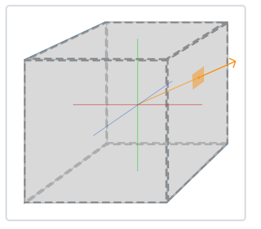

<!-- more -->

# 创建立方体纹理

创建立方体贴图跟创建2D贴图一样,但是绑定到GL_TEXTURE_CUBE_MAP上.

```sh
glGenTextures(1, &CubeMapID);
glBindTexture(GL_TEXTURE_CUBE_MAP, CubeMapID);
```

立方体纹理右6个面,每个面都要调用一次glTexImage2D,因此共需要调用6次.每个面有特定的纹理目标.按照顺序是这样.

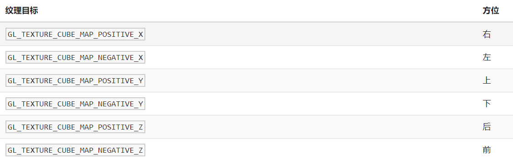

这些纹理目标为枚举型,按照顺序他们的值是线性叠加的.因此编写代码的时候可以用for循环调用glTex2D,然后用循环次数作为这些纹理目标的枚举值.从GL_TEXTUREE_MAP_POSITIVE_X开始.

例如以i作为循环次数记录.

```sh
glTexImage2D(GL_TEXTURE_CUBE_MAP_POSITIVE_X + i, 0, GL_RGB, width, height, 0, GL_RGB, GL_UNSIGNED_BYTE, data);
```

立方体纹理也需要设置环绕模式与过滤模式.

```sh
glTexParameteri(GL_TEXTURE_CUBE_MAP, GL_TEXTURE_WRAP_S, GL_CLAMP_TO_EDGE);
glTexParameteri(GL_TEXTURE_CUBE_MAP, GL_TEXTURE_WRAP_T, GL_CLAMP_TO_EDGE);
glTexParameteri(GL_TEXTURE_CUBE_MAP, GL_TEXTURE_WRAP_R, GL_CLAMP_TO_EDGE);
glTexParameteri(GL_TEXTURE_CUBE_MAP, GL_TEXTURE_MIN_FILTER, GL_LINEAR);
glTexParameteri(GL_TEXTURE_CUBE_MAP, GL_TEXTURE_MAG_FILTER, GL_LINEAR);
```

一般的纹理是二维的因此仅需要设定ST的环绕模式即可.但是立方体纹理是三维的因此需要对R设置.可以简单理解为z坐标.

# 天空盒

立方体纹理常用于天空盒.设置好纹理数据和VAO,VBO之后,编写天空盒用的shader就可以了.

```sh
#version 330 core
layout(location=0) in vec3 aPos;

out vec3 TexCoords;

uniform mat4 projection;
uniform mat4 view;

void main()
{
	TexCoords=aPos;
	gl_Position = projection * view * vec4(aPos, 1.0);
}
```
片元着色器获取立方体纹理的纹素作为颜色输出.

```sh
#version 330 core
out vec4 FragColor;
in vec3 TexCoords;
uniform samplerCube skyBox;
void main()
{
	FragColor=texture(skyBox,TexCoords);
}
```

在绘制天空和的时候需要开启深度测试,以及关闭天空盒的深度写入.因为有些对象与相机的距离可能比天空盒面到相机的距离远.因此这种情况下天空盒有可能将某些物体覆盖了.并且需要注意需要先渲染天空盒再渲染其他物体.

```sh
int main()
{
glDepthMask(GL_FALSE);
//绘制天空盒
//...
glDepthMask(GL_TRUE);
//绘制其他物体
}
```
如果按照以往的思路将MVP矩阵参数传进去将纹理坐标设置好的话并不会得到一个良好的结果.


因为我们不想天空盒跟场景中其他物体一样.天空盒不应受移动影响.仅受旋转和缩放影响.因此需要去掉观察矩阵的平移部分.即保留矩阵左上角部分.

```sh
view=glm::mat4(glm::mat3(view))
```

将这个view传进去shader可得到正确的显示.

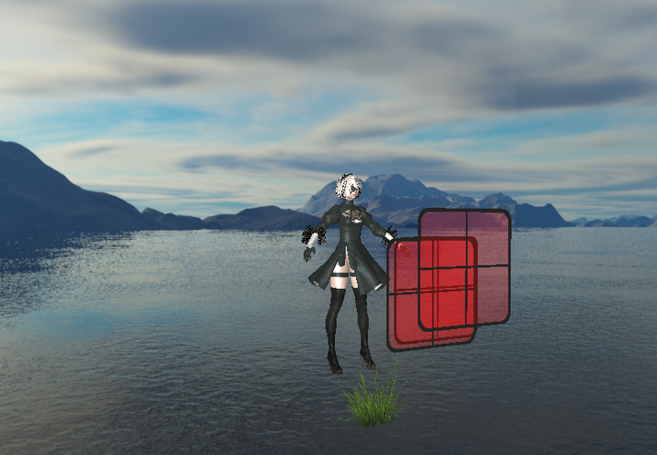

以上的做法是关闭深度写入,让天空盒不参与深度测试.让每个像素都运行一次天空盒的片元着色器.但其实将天空盒的深度值永远设置为1就可以获得正确的效果了并且参与深度测试的话也不需要每个像素都调用天空盒的着色器.因为在某些复杂的场景里面天空盒仅仅显示一小部分.为此,我们需要将天空盒深度值永远设为1.

根据流水线,在顶点着色器运行时投影矩阵会进行透视除法,并最后处于标准化设备空间(NDC)中的.
$$
out=\begin{equation}
	\begin{pmatrix} x/w \\ y/w \\ z/w \end{pmatrix}
\end{equation}
$$

因此若想经过透视除法后的z值为1,则需要将z值定为w.

```sh
#version 330 core
layout(location=0) in vec3 aPos;

out vec3 TexCoords;

uniform mat4 projection;
uniform mat4 view;

void main()
{
    TexCoords=aPos;
    vec4 pos = projection * view * vec4(aPos, 1.0);
    gl_Position = pos.xyww;
}
```

将z值定为w进行透视除法后就变为1.

这时候还需要开启深度测试并调用深度测试函数设置比较运算符为GL_LEQUAL.

GL_LEQUAL为片元的深度值小于等于缓存的深度值时通过测试.因为如果调用默认的GL_LESS的话基本上天空盒是不会通过测试的.这时候就不需要设置关闭深度写入了.

```sh
glDepthFunc(GL_LEQUAL);
//绘制天空盒
glDepthFunc(GL_LESS);
```

绘制完天空盒之后改回默认的深度运算操作符,以便其他物体进行深度测试.

如果场景里面没有需要透明度混合的物体的话则天空盒可以随便放置于主循环的某一个位置进行渲染.否则的话会出现这种情况.

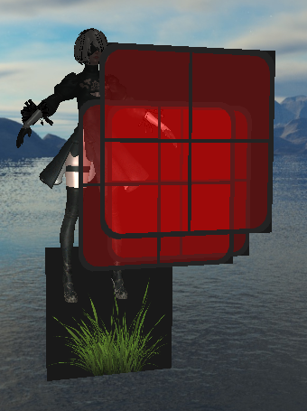

2B因为不需要透明度混合,因此可以获得正常的渲染效果.但是草地于窗户精灵体需要透明度混合因此会出现奇怪的效果.

这里我是先渲染场景的所有物体,最后才渲染天空盒的.因此这时候场景物体部分的深度值比1小,通过测试与默认的颜色缓存的颜色进行混合.接着天空盒与深度缓存进行测试,因为天空盒深度值为1,比场景里物体的深度值大,因此这部分片元会被抛弃.所以物体混合的颜色里面没有天空盒纹理的颜色.

为此,最好在主循环刚开始的时候渲染天空盒.让天空盒颜色代替默认颜色缓存里的颜色.

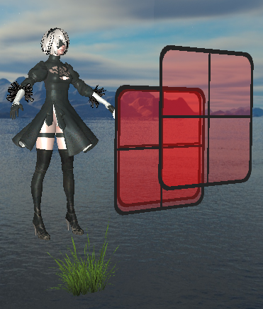

所以,无论是对天空盒关闭深度写入还是设置天空盒的深度值为1,都最好在主循环开始的时候渲染.

# 反射

立方体纹理可以用于环境映射.常用有反射和折射.首先是反射:

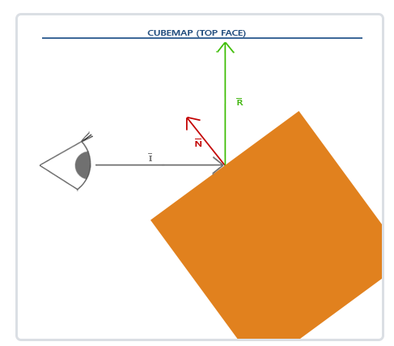

反射很简单.主要就是获取向量 $R$ 的方向然后通过 $R$ 在立方体纹理中获取纹素.

在顶点着色器获取片元的位置以及法向量输出到片元着色器.

```sh
#version 330 core 
layout (location=0) in vec3 aPos;
layout (location=1) in vec3 aNormal;

out vec3 fragPos;
out vec3 Normal;

uniform mat4 model;
uniform mat4 view;
uniform mat4 projection;

void main() 
{  
	Normal=mat3(transpose(inverse(view*model)))*aNormal;
	fragPos=vec3(view*model*vec4(aPos,1.0));

	gl_Position=projection*view*model*vec4(aPos,1.0); 
} 
```

这里的法线用了法线矩阵消除缩放对物体法线的影响.片元位置放置在相机空间中,因为我偏好于将这些计算放在相机空间,这样就不用在片元着色器计算观察位置到片元位置了,直接可以用片元位置代替,因为在相机空间中,摄像机的位置就是原点.

根据上面的图片,需要在片元着色器计算反射向量 $𝑅$ .反射向量可以通过GLSL内置函数 
$𝑟𝑒𝑓𝑙𝑒𝑐𝑡$
计算,也可以用反射向量的计算方式计算 $R:I−2∗(n \cdot I)∗𝑛$ .因为在顶点着色器片元位置在相机空间下,所以向量 $𝐼$ 仅需要对片元位置归一化即可.

```sh
#version 330 core 
out vec4 FragColor; 

in vec3 Normal;
in vec3 fragPos;

uniform samplerCube skybox;

void main() 
{ 
	//环境映射反射
        vec3 I=normalize(fragPos);
	vec3 R=reflect(I,normal);

	FragColor=vec4(texture(skybox,R).xyz,1.0);
} 
```
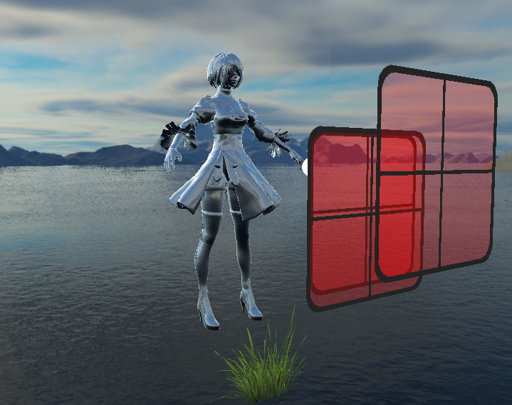

可以运用反射贴图使模型的仅某一部分进行反射.通过引入反射贴图并对反射贴图进行采样获得当前网格的反射系数,然后运用插值对模型的反射贴图与其他光照模型进行综合

```sh
struct Material
{
	sampler2D texture_diffuse0;
	sampler2D texture_specular0;
	sampler2D texture_normal0;
	sampler2D texture_reflection0;
	float shininess;//影响镜面高光的散射/半径
};
```

在material就结构体里面增加一个反射贴图的声明.接着求出反射系数.

```sh
float reflectRate=(texture(material.texture_reflection0,TexCoords).r+texture(material.texture_reflection0,TexCoords).g+texture(material.texture_reflection0,TexCoords).b)/3;
```

不过反射贴图一般颜色分量不是0就是1,所以也可以简单点

```sh
float reflectRate=texture(material.texture_reflection0,TexCoords).r;
```

在总颜色输出那里做一个插值就可以了.

```sh
void main() 
{ 
	vec3 normal=normalize(Normal);
	vec3 viewDir=normalize(-fragPos);//观察空间下进行
	vec3 Direction=CalcDirectionalLight(dirLight,normal,viewDir);
	vec3 Point = CalcPointLight(pointLight,normal,fragPos,viewDir);
	vec3 Spot=CalcSpotLight(spotLight,normal,fragPos,viewDir);

	//环境映射反射
	vec3 I=normalize(fragPos);
	vec3 R=reflect(I,normal);

	float reflectRate=texture(material.texture_reflection0,TexCoords).r;

	vec4 reflection=texture(skybox,R);
	FragColor=vec4(reflectRate*reflection.xyz+(1-reflectRate)*(Spot+Point+Direction),1.0);
}
```

最终效果中可以看到身上比较闪闪的地方都有天空盒的映射,其中以眼部的镜片效果最明显.

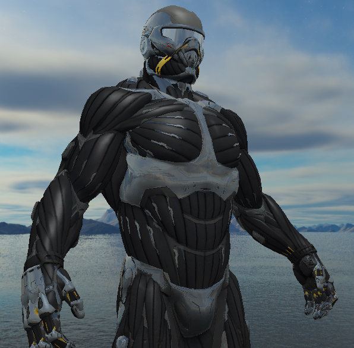

# 折射

折射与反射的区别不大,就是将 $𝑟𝑒𝑓𝑙𝑒𝑐𝑡$ 函数改为 $𝑟𝑒𝑓𝑟𝑎𝑐𝑡$ 函数,再加一个折射率常数.

折射用到了斯涅耳定律,斯涅耳定律很简单:$\eta_{1}sin\theta_{1}=\eta_{2}sin\theta_{2}$

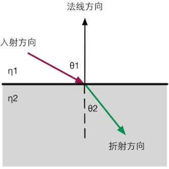

其中 $\eta_{1}$ , $\eta_{1}$ 表示两种介质的折射率, $\theta_{1}$ , $\theta_{2}$ 表示光线方向与法线的夹角.

介质的折射率有一个固定的参数.

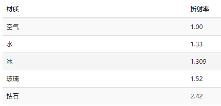

但是!!!我们不需要自己计算斯涅尔定律,反射有内建GLSL函数.折射与反射的区别不大,就是将  𝑟𝑒𝑓𝑙𝑒𝑐𝑡 函数改为 𝑟𝑒𝑓𝑟𝑎𝑐𝑡 函数,再加一个折射率常数.将上述反射部分的片元着色器代码修改下.

其中 $ratio=\frac{\eta_{1}}{\eta_{2}}$,两种折射率比例.然后作为 𝑟𝑒𝑓𝑟𝑎𝑐𝑡 的第三个参数就行.

```sh
float ratio=1.0/1.33;
vec3 I=normalize(fragPos);
vec3 R=refract(I,normal,ratio);

FragColor=vec4(texture(skybox,R).xyz,1.0);
```

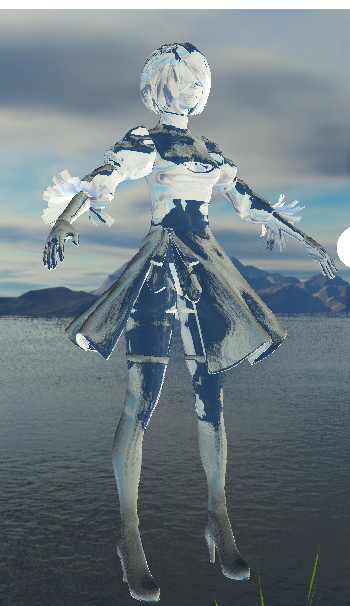

当然, 𝑟𝑒𝑓𝑟𝑎𝑐𝑡 函数想要自己算也不是不行.

---

杨超：cg refract函数
https://zhuanlan.zhihu.com/p/65105474

---

这里有一篇折射函数的推导过程.其中$eta=ratio=\frac{\eta_{1}}{\eta_{2}}$

按照这篇文章的推导即可得到正确折射向量:
```sh
vec3 refract(vec3 I,vec3 normal,float ratio)
{
	vec3 OC=dot(-I,normal)*normal;
	vec3 CA=-I-OC;
	vec3 EB=-ratio*CA;
	float EB_length_2=EB.x*EB.x+EB.y*EB.y+EB.z+EB.z;

	vec3 OE=-sqrt(1-EB_length_2)*normal;

	return EB+OE;
}
```

# 参考文档或书籍

---

立方体贴图 - LearnOpenGL CN
https://learnopengl-cn.github.io/04%20Advanced%20OpenGL/06%20Cubemaps/

---