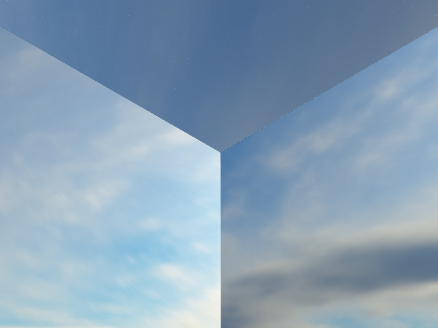
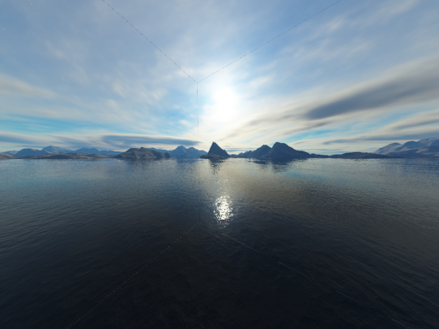

# CubeMap采样过程

在OpenGL，Vulkan等API中，采样CubeMap的话需要先将所需的6个面的贴图数据传入GPU，然后再GLSL或者HLSL之类的着色器语言中根据三维的纹理坐标来采样。

在OpenGL中，首先需要指定一个GL_TEXTURE_CUBE_MAP类型的纹理ID。然后读取6张贴图的像素值，再对每张贴图的像素调用glTexImage2D来生成2D纹理.在glTexImage2D函数的第一个参数需要绑定到对应的纹理目标来告诉OpenGL当前的纹理是用于CubeMap的哪个面.有以下纹理目标：

● GL_TEXTURE_CUBE_MAP_POSITIVE_X  
● GL_TEXTURE_CUBE_MAP_NEGATIVE_X  
● GL_TEXTURE_CUBE_MAP_POSITIVE_Y  
● GL_TEXTURE_CUBE_MAP_NEGATIVE_Y  
● GL_TEXTURE_CUBE_MAP_POSITIVE_Z  
● GL_TEXTURE_CUBE_MAP_NEGATIVE_Z  

十分直接明了,只需要读取图片像素,绑定好对应的纹理目标,然后再GLSL中使用samplerCube就行了.

具体的实现细节可以看：

---

立方体贴图 - LearnOpenGL CN
https://learnopengl-cn.github.io/04%20Advanced%20OpenGL/06%20Cubemaps/

---

Vulkan就比较麻烦一点.因为需要手动管理贴图的缓冲,并没有类似于GL_TEXTURE_CUBE_MAP_POSITIVE_X的纹理目标.

可以以+X,-X,+Y,-Y,+Z,-Z的顺序依次读取6张图片的像素然后存储在容器中,然后创建一个6张图片大小的缓冲区,在调用vkCmdCopyBufferToImage函数的时候指定6个缓冲块.每个块设定好在缓冲区的偏移位置,大小等信息.如下:
```sh
std::vector<VkBufferImageCopy> copyRegions;
for (uint32_t i = 0; i < imageCount; ++i)
{
	VkBufferImageCopy copyRegion = {};
	copyRegion.bufferOffset = i * width * height * 4;
	copyRegion.imageExtent.width = width;
	copyRegion.imageExtent.height = height;
	copyRegion.imageExtent.depth = 1;
	copyRegion.imageSubresource.aspectMask = VK_IMAGE_ASPECT_COLOR_BIT;
	copyRegion.imageSubresource.baseArrayLayer = i;
	copyRegion.imageSubresource.layerCount = 1;
	copyRegion.imageSubresource.mipLevel = 0;
	copyRegion.imageOffset = { 0,0 };
	copyRegions.emplace_back(copyRegion);
}
vkCmdCopyBufferToImage(commandBuffer, buffer, image, VK_IMAGE_LAYOUT_TRANSFER_DST_OPTIMAL, copyRegions.size(), copyRegions.data());
```

bufferOffset指定当前块在缓冲区中的偏移,width*height*4为图片像素的大小.乘以4是因为图片使用了RGBA四个通道(其实一般用于天空盒之类的使用RGB通道就好了,但是使用了RGB通道在我的Intel Graphics 500上可以运行,但在Nvidia GeForce 840M上则疯狂报错).然后指定当前块的层级(baseArrayLayer),然后将这一缓冲区复制到图像上就可以了.

可以看看Sascha Willems的Vulkan例子中关于CubeMap的实现：

---

https://github.com/SaschaWillems/Vulkan/blob/master/examples/texturecubemap/texturecubemap.cpp
https://github.com/SaschaWillems/Vulkan/blob/master/examples/texturecubemap/texturecubemap.cpp

---

不过,换一种思路,如果不用内建的samplerCube,而是传进6张图片到片元着色器中进行采样要怎么样做呢.

在《Real Time Readering》第四版一书中第6.2.4小节有说到:

 > A cube map is accessed with a three-component texture coordinate vector that specifies the direction of a ray pointing from the center of the cube outward. The point where the ray intersects the cube is found as follows. The texture coordinate with the largest magnitude selects the corresponding face (e.g., the vector (−3.2,5.1,−8.4) selects the −z face). The remaining two coordinates are divided by the absolute value of the largest magnitude coordinate, i.e., 8.4. They now range from −1 to 1, and are simply remapped to [0,1] in order to compute the texture coordinates. For example, the coordinates (−3.2,5.1) are mapped to ((−3.2/8.4+1)/2, (5.1/8.4+1)/2) ≈ (0.31,0.80).

大概意思就是CubeMap使用三维纹理坐标采样.首先选择标量正值最大的那个分量作为采样的面.例如(−3.2,5.1,−8.4)就选-Z面进行采样,剩下的那两个分量就除以标量正值最大的那个分量,以便映射到[-1,1]区间.之后再将这些值映射到[0,1]区间,以便计算纹理坐标值.

首先,定义一个立方体网格:

```sh
float skyboxVertices[24] = 
{
	//position
	-1.0f,1.0f,-1.0f,
	-1.0f,1.0f, 1.0f,
	 1.0f,1.0f, 1.0f,
	 1.0f,1.0f,-1.0f,
	-1.0f,-1.0f,-1.0f,
	-1.0f,-1.0f, 1.0f,
	 1.0f,-1.0f, 1.0f,
	 1.0f,-1.0f,-1.0f
};
uint32_t skyboxIndices[36] =
{
	//+x
	3,6,7,
	3,2,6,
	//-x
	0,5,1,
	0,4,5,
	//+y
	0,1,2,
	0,2,3,
	//-y
	4,6,5,
	4,7,6,
	//+z
	1,5,6,
	1,6,2,
	//-z
	0,7,4,
	0,3,7
};
```

立方体的8个顶点将作为采样要用到的三维纹理坐标.由于都是在[-1,1]区间,所以上述映射到[-1,1]区间这一步就免了.

片元着色器的具体GLSL代码实现如下:
```sh
#version 330 core
out vec4 FragColor;
in vec3 TexCoords;
uniform sampler2D posx;
uniform sampler2D negx;
uniform sampler2D posy;
uniform sampler2D negy;
uniform sampler2D posz;
uniform sampler2D negz;

vec4 textureCube(sampler2D posx,sampler2D negx,sampler2D posy,sampler2D negy,sampler2D posz,sampler2D negz,vec3 cubeTexcoord)
{
	float mag=max(max(abs(TexCoords.x),abs(TexCoords.y)),abs(TexCoords.z));
	if(mag==abs(TexCoords.x))
	{
		if(TexCoords.x>0)
			return texture(posx,vec2((TexCoords.z+1)/2,(TexCoords.y+1)/2));
		else if(TexCoords.x<0)
			return texture(negx,vec2((TexCoords.z+1)/2,(TexCoords.y/mag+1)/2));
	}
	else if(mag==abs(TexCoords.y))
	{
		if(TexCoords.y>0)
			return texture(posy,vec2((TexCoords.x+1)/2,(TexCoords.z+1)/2));
		else if(TexCoords.y<0)
			return texture(negy,vec2((TexCoords.x+1)/2,(TexCoords.z+1)/2));
	}
	else if(mag==abs(TexCoords.z))
	{
		if(TexCoords.z>0)
			return texture(posz,vec2((TexCoords.x+1)/2,(TexCoords.y+1)/2));
		else if(TexCoords.z<0)
			return texture(negz,vec2((TexCoords.x+1)/2,(TexCoords.y+1)/2));
	}
}

void main()
{
	FragColor=textureCube(posx,negx,posy,negy,posz,negz,TexCoords);
}
```

首先从顶点着色器中获取纹理坐标.然后去正数最大的那个分量.再根据该分量的符号判断需要采样的面.然后对剩下的两个分量映射到[0,1]区间.

但是运行会发现两个面之间是有断层的:



因为两个相对的面是存在镜像的,所以如果统一以左下角为原点的话,则相对的另一个面是以右下角为原点的.所以需要修改一下纹理坐标.

```sh
float mag=max(max(abs(TexCoords.x),abs(TexCoords.y)),abs(TexCoords.z));
if(mag==abs(TexCoords.x))
{
	if(TexCoords.x>0)
		return texture(posx,vec2(1-(TexCoords.z+1)/2,(TexCoords.y+1)/2));
	else if(TexCoords.x<0)
		return texture(negx,vec2((TexCoords.z+1)/2,(TexCoords.y+1)/2));
}
else if(mag==abs(TexCoords.y))
{
	if(TexCoords.y>0)
		return texture(posy,vec2((TexCoords.x+1)/2,1-(TexCoords.z+1)/2));
	else if(TexCoords.y<0)
		return texture(negy,vec2((TexCoords.x+1)/2,(TexCoords.z+1)/2));
}
else if(mag==abs(TexCoords.z))
{
	if(TexCoords.z>0)
		return texture(posz,vec2((TexCoords.x+1)/2,(TexCoords.y+1)/2));
	else if(TexCoords.z<0)
		return texture(negz,vec2(1-(TexCoords.x+1)/2,(TexCoords.y+1)/2));
}
```

再每个坐标轴上对另一个面的纹理坐标进行镜像操作.例如,再x轴上的两个面在z轴方向上是相反的,则1-以进行镜像,y轴与z轴上的面同理.

最后就得到一个观感正常的天空盒.注意面之间因为没有做抗锯齿的操作,导致锯齿产生裂缝.

