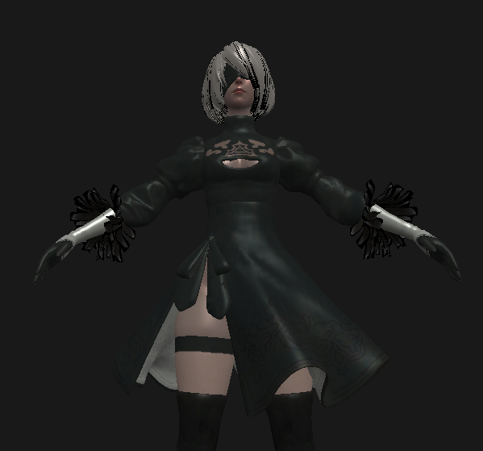
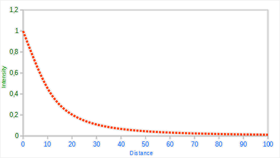
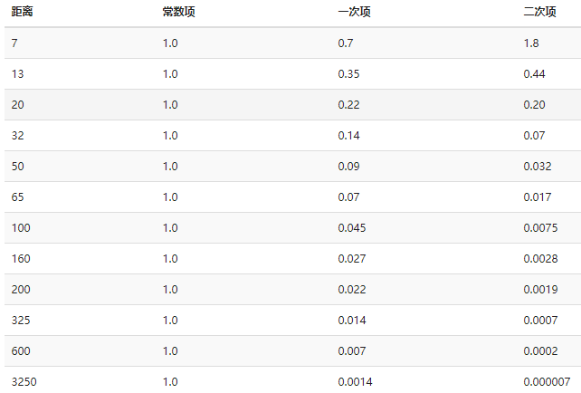
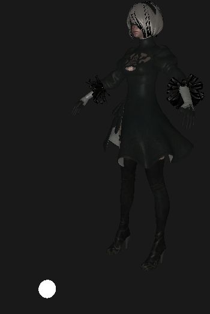
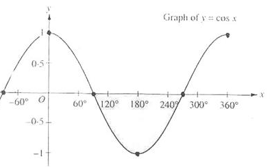
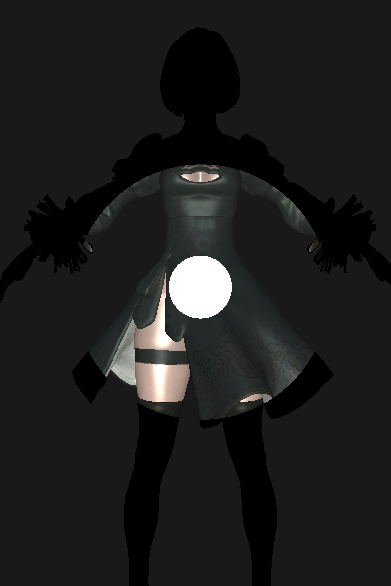
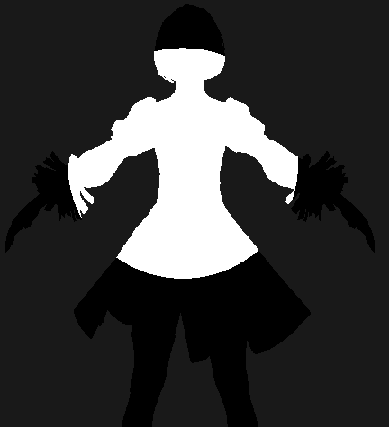
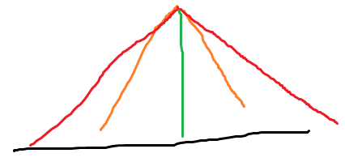

主要介绍三种光源的属性,公式和效果


# 平行光
平行光比较简单,主要包含一个代表方向的三维向量.当然使用齐次坐标向量也行.但是要把 
$𝑤$分量设置为0代表方向向量而不是点向量.然后再使用Phong着色模型中的diffuse,specular,和ambient对场景物体的贴图描述得到.GLSL代码可以先定义一个关于平行光的结构体:

```sh
struct DirectionalLight
{
	vec3 direction;

	vec3 ambient;
	vec3 diffuse;
	vec3 specular;
};
uniform DirectionalLight dirLight;
```

一般平行光在一个场景里面用一个就够了.当然想要来点别出心裁的也可以设立多个   平行光源.但是得注意性能开销.

```sh
vec3 CalcDirectionalLight(DirectionalLight dirLight,vec3 normal,vec3 viewDir)//计算平行光
{
	vec3 lightDir=normalize(-dirLight.direction);

	float diff=0.5*dot(normal,lightDir)+0.5;

	float spec=pow(max(0.0,dot(normal,normalize(viewDir+lightDir))),material.shininess);

	vec3 ambient=dirLight.ambient*texture(material.texture_diffuse0,TexCoords);
	vec3 diffuse=dirLight.diffuse*diff*texture(material.texture_diffuse0,TexCoords);
	vec3 specular=dirLight.specular*spec*texture(material.texture_specular0,TexCoords);

	return (ambient+diffuse+specular);
}
```

上面就是计算平行光的函数了,平行光的方向主要作用于Phong氏着色模型.然后通过三个分量对纹理进行采样最后叠加,返回一个RGB形式的颜色值．

设置一下平行光的参数:
```sh
objectShader.setVec3("dirLight.direction", -0.2,-1.0,-0.3);
objectShader.setVec3("dirLight.ambient", glm::vec3(0.0));
objectShader.setVec3("dirLight.diffuse", glm::vec3(0.05));
objectShader.setVec3("dirLight.specular", glm::vec3(0.2));
```



# 点光
点光稍微复杂一点.

首先点光需要一个**位置向量**.然后还得有一个衰减的效果.现实世界中,在靠近点光源比较近的情况下会显得特别亮,然而距离越远的时候光线衰减的特别快,然后在比较远地方衰减又不是很明显.可以想象得到,光线的衰减并不是线性的.因此需要用一个方程来描述这种衰减特性.

目前已经有这样的一个公式了:
$$
\begin{equation} F_{att} = \frac{1.0}{K_c + K_l * d + K_q * d^2} \end{equation}
$$

$𝑑$指的是光源位置到片元位置的距离.

$K_{c}$ 是一个常数项,一般为1.0.主要保证分母永远大于1,否则的话在某些距离上它反而会增加强度.可以想象一下 如果$F_{att}$得出的结果大于1,则光强大于1,明显会比原来还亮.常理上说不通.但是如果用于一个光怪陆离的游戏场景中也许会获得意想不到的结果哈哈.

$K_l * d$可以看到是一个一次函数.这是线性的.因此这部分是模拟光线性衰减的特性. $K_l$是自己定义的变量.
$K_q * d^2$ 是一个二次函数,用于模拟光的非线性衰减部分.同样$K_q$也是自定义的变量.

由于有二次项,光线会在大部分时候以线性的方式衰退,直到距离在一定程度上让二次项超过一次项,光的强度会以更快的速度下降.导致光在近距离时亮度很高,但随着距离变远亮度迅速降低,最后会以更慢的速度减少亮度.在100个单位距离内光线的衰减图:



以下的表中根据上面三个变量获得的点光源半径:



在代码中,点光结构体可以这样定义:
```sh
struct PointLight
{
	vec3 position;

	float constant;
	float linear;
	float quadratic;

	vec3 ambient;
	vec3 diffuse;
	vec3 specular;
};
uniform PointLight pointLight;
//uniform PointLight pointLight[lightnum];
```

游戏场景中一般有多个点光源,来模拟灯,火把以及火堆等情况.因此可以定义一个数组将场景中的点光记录下来进行计算.当然灯光的使用也是有性能开销的,要合理控制场景内的光源.

```sh
vec3 CalcPointLight(PointLight light,vec3 normal,vec3 fragPos,vec3 viewDir)
{
  vec3 lightDir=normalize(light.position-fragPos);

  float distance=length(light.position-fragPos);
  float attenuation=1.0/(light.constant+light.linear*distance+light.quadratic*distance*distance);

  float diff=0.5*dot(normal,lightDir)+0.5;
  float spec=pow(max(dot(normal,normalize(viewDir+lightDir)),0.0),material.shininess);

  vec3 ambient=light.ambient*texture(material.texture_diffuse0,TexCoords);
  vec3 diffuse=light.diffuse*texture(material.texture_diffuse0,TexCoords)*diff;
  vec3 specular=light.specular*texture(material.texture_specular0,TexCoords)*spec;

  return (ambient+diffuse+specular)*attenuation;
}
```

以上就是计算点光的函数了.套用公式很容易理解.

```sh
objectShader.setVec3("pointLight.position", pointPos);
objectShader.setVec3("pointLight.ambient", glm::vec3(0.1));
objectShader.setVec3("pointLight.diffuse", glm::vec3(0.5));
objectShader.setVec3("pointLight.specular", glm::vec3(0.4));
objectShader.setFloat("pointLight.constant", 1.0);
objectShader.setFloat("pointLight.linear", 0.022);
objectShader.setFloat("pointLight.quadratic", 0.0019);
```

在代码中设置点光的属性,可以得到下图的表现:



# 聚光

聚光最容易联想到的例子是电筒.聚光的光线从某一个位置射出,然后有一个锥形的发光部分.只有位于锥形内的物体才被照亮.其他保持黑暗.


上图可以看到,聚光有一个**位置**,一个**方向**,一个**切光角**𝜙,一个光源方向于光源到片元方向的夹角𝜃.

根据聚光的特性,我们要做的就是判断哪些片元在聚光的圆锥体内.判断的方法是对比图中𝜙与𝜃的大小:

● 𝜃 >= 𝜙:计算片元的ambient,diffuse与specular.

● 𝜃 < 𝜙:计算片元的ambient.

这里直接计算角度不太容易.而且直接获取角度也需要额外的性能开销.因此用一个诀窍会节省性能.

$\alpha\cdot\beta=\left| \alpha \right|*\left| \beta \right|*cos(\theta)$ 这是向量点积的公式.用过转换可以得到 $cos(\theta)=\frac{\alpha\cdot\beta}{\left| \alpha \right|*\left| \beta \right|}$.

然后将 𝛼, 𝛽 归一化 $\left| \alpha \right|*\left| \beta \right|$ 结果为1.即
$$
cos(\theta)=\alpha\cdot\beta
$$

因此 𝜃 与 𝜙 的比较可以变为 $cos(\theta)$ 与 $cos(\theta)$ 的比较.

不过这里也有一个要注意的地方. $𝑐𝑜𝑠$ 函数在$[0,π]$区间是递减的.



因此,若

● $\theta>=\phi$,则$cos(\theta)<=cos(\phi)$

● $\theta<\phi$,则$cos(\theta)>cos(\phi)$

GLSL定义聚光代码如下:
```sh
struct SpotLight
{
	vec3 position;
	vec3 direction;

	float innerCutOff;

	vec3 ambient;
	vec3 diffuse;
	vec3 specular;
};
```
这里的innerCutOff传进去的是 $cos(\phi)$ 值而不是 𝜙 值.

计算函数如下:
```sh
vec3 CalcSpotLight1(SpotLight light,vec3 normal,vec3 fragPos,vec3 viewDir)
{
	vec3 ambient=light.ambient*texture(material.texture_diffuse0,TexCoords);
	vec3 lightDir=normalize(light.position-fragPos);
	float theta=dot(lightDir,normalize(-light.direction));
	if(theta>light.innerCutOff)
	{
		float diff=0.5*dot(normal,lightDir)+0.5;
		float spec=pow(max(dot(normal,normalize(viewDir+lightDir)),0.0),material.shininess);
		vec3 diffuse=light.diffuse*texture(material.texture_diffuse0,TexCoords)*diff;
		vec3 specular=light.specular*texture(material.texture_specular0,TexCoords)*spec;
		return ambient+diffuse+specular;
	}
	else
		return ambient;
 
}
```

设置聚光的参数:
```sh
objectShader.setVec3("spotLight.position", camera.Position);
objectShader.setVec3("spotLight.direction", camera.Front);
objectShader.setFloat("spotLight.innerCutOff", glm::cos(glm::radians(10.0)));
objectShader.setVec3("spotLight.ambient", glm::vec3(0));
objectShader.setVec3("spotLight.diffuse", glm::vec3(1));
objectShader.setVec3("spotLight.specular", glm::vec3(1));
```




可以改变一下输出的颜色值.可以得到一些很有趣的画面.



注意,圆锥边缘太锋利颜色过渡太锋利了,现实中聚光边缘会相对柔和很多,而且中心颜色强度到边缘颜色强度之间有一个平缓的渐变.

为了解决这个问题,聚光中加入一个变量--外切光角,上面提到的切光角变为内切光角.同样,传进去的也是余弦值.

```sh
struct SpotLight
{
	vec3 position;
	vec3 direction;

	float innerCutOff;
	float outerCutOff;

	vec3 ambient;
	vec3 diffuse;
	vec3 specular;
};
uniform SpotLight spotLight;
```



这里的计算不需要对角度进行判断了,因为在shader里面分支语句和循环语句都挺消耗性能的.

这里引入一个计算公式:
$$
I=\frac{cos(\theta)-cos(\gamma)}{cos(\phi)-cos(\gamma)}
$$

$𝐼$ 就是最终的光强 $Intensity$ , 𝛾 是外切光角.

根据计算公式得函数:
```sh
vec3 CalcSpotLight(SpotLight light,vec3 normal,vec3 fragPos,vec3 viewDir)
{
	vec3 lightDir=normalize(light.position-fragPos);

	float theta=dot(lightDir,normalize(-light.direction));
	float intensity=clamp((theta-light.outerCutOff)/(light.innerCutOff-light.outerCutOff),0.0,1.0);

	float diff=0.5*dot(normal,lightDir)+0.5;
	float spec=pow(max(dot(normal,normalize(viewDir+lightDir)),0.0),material.shininess);

	vec3 ambient=light.ambient*texture(material.texture_diffuse0,TexCoords);
	vec3 diffuse=light.diffuse*texture(material.texture_diffuse0,TexCoords)*diff;
	vec3 specular=light.specular*texture(material.texture_specular0,TexCoords)*spec;

  return (ambient+diffuse+specular)*intensity;
}
```
代码中使用 clamp()函数将光线约束在 $[0,1]$ 区间.

设置新的参数:
```sh
objectShader.setVec3("spotLight.position", camera.Position);
objectShader.setVec3("spotLight.direction", camera.Front);
objectShader.setFloat("spotLight.innerCutOff", glm::cos(glm::radians(10.0)));
objectShader.setFloat("spotLight.outerCutOff", glm::cos(glm::radians(15.0)));
objectShader.setVec3("spotLight.ambient", glm::vec3(0));
objectShader.setVec3("spotLight.diffuse", glm::vec3(1));
objectShader.setVec3("spotLight.specular", glm::vec3(1));
```
最终的结果如图:


修改了下最终输出的颜色:


通过设置不同的参数可以获取不同的灯光体验.

# 参考文档或书籍

---

投光物-learnopengl-cn
https://learnopengl-cn.github.io/02%20Lighting/05%20Light%20casters/

---