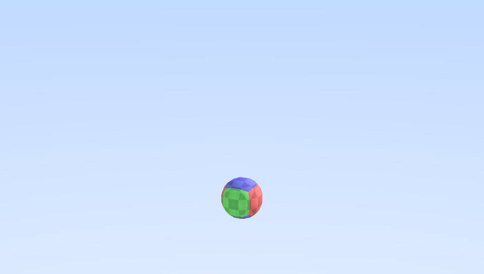
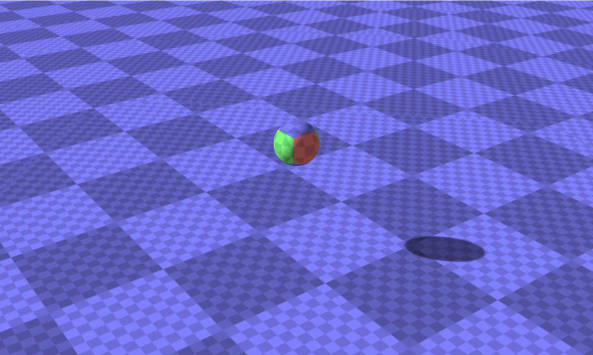
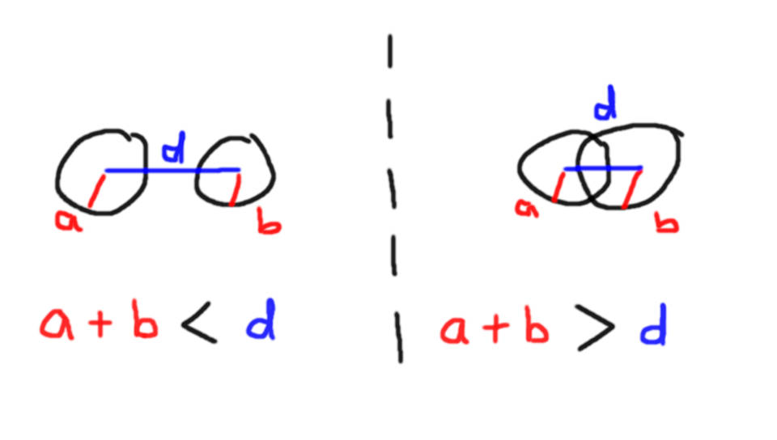
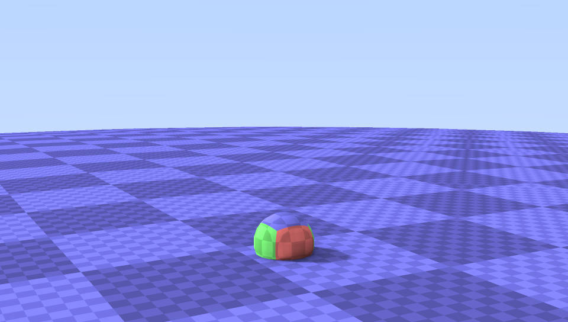

#  GamePhysicsInOneWeekend V1.07 个人翻译

## 1. 总览
本系列书籍受Peter Shirley相似名字的书籍"Ray Tracing In One Weekend"启发.他的书可以让没有任何图形编程知识的人都可以自制一个光线追踪器.

　　读完他的书之后,我想对于学科应该尽可能有更多相似系列的书籍.总之,在开始学习某个学科时,最困难的部分经常是弄清楚如何开始.

　　甚至,我有一个做一点微小贡献的想法.所以这本书就是我的结果.现在,这本书并不是让你成为一个游戏刚体物理方面的专家,它旨在成为该学科的一个大出发点.并且如果你完成了本系列,则在最后你会明白连续碰撞检测,约束,汽车,布娃娃系统,且你可以模拟一个稳定的方块栈.

　　因为这是一本关于游戏物理的书,所以你需要一个渲染器.如果你自己有一个,那就太好了.如果没有的话,我准备了一个简单的Vulkan渲染器.与本书一起的网站, [https://gamephysicsweekend.github.io/](https://gamephysicsweekend.github.io/),有介绍怎么样使用.特别说明,这个"渲染器"只是本书的一个骨架项目.这个项目里面有一些注释"// TODO: add code",这就是需要你从书中手动写代码到项目里的地方.

　　本书的代码是用C++写的.由于本书计划用于游戏应用,我假设你是游戏行业从业人员或者打算投身于游戏工业的学生.且C++在游戏开发中普遍使用,所以它是本书自然而然的选择.

　　与此同时也假设你知道一些向量微积分,线性代数以及四元数的一些知识.如果不知道也没关系.我推荐Schaum的大纲作为导引.这些书相对不太贵且有着吸引人的学科概述.我也推荐3blue1brown的视频讲义来构建数学直觉.

　　讲到数学,本书假设+z轴为上向量;其他人喜欢使用+y轴作为上向量,但这里不是.以及作为基本簿记,向量是写成变量上有一个小箭头,$\vec v$ ,矩阵则总是大写粗体,**M**,四元数则是小写粗体,**q**,标量可以大写也可以小写,$s S$  
$$
{\vec v} - 向量 \\
{\textbf M} - 矩阵 \\
{\textbf q} - 四元数 \\
s - 标量
$$
　　最后,我从没找到一本书是没有任何错误的.所以如果你找到任何错误,可以在推特@ghodges_dev上给出建设性的反馈或问题.如果没有社交媒体,则可以给我发电子邮件greg@gamephysicsweekend.com.一些人喜欢在github页面提交issue,那也是极好的联系.但是我可能不能及时响应,但我保证一定很快会回复.

　　无论你是学生或者是专业的程序员,我都希望你可以从本书中有所收获.让我们开始吧.

### 1.1 致谢
Peter Shirley, Zachary Williams, Adam Petrone, Nick Korn, Mincho Paskalev, Yuki Nishidate

## 2 向量类
我们需要一种可以在2D,3D和4D空间表示位置和方向的方式.基于此,我们使用Vec类表示2D向量,Vec3类表示3D向量以及Vec类表示4D向量.

　　虽然我们通常只关心3D向量,因为我们在创建一个3D物理引擎.但是Vec2和Vec4在这里主要就是支撑下一章介绍的矩阵类.

　　这些类实现了你所期望的向量的基本特性,比如点积,叉积,加法,乘法等.如果您熟悉任何着色语言或开源数学库(如glsl或glm),那么这些类应该非常熟悉.
　　
　　此外,如果您使用github上的渲染器,则包含此代码,您不需要手动编写.

```cpp
/*
 ================================
 Vec2
 ================================
 */
class Vec2 {
public:
	Vec2();
	Vec2( const float value );
	Vec2( const Vec2 & rhs );
	Vec2( float X, float Y );
	Vec2( const float * xy );
	Vec2 & operator = ( const Vec2 & rhs );
	
	bool			operator == ( const Vec2 & rhs ) const;
	bool			operator != ( const Vec2 & rhs ) const;
	Vec2			operator + ( const Vec2 & rhs ) const;
	const Vec2 &	operator += ( const Vec2 & rhs );
	const Vec2 &	operator -= ( const Vec2 & rhs );
	Vec2			operator - ( const Vec2 & rhs ) const;
	Vec2			operator * ( const float rhs ) const;
    const Vec2 &	operator *= ( const float rhs );
    const Vec2 &	operator /= ( const float rhs );
	float			operator [] ( const int idx ) const;
	float &			operator [] ( const int idx );
	
	const Vec2 & Normalize();
	float GetMagnitude() const;
	bool IsValid() const;
	float Dot( const Vec2 & rhs ) const { return x * rhs.x + y * rhs.y; }
	
	const float * ToPtr() const { return &x; }
	
public:
	float x;
	float y;
};

inline Vec2::Vec2() : 
x( 0 ), 
y( 0 ) {
}

inline Vec2::Vec2( const float value ) :
x( value ),
y( value ) {
}

inline Vec2::Vec2( const Vec2 & rhs ) :
x( rhs.x ),
y( rhs.y ) {
}

inline Vec2::Vec2( float X, float Y ) :
x( X ),
y( Y ) {
}

inline Vec2::Vec2( const float * xy ) :
x( xy[ 0 ] ),
y( xy[ 1 ] ) {
}

inline Vec2& Vec2::operator=( const Vec2 & rhs ) {
	x = rhs.x;
	y = rhs.y;
	return *this;
}

inline bool Vec2::operator==( const Vec2 & rhs ) const {
	if ( x != rhs.x ) {
		return false;
	}
	if ( y != rhs.y ) {
		return false;
	}
	
	return true;
}

inline bool Vec2::operator != ( const Vec2 & rhs ) const {
	if ( *this == rhs ) {
		return false;
	}
	
	return true;
}

inline Vec2 Vec2::operator + ( const Vec2 & rhs ) const {
	Vec2 temp;
	temp.x = x + rhs.x;
	temp.y = y + rhs.y;
	return temp;
}

inline const Vec2 & Vec2::operator += ( const Vec2 & rhs ) {
	x += rhs.x;
	y += rhs.y;
	return *this;
}

inline const Vec2 & Vec2::operator -= ( const Vec2 & rhs ) {
	x -= rhs.x;
	y -= rhs.y;
	return *this;
}

inline Vec2 Vec2::operator - ( const Vec2 & rhs ) const {
	Vec2 temp;
	temp.x = x - rhs.x;
	temp.y = y - rhs.y;
	return temp;
}

inline Vec2 Vec2::operator * ( const float rhs ) const {
	Vec2 temp;
	temp.x = x * rhs;
	temp.y = y * rhs;
	return temp;
}

inline const Vec2 & Vec2::operator *= ( const float rhs ) {
	x *= rhs;
	y *= rhs;
    return *this;
}

inline const Vec2 & Vec2::operator /= ( const float rhs ) {
	x /= rhs;
	y /= rhs;
    return *this;
}

inline float Vec2::operator [] ( const int idx ) const {
	assert( idx >= 0 && idx < 2 );
	return ( &x )[ idx ];
}

inline float & Vec2::operator [] ( const int idx ) {
	assert( idx >= 0 && idx < 2 );
	return ( &x )[ idx ];
}

inline const Vec2 & Vec2::Normalize() {
	float mag = GetMagnitude();
	float invMag = 1.0f / mag;
	if ( 0.0f * invMag == 0.0f * invMag ) {
		x = x * invMag;
		y = y * invMag;
	}
    
    return *this;
}

inline float Vec2::GetMagnitude() const {
	float mag;
	
	mag = x * x + y * y;
	mag = sqrtf( mag );
	
	return mag;
}

inline bool Vec2::IsValid() const {
	if ( x * 0.0f != x * 0.0f ) {
		// x is NaN or Inf
		return false;
	}
	
	if ( y * 0.0f != y * 0.0f ) {
		// y is NaN or Inf
		return false;
	}
	
	return true;
}

/*
 ================================
 Vec3
 ================================
 */
class Vec3 {
public:
	Vec3();
	Vec3( float value );
	Vec3( const Vec3 & rhs );
	Vec3( float X, float Y, float Z );
	Vec3( const float * xyz );
	Vec3 & operator = ( const Vec3 & rhs );
	Vec3 & operator = ( const float * rhs );
    
	bool			operator == ( const Vec3 & rhs ) const;
	bool			operator != ( const Vec3 & rhs ) const;
	Vec3			operator + ( const Vec3 & rhs ) const;
	const Vec3 &	operator += ( const Vec3 & rhs );
	const Vec3 &	operator -= ( const Vec3 & rhs );
	Vec3			operator - ( const Vec3 & rhs ) const;
	Vec3			operator * ( const float rhs ) const;
    Vec3			operator / ( const float rhs ) const;
	const Vec3 &	operator *= ( const float rhs );
    const Vec3 &	operator /= ( const float rhs );
	float			operator [] ( const int idx ) const;
	float &			operator [] ( const int idx );
	
	void Zero() { x = 0.0f; y = 0.0f; z = 0.0f; }

	Vec3 Cross( const Vec3 & rhs ) const;
	float Dot( const Vec3 & rhs ) const;
	
	const Vec3 & Normalize();
	float GetMagnitude() const;
	float GetLengthSqr() const { return Dot( *this ); }
	bool IsValid() const;
	void GetOrtho( Vec3 & u, Vec3 & v ) const;
	
	const float * ToPtr() const { return &x; }

public:
	float x;
	float y;
	float z;
};

inline Vec3::Vec3() :
x( 0 ),
y( 0 ),
z( 0 ) {
}

inline Vec3::Vec3( float value ) :
x( value ),
y( value ),
z( value ) {
}

inline Vec3::Vec3( const Vec3 &rhs ) :
x( rhs.x ),
y( rhs.y ),
z( rhs.z ) {
}

inline Vec3::Vec3( float X, float Y, float Z ) :
x( X ),
y( Y ),
z( Z ) {
}

inline Vec3::Vec3( const float * xyz ) :
x( xyz[ 0 ] ),
y( xyz[ 1 ] ),
z( xyz[ 2 ] ) {
}

inline Vec3 & Vec3::operator = ( const Vec3 & rhs ) {
	x = rhs.x;
	y = rhs.y;
	z = rhs.z;
	return *this;
}

inline Vec3& Vec3::operator=( const float * rhs ) {
	x = rhs[ 0 ];
	y = rhs[ 1 ];
	z = rhs[ 2 ];
	return *this;
}

inline bool Vec3::operator == ( const Vec3 & rhs ) const {
	if ( x != rhs.x ) {
		return false;
	}
	
	if ( y != rhs.y ) {
		return false;
	}
	
	if ( z != rhs.z ) {
		return false;
	}
	
	return true;
}

inline bool Vec3::operator != ( const Vec3 & rhs ) const {
	if ( *this == rhs ) {
		return false;
	}
	
	return true;
}

inline Vec3 Vec3::operator + ( const Vec3 & rhs ) const {
	Vec3 temp;
	temp.x = x + rhs.x;
	temp.y = y + rhs.y;
	temp.z = z + rhs.z;
	return temp;
}

inline const Vec3 & Vec3::operator += ( const Vec3 & rhs ) {
	x += rhs.x;
	y += rhs.y;
	z += rhs.z;
	return *this;
}

inline const Vec3 & Vec3::operator -= ( const Vec3 & rhs ) {
	x -= rhs.x;
	y -= rhs.y;
	z -= rhs.z;
	return *this;
}

inline Vec3 Vec3::operator - ( const Vec3 & rhs ) const {
	Vec3 temp;
	temp.x = x - rhs.x;
	temp.y = y - rhs.y;
	temp.z = z - rhs.z;
	return temp;
}

inline Vec3 Vec3::operator * ( const float rhs ) const {
	Vec3 temp;
	temp.x = x * rhs;
	temp.y = y * rhs;
	temp.z = z * rhs;
	return temp;
}

inline Vec3 Vec3::operator / ( const float rhs ) const {
	Vec3 temp;
	temp.x = x / rhs;
	temp.y = y / rhs;
	temp.z = z / rhs;
	return temp;
}

inline const Vec3 & Vec3::operator *= ( const float rhs ) {
	x *= rhs;
	y *= rhs;
	z *= rhs;
	return *this;
}

inline const Vec3 & Vec3::operator /= ( const float rhs ) {
	x /= rhs;
	y /= rhs;
	z /= rhs;
	return *this;
}

inline float Vec3::operator [] ( const int idx ) const {
	assert( idx >= 0 && idx < 3 );
	return ( &x )[ idx ];
}

inline float & Vec3::operator [] ( const int idx ) {
	assert( idx >= 0 && idx < 3 );
	return ( &x )[ idx ];
}

inline Vec3 Vec3::Cross( const Vec3 & rhs ) const {
	// This cross product is A x B, where this is A and rhs is B
	Vec3 temp;
	temp.x = ( y * rhs.z ) - ( rhs.y * z );
	temp.y = ( rhs.x * z ) - ( x * rhs.z );
	temp.z = ( x * rhs.y ) - ( rhs.x * y );
	return temp;
}

inline float Vec3::Dot( const Vec3 & rhs ) const {
	float temp = ( x * rhs.x ) + ( y * rhs.y ) + ( z * rhs.z );
	return temp;
}

inline const Vec3 & Vec3::Normalize() {
	float mag = GetMagnitude();
	float invMag = 1.0f / mag;
	if ( 0.0f * invMag == 0.0f * invMag ) {
		x *= invMag;
		y *= invMag;
		z *= invMag;
	}
    return *this;
}

inline float Vec3::GetMagnitude() const {
	float mag;
	
	mag = x * x + y * y + z * z;
	mag = sqrtf( mag );
	
	return mag;
}

inline bool Vec3::IsValid() const {
	if ( x * 0.0f != x * 0.0f ) {
		return false;
	}
	
	if ( y * 0.0f != y * 0.0f ) {
		return false;
	}
	
	if ( z * 0.0f != z * 0.0f ) {
		return false;
	}
	
	return true;
}

inline void Vec3::GetOrtho( Vec3 & u, Vec3 & v ) const {
	Vec3 n = *this;
	n.Normalize();

	const Vec3 w = ( n.z * n.z > 0.9f * 0.9f ) ? Vec3( 1, 0, 0 ) : Vec3( 0, 0, 1 );
	u = w.Cross( n );
	u.Normalize();

	v = n.Cross( u );
	v.Normalize();
	u = v.Cross( n );
	u.Normalize();
}

/*
 ================================
 Vec4
 ================================
 */
class Vec4 {
public:
	Vec4();
	Vec4( const float value );
	Vec4( const Vec4 & rhs );
	Vec4( float X, float Y, float Z, float W );
	Vec4( const float * rhs );
	Vec4 & operator = ( const Vec4 & rhs );
	
	bool			operator == ( const Vec4 & rhs ) const;
	bool			operator != ( const Vec4 & rhs ) const;
	Vec4			operator + ( const Vec4 & rhs ) const;
	const Vec4 &	operator += ( const Vec4 & rhs );
	const Vec4 &	operator -= ( const Vec4 & rhs );
    const Vec4 &	operator *= ( const Vec4 & rhs );
	const Vec4 &	operator /= ( const Vec4 & rhs );
	Vec4			operator - ( const Vec4 & rhs ) const;
	Vec4			operator * ( const float rhs ) const;
	float			operator [] ( const int idx ) const;
	float &			operator [] ( const int idx );
	
	float Dot( const Vec4 & rhs ) const;
	const Vec4 & Normalize();
	float GetMagnitude() const;
	bool IsValid() const;
	void Zero() { x = 0; y = 0; z = 0; w = 0; }
	
    const float *   ToPtr() const   { return &x; }
	float *         ToPtr()         { return &x; }
	
public:
	float x;
	float y;
	float z;
	float w;
};

inline Vec4::Vec4() :
x( 0 ),
y( 0 ),
z( 0 ),
w( 0 ) {
}

inline Vec4::Vec4( const float value ) :
x( value ),
y( value ),
z( value ),
w( value ) {
}

inline Vec4::Vec4( const Vec4 & rhs ) :
x( rhs.x ),
y( rhs.y ),
z( rhs.z ),
w( rhs.w ) {
}

inline Vec4::Vec4( float X, float Y, float Z, float W ) :
x( X ),
y( Y ),
z( Z ),
w( W ) {
}

inline Vec4::Vec4( const float * rhs ) {
	x = rhs[ 0 ];
	y = rhs[ 1 ];
	z = rhs[ 2 ];
	w = rhs[ 3 ];
}

inline Vec4 & Vec4::operator = ( const Vec4 & rhs ) {
	x = rhs.x;
	y = rhs.y;
	z = rhs.z;
	w = rhs.w;
	return *this;
}

inline bool Vec4::operator == ( const Vec4 & rhs ) const {
	if ( x != rhs.x ) {
		return false;
	}
	
	if ( y != rhs.y ) {
		return false;
	}
	
	if ( z != rhs.z ) {
		return false;
	}
	
	if ( w != rhs.w ) {
		return false;
	}
	
	return true;
}

inline bool Vec4::operator != ( const Vec4 & rhs ) const {
	if ( *this == rhs ) {
		return false;
	}
	
	return true;
}

inline Vec4 Vec4::operator + ( const Vec4 & rhs ) const {
	Vec4 temp;
	temp.x = x + rhs.x;
	temp.y = y + rhs.y;
	temp.z = z + rhs.z;
	temp.w = w + rhs.w;
	return temp;
}

inline const Vec4 & Vec4::operator += ( const Vec4 & rhs ) {
	x += rhs.x;
	y += rhs.y;
	z += rhs.z;
	w += rhs.w;
	return *this;
}

inline const Vec4 & Vec4::operator -= ( const Vec4 & rhs ) {
	x -= rhs.x;
	y -= rhs.y;
	z -= rhs.z;
	w -= rhs.w;
	return *this;
}

inline const Vec4 & Vec4::operator *= ( const Vec4 & rhs ) {
	x *= rhs.x;
	y *= rhs.y;
	z *= rhs.z;
	w *= rhs.w;
	return *this;
}

inline const Vec4 & Vec4::operator /= ( const Vec4 & rhs ) {
	x /= rhs.x;
	y /= rhs.y;
	z /= rhs.z;
	w /= rhs.w;
	return *this;
}

inline Vec4 Vec4::operator - ( const Vec4 & rhs ) const {
	Vec4 temp;
	temp.x = x - rhs.x;
	temp.y = y - rhs.y;
	temp.z = z - rhs.z;
	temp.w = w - rhs.w;
	return temp;
}

inline Vec4 Vec4::operator * ( const float rhs ) const {
	Vec4 temp;
	temp.x = x * rhs;
	temp.y = y * rhs;
	temp.z = z * rhs;
	temp.w = w * rhs;
	return temp;
}

inline float Vec4::operator [] ( const int idx ) const {
	assert( idx >= 0 && idx < 4 );
	return ( &x )[ idx ];
}

inline float& Vec4::operator [] ( const int idx ) {
	assert( idx >= 0 && idx < 4 );
	return ( &x )[ idx ];
}

inline float Vec4::Dot( const Vec4 & rhs ) const {
	float xx = x * rhs.x;
	float yy = y * rhs.y;
	float zz = z * rhs.z;
	float ww = w * rhs.w;
	return ( xx + yy + zz + ww );
}

inline const Vec4 & Vec4::Normalize() {
	float mag = GetMagnitude();
	float invMag = 1.0f / mag;
	if ( 0.0f * invMag == 0.0f * invMag ) {
		x *= invMag;
		y *= invMag;
		z *= invMag;
		w *= invMag;
	}
    
    return *this;
}

inline float Vec4::GetMagnitude() const {
	float mag;
	
	mag = x * x + y * y + z * z + w * w;
	mag = sqrtf( mag );
	
	return mag;
}

inline bool Vec4::IsValid() const {
	if ( x * 0.0f != x * 0.0f ) {
		return false;
	}
	
	if ( y * 0.0f != y * 0.0f ) {
		return false;
	}
	
	if ( z * 0.0f != z * 0.0f ) {
		return false;
	}
	
	if ( w * 0.0f != w * 0.0f ) {
		return false;
	}
	
	return true;
}
```

## 3 矩阵类

如果没有线性代数,几乎不可能渲染3D几何图形.物理模拟也是如此.我们肯定需要一个类来表示惯性张量(它可以被认为是一个3x3矩阵).这个会使用Mat2,Mat3和Mat4类.

　　Mat2类用于表示2x2矩阵,在这里仅用作Mat3类的支持类.Mat3类用于3x3矩阵,这将是最常用的矩阵类.Mat4类用于4x4矩阵,渲染器只使用它来构造投影矩阵.

　　同样,如果您正在使用github页面中的“渲染器”,这些类已经包含在内.

```cpp
/*
====================================================
Mat2
====================================================
*/
class Mat2 {
public:
	Mat2() {}
	Mat2( const Mat2 & rhs );
	Mat2( const float * mat );
	Mat2( const Vec2 & row0, const Vec2 & row1 );
	Mat2 & operator = ( const Mat2 & rhs );

	const Mat2 & operator *= ( const float rhs );
	const Mat2 & operator += ( const Mat2 & rhs );

	float Determinant() const { return rows[ 0 ].x * rows[ 1 ].y - rows[ 0 ].y * rows[ 1 ].x; }

public:
	Vec2 rows[ 2 ];
};

inline Mat2::Mat2( const Mat2 & rhs ) {
	rows[ 0 ] = rhs.rows[ 0 ];
	rows[ 1 ] = rhs.rows[ 1 ];
}

inline Mat2::Mat2( const float * mat ) {
	rows[ 0 ] = mat + 0;
	rows[ 1 ] = mat + 2;
}

inline Mat2::Mat2( const Vec2 & row0, const Vec2 & row1 ) {
	rows[ 0 ] = row0;
	rows[ 1 ] = row1;
}

inline Mat2 & Mat2::operator = ( const Mat2 & rhs ) {
	rows[ 0 ] = rhs.rows[ 0 ];
	rows[ 1 ] = rhs.rows[ 1 ];
	return *this;
}

inline const Mat2 & Mat2::operator *= ( const float rhs ) {
	rows[ 0 ] *= rhs;
	rows[ 1 ] *= rhs;
	return *this;
}

inline const Mat2 & Mat2::operator += ( const Mat2 & rhs ) {
	rows[ 0 ] += rhs.rows[ 0 ];
	rows[ 1 ] += rhs.rows[ 1 ];
	return *this;
}

/*
====================================================
Mat3
====================================================
*/
class Mat3 {
public:
	Mat3() {}
	Mat3( const Mat3 & rhs );
	Mat3( const float * mat );
	Mat3( const Vec3 & row0, const Vec3 & row1, const Vec3 & row2 );
	Mat3 & operator = ( const Mat3 & rhs );

	void Zero();
	void Identity();

	float Trace() const;
	float Determinant() const;
	Mat3 Transpose() const;
	Mat3 Inverse() const;
	Mat2 Minor( const int i, const int j ) const;
	float Cofactor( const int i, const int j ) const;

	Vec3 operator * ( const Vec3 & rhs ) const;
	Mat3 operator * ( const float rhs ) const;
	Mat3 operator * ( const Mat3 & rhs ) const;
	Mat3 operator + ( const Mat3 & rhs ) const;
	const Mat3 & operator *= ( const float rhs );
	const Mat3 & operator += ( const Mat3 & rhs );

public:
	Vec3 rows[ 3 ];
};

inline Mat3::Mat3( const Mat3 & rhs ) {
	rows[ 0 ] = rhs.rows[ 0 ];
	rows[ 1 ] = rhs.rows[ 1 ];
	rows[ 2 ] = rhs.rows[ 2 ];
}

inline Mat3::Mat3( const float * mat ) {
	rows[ 0 ] = mat + 0;
	rows[ 1 ] = mat + 3;
	rows[ 2 ] = mat + 6;
}

inline Mat3::Mat3( const Vec3 & row0, const Vec3 & row1, const Vec3 & row2 ) {
	rows[ 0 ] = row0;
	rows[ 1 ] = row1;
	rows[ 2 ] = row2;
}

inline Mat3 & Mat3::operator = ( const Mat3 & rhs ) {
	rows[ 0 ] = rhs.rows[ 0 ];
	rows[ 1 ] = rhs.rows[ 1 ];
	rows[ 2 ] = rhs.rows[ 2 ];
	return *this;
}

inline const Mat3 & Mat3::operator *= ( const float rhs ) {
	rows[ 0 ] *= rhs;
	rows[ 1 ] *= rhs;
	rows[ 2 ] *= rhs;
	return *this;
}

inline const Mat3 & Mat3::operator += ( const Mat3 & rhs ) {
	rows[ 0 ] += rhs.rows[ 0 ];
	rows[ 1 ] += rhs.rows[ 1 ];
	rows[ 2 ] += rhs.rows[ 2 ];
	return *this;
}

inline void Mat3::Zero() {
	rows[ 0 ].Zero();
	rows[ 1 ].Zero();
	rows[ 2 ].Zero();
}

inline void Mat3::Identity() {
	rows[ 0 ] = Vec3( 1, 0, 0 );
	rows[ 1 ] = Vec3( 0, 1, 0 );
	rows[ 2 ] = Vec3( 0, 0, 1 );
}

inline float Mat3::Trace() const {
	const float xx = rows[ 0 ][ 0 ] * rows[ 0 ][ 0 ];
	const float yy = rows[ 1 ][ 1 ] * rows[ 1 ][ 1 ];
	const float zz = rows[ 2 ][ 2 ] * rows[ 2 ][ 2 ];
	return ( xx + yy + zz );
}

inline float Mat3::Determinant() const {
	const float i = rows[ 0 ][ 0 ] * ( rows[ 1 ][ 1 ] * rows[ 2 ][ 2 ] - rows[ 1 ][ 2 ] * rows[ 2 ][ 1 ] );
	const float j = rows[ 0 ][ 1 ] * ( rows[ 1 ][ 0 ] * rows[ 2 ][ 2 ] - rows[ 1 ][ 2 ] * rows[ 2 ][ 0 ] );
	const float k = rows[ 0 ][ 2 ] * ( rows[ 1 ][ 0 ] * rows[ 2 ][ 1 ] - rows[ 1 ][ 1 ] * rows[ 2 ][ 0 ] );
	return ( i - j + k );
}

inline Mat3 Mat3::Transpose() const {
	Mat3 transpose;
	for ( int i = 0; i < 3; i++ ) {
		for ( int j = 0; j < 3; j++ ) {
			transpose.rows[ i ][ j ] = rows[ j ][ i ];
		}
	}
	return transpose;
}

inline Mat3 Mat3::Inverse() const {
	Mat3 inv;
	for ( int i = 0; i < 3; i++ ) {
		for ( int j = 0; j < 3; j++ ) {
			inv.rows[ j ][ i ] = Cofactor( i, j );	// Perform the transpose while calculating the cofactors
		}
	}
	float det = Determinant();
	float invDet = 1.0f / det;
	inv *= invDet;
	return inv;
}

inline Mat2 Mat3::Minor( const int i, const int j ) const {
	Mat2 minor;

	int yy = 0;
	for ( int y = 0; y < 3; y++ ) {
		if ( y == j ) {
			continue;
		}

		int xx = 0;
		for ( int x = 0; x < 3; x++ ) {
			if ( x == i ) {
				continue;
			}

			minor.rows[ xx ][ yy ] = rows[ x ][ y ];
			xx++;
		}

		yy++;
	}
	return minor;
}

inline float Mat3::Cofactor( const int i, const int j ) const {
	const Mat2 minor = Minor( i, j );
	const float C = float( pow( -1, i + 1 + j + 1 ) ) * minor.Determinant();
	return C;
}

inline Vec3 Mat3::operator * ( const Vec3 & rhs ) const {
	Vec3 tmp;
	tmp[ 0 ] = rows[ 0 ].Dot( rhs );
	tmp[ 1 ] = rows[ 1 ].Dot( rhs );
	tmp[ 2 ] = rows[ 2 ].Dot( rhs );
	return tmp;
}

inline Mat3 Mat3::operator * ( const float rhs ) const {
	Mat3 tmp;
	tmp.rows[ 0 ] = rows[ 0 ] * rhs;
	tmp.rows[ 1 ] = rows[ 1 ] * rhs;
	tmp.rows[ 2 ] = rows[ 2 ] * rhs;
	return tmp;
}

inline Mat3 Mat3::operator * ( const Mat3 & rhs ) const {
	Mat3 tmp;
	for ( int i = 0; i < 3; i++ ) {
		tmp.rows[ i ].x = rows[ i ].x * rhs.rows[ 0 ].x + rows[ i ].y * rhs.rows[ 1 ].x + rows[ i ].z * rhs.rows[ 2 ].x;
		tmp.rows[ i ].y = rows[ i ].x * rhs.rows[ 0 ].y + rows[ i ].y * rhs.rows[ 1 ].y + rows[ i ].z * rhs.rows[ 2 ].y;
		tmp.rows[ i ].z = rows[ i ].x * rhs.rows[ 0 ].z + rows[ i ].y * rhs.rows[ 1 ].z + rows[ i ].z * rhs.rows[ 2 ].z;
	}
	return tmp;
}

inline Mat3 Mat3::operator + ( const Mat3 & rhs ) const {
	Mat3 tmp;
	for ( int i = 0; i < 3; i++ ) {
		tmp.rows[ i ] = rows[ i ] + rhs.rows[ i ];
	}
	return tmp;
}

/*
====================================================
Mat4
====================================================
*/
class Mat4 {
public:
	Mat4() {}
	Mat4( const Mat4 & rhs );
	Mat4( const float * mat );
	Mat4( const Vec4 & row0, const Vec4 & row1, const Vec4 & row2, const Vec4 & row3 );
	Mat4 & operator = ( const Mat4 & rhs );
	~Mat4() {}

	void Zero();
	void Identity();

	float Trace() const;
	float Determinant() const;
	Mat4 Transpose() const;
	Mat4 Inverse() const;
	Mat3 Minor( const int i, const int j ) const;
	float Cofactor( const int i, const int j ) const;

	void Orient( Vec3 pos, Vec3 fwd, Vec3 up );
	void LookAt( Vec3 pos, Vec3 lookAt, Vec3 up );
	void PerspectiveOpenGL( float fovy, float aspect_ratio, float near, float far );
	void PerspectiveVulkan( float fovy, float aspect_ratio, float near, float far );
	void OrthoOpenGL( float xmin, float xmax, float ymin, float ymax, float znear, float zfar );
	void OrthoVulkan( float xmin, float xmax, float ymin, float ymax, float znear, float zfar );

	const float * ToPtr() const { return rows[ 0 ].ToPtr(); }
	float * ToPtr() { return rows[ 0 ].ToPtr(); }

	Vec4 operator * ( const Vec4 & rhs ) const;
	Mat4 operator * ( const float rhs ) const;
	Mat4 operator * ( const Mat4 & rhs ) const;
	const Mat4 & operator *= ( const float rhs );

public:
	Vec4 rows[ 4 ];
};

inline Mat4::Mat4( const Mat4 & rhs ) {
	rows[ 0 ] = rhs.rows[ 0 ];
	rows[ 1 ] = rhs.rows[ 1 ];
	rows[ 2 ] = rhs.rows[ 2 ];
	rows[ 3 ] = rhs.rows[ 3 ];
}

inline Mat4::Mat4( const float * mat ) {
	rows[ 0 ] = mat + 0;
	rows[ 1 ] = mat + 4;
	rows[ 2 ] = mat + 8;
	rows[ 3 ] = mat + 12;
}

inline Mat4::Mat4( const Vec4 & row0, const Vec4 & row1, const Vec4 & row2, const Vec4 & row3 ) {
	rows[ 0 ] = row0;
	rows[ 1 ] = row1;
	rows[ 2 ] = row2;
	rows[ 3 ] = row3;
}

inline Mat4 & Mat4::operator = ( const Mat4 & rhs ) {
	rows[ 0 ] = rhs.rows[ 0 ];
	rows[ 1 ] = rhs.rows[ 1 ];
	rows[ 2 ] = rhs.rows[ 2 ];
	rows[ 3 ] = rhs.rows[ 3 ];
	return *this;
}

inline const Mat4 & Mat4::operator *= ( const float rhs ) {
	rows[ 0 ] *= rhs;
	rows[ 1 ] *= rhs;
	rows[ 2 ] *= rhs;
	rows[ 3 ] *= rhs;
	return *this;
}

inline void Mat4::Zero() {
	rows[ 0 ].Zero();
	rows[ 1 ].Zero();
	rows[ 2 ].Zero();
	rows[ 3 ].Zero();
}

inline void Mat4::Identity() {
	rows[ 0 ] = Vec4( 1, 0, 0, 0 );
	rows[ 1 ] = Vec4( 0, 1, 0, 0 );
	rows[ 2 ] = Vec4( 0, 0, 1, 0 );
	rows[ 3 ] = Vec4( 0, 0, 0, 1 );
}

inline float Mat4::Trace() const {
	const float xx = rows[ 0 ][ 0 ] * rows[ 0 ][ 0 ];
	const float yy = rows[ 1 ][ 1 ] * rows[ 1 ][ 1 ];
	const float zz = rows[ 2 ][ 2 ] * rows[ 2 ][ 2 ];
	const float ww = rows[ 3 ][ 3 ] * rows[ 3 ][ 3 ];
	return ( xx + yy + zz + ww );
}

inline float Mat4::Determinant() const {
	float det = 0.0f;
	float sign = 1.0f;
	for ( int j = 0; j < 4; j++ ) {
		Mat3 minor = Minor( 0, j );

		det += rows[ 0 ][ j ] * minor.Determinant() * sign;
		sign = sign * -1.0f;
	}
	return det;
}

inline Mat4 Mat4::Transpose() const {
	Mat4 transpose;
	for ( int i = 0; i < 4; i++ ) {
		for ( int j = 0; j < 4; j++ ) {
			transpose.rows[ i ][ j ] = rows[ j ][ i ];
		}
	}
	return transpose;
}

inline Mat4 Mat4::Inverse() const {
	Mat4 inv;
	for ( int i = 0; i < 4; i++ ) {
		for ( int j = 0; j < 4; j++ ) {
			inv.rows[ j ][ i ] = Cofactor( i, j );	// Perform the transpose while calculating the cofactors
		}
	}
	float det = Determinant();
	float invDet = 1.0f / det;
	inv *= invDet;
	return inv;
}

inline Mat3 Mat4::Minor( const int i, const int j ) const {
	Mat3 minor;

	int yy = 0;
	for ( int y = 0; y < 4; y++ ) {
		if ( y == j ) {
			continue;
		}

		int xx = 0;
		for ( int x = 0; x < 4; x++ ) {
			if ( x == i ) {
				continue;
			}

			minor.rows[ xx ][ yy ] = rows[ x ][ y ];
			xx++;
		}

		yy++;
	}
	return minor;
}

inline float Mat4::Cofactor( const int i, const int j ) const {
	const Mat3 minor = Minor( i, j );
	const float C = float( pow( -1, i + 1 + j + 1 ) ) * minor.Determinant();
	return C;
}

inline void Mat4::Orient( Vec3 pos, Vec3 fwd, Vec3 up ) {
	Vec3 left = up.Cross( fwd );

	// For our coordinate system where:
	// +x-axis = fwd
	// +y-axis = left
	// +z-axis = up
	rows[ 0 ] = Vec4( fwd.x, left.x, up.x, pos.x );
	rows[ 1 ] = Vec4( fwd.y, left.y, up.y, pos.y );
	rows[ 2 ] = Vec4( fwd.z, left.z, up.z, pos.z );
	rows[ 3 ] = Vec4( 0, 0, 0, 1 );
}

inline void Mat4::LookAt( Vec3 pos, Vec3 lookAt, Vec3 up ) {
	Vec3 fwd = pos - lookAt;
	fwd.Normalize();

	Vec3 right = up.Cross( fwd );
	right.Normalize();

	up = fwd.Cross( right );
	up.Normalize();

	// For NDC coordinate system where:
	// +x-axis = right
	// +y-axis = up
	// +z-axis = fwd
	rows[ 0 ] = Vec4( right.x, right.y, right.z, -pos.Dot( right ) );
	rows[ 1 ] = Vec4( up.x, up.y, up.z, -pos.Dot( up ) );
	rows[ 2 ] = Vec4( fwd.x, fwd.y, fwd.z, -pos.Dot( fwd ) );
	rows[ 3 ] = Vec4( 0, 0, 0, 1 );
}

inline void Mat4::PerspectiveOpenGL( float fovy, float aspect_ratio, float near, float far ) {
	const float pi = acosf( -1.0f );
	const float fovy_radians = fovy * pi / 180.0f;
	const float f = 1.0f / tanf( fovy_radians * 0.5f );
	const float xscale = f;
	const float yscale = f / aspect_ratio;

	rows[ 0 ] = Vec4( xscale, 0, 0, 0 );
	rows[ 1 ] = Vec4( 0, yscale, 0, 0 );
	rows[ 2 ] = Vec4( 0, 0, ( far + near ) / ( near - far ), ( 2.0f * far * near ) / ( near - far ) );
	rows[ 3 ] = Vec4( 0, 0, -1, 0 );
}

inline void Mat4::PerspectiveVulkan( float fovy, float aspect_ratio, float near, float far ) {
	// Vulkan changed its NDC.  It switch from a left handed coordinate system to a right handed one.
	// +x points to the right, +z points into the screen, +y points down (it used to point up, in opengl).
	// It also changed the range from [-1,1] to [0,1] for the z.
	// Clip space remains [-1,1] for x and y.
	// Check section 23 of the specification.
	Mat4 matVulkan;
	matVulkan.rows[ 0 ] = Vec4( 1, 0, 0, 0 );
	matVulkan.rows[ 1 ] = Vec4( 0, -1, 0, 0 );
	matVulkan.rows[ 2 ] = Vec4( 0, 0, 0.5f, 0.5f );
	matVulkan.rows[ 3 ] = Vec4( 0, 0, 0, 1 );

	Mat4 matOpenGL;
	matOpenGL.PerspectiveOpenGL( fovy, aspect_ratio, near, far );

	*this = matVulkan * matOpenGL;
}

inline void Mat4::OrthoOpenGL( float xmin, float xmax, float ymin, float ymax, float znear, float zfar ) {
	const float width	= xmax - xmin;
	const float height	= ymax - ymin;
	const float depth	= zfar - znear;

	const float tx = -( xmax + xmin ) / width;
	const float ty = -( ymax + ymin ) / height;
	const float tz = -( zfar + znear ) / depth;

	rows[ 0 ] = Vec4( 2.0f / width, 0, 0, tx );
	rows[ 1 ] = Vec4( 0, 2.0f / height, 0, ty );
	rows[ 2 ] = Vec4( 0, 0, -2.0f / depth, tz );
	rows[ 3 ] = Vec4( 0, 0, 0, 1 );
}

inline void Mat4::OrthoVulkan( float xmin, float xmax, float ymin, float ymax, float znear, float zfar ) {
	// Vulkan changed its NDC.  It switch from a left handed coordinate system to a right handed one.
	// +x points to the right, +z points into the screen, +y points down (it used to point up, in opengl).
	// It also changed the range from [-1,1] to [0,1] for the z.
	// Clip space remains [-1,1] for x and y.
	// Check section 23 of the specification.
	Mat4 matVulkan;
	matVulkan.rows[ 0 ] = Vec4( 1, 0, 0, 0 );
	matVulkan.rows[ 1 ] = Vec4( 0, -1, 0, 0 );
	matVulkan.rows[ 2 ] = Vec4( 0, 0, 0.5f, 0.5f );
	matVulkan.rows[ 3 ] = Vec4( 0, 0, 0, 1 );

	Mat4 matOpenGL;
	matOpenGL.OrthoOpenGL( xmin, xmax, ymin, ymax, znear, zfar );

	*this = matVulkan * matOpenGL;
}

inline Vec4 Mat4::operator * ( const Vec4 & rhs ) const {
	Vec4 tmp;
	tmp[ 0 ] = rows[ 0 ].Dot( rhs );
	tmp[ 1 ] = rows[ 1 ].Dot( rhs );
	tmp[ 2 ] = rows[ 2 ].Dot( rhs );
	tmp[ 3 ] = rows[ 3 ].Dot( rhs );
	return tmp;
}

inline Mat4 Mat4::operator * ( const float rhs ) const {
	Mat4 tmp;
	tmp.rows[ 0 ] = rows[ 0 ] * rhs;
	tmp.rows[ 1 ] = rows[ 1 ] * rhs;
	tmp.rows[ 2 ] = rows[ 2 ] * rhs;
	tmp.rows[ 3 ] = rows[ 3 ] * rhs;
	return tmp;
}

inline Mat4 Mat4::operator * ( const Mat4 & rhs ) const {
	Mat4 tmp;
	for ( int i = 0; i < 4; i++ ) {
		tmp.rows[ i ].x = rows[ i ].x * rhs.rows[ 0 ].x + rows[ i ].y * rhs.rows[ 1 ].x + rows[ i ].z * rhs.rows[ 2 ].x + rows[ i ].w * rhs.rows[ 3 ].x;
		tmp.rows[ i ].y = rows[ i ].x * rhs.rows[ 0 ].y + rows[ i ].y * rhs.rows[ 1 ].y + rows[ i ].z * rhs.rows[ 2 ].y + rows[ i ].w * rhs.rows[ 3 ].y;
		tmp.rows[ i ].z = rows[ i ].x * rhs.rows[ 0 ].z + rows[ i ].y * rhs.rows[ 1 ].z + rows[ i ].z * rhs.rows[ 2 ].z + rows[ i ].w * rhs.rows[ 3 ].z;
		tmp.rows[ i ].w = rows[ i ].x * rhs.rows[ 0 ].w + rows[ i ].y * rhs.rows[ 1 ].w + rows[ i ].z * rhs.rows[ 2 ].w + rows[ i ].w * rhs.rows[ 3 ].w;
	}
	return tmp;
}

/*
====================================================
MatMN
====================================================
*/
class MatMN {
public:
	MatMN() : M( 0 ), N( 0 ) {}
	MatMN( int M, int N );
	MatMN( const MatMN & rhs ) {
		*this = rhs;
	}
	~MatMN() { delete[] rows; }

	const MatMN & operator = ( const MatMN & rhs );
	const MatMN & operator *= ( float rhs );
	VecN operator * ( const VecN & rhs ) const;
	MatMN operator * ( const MatMN & rhs ) const;
	MatMN operator * ( const float rhs ) const;

	void Zero();
	MatMN Transpose() const;

public:
	int		M;	// M rows
	int		N;	// N columns
	VecN *	rows;
};

inline MatMN::MatMN( int _M, int _N ) {
	M = _M;
	N = _N;
	rows = new VecN[ M ];
	for ( int m = 0; m < M; m++ ) {
		rows[ m ] = VecN( N );
	}
}

inline const MatMN & MatMN::operator = ( const MatMN & rhs ) {
	M = rhs.M;
	N = rhs.N;
	rows = new VecN[ M ];
	for ( int m = 0; m < M; m++ ) {
		rows[ m ] = rhs.rows[ m ];
	}
	return *this;
}

inline const MatMN & MatMN::operator *= ( float rhs ) {
	for ( int m = 0; m < M; m++ ) {
		rows[ m ] *= rhs;
	}
	return *this;
}

inline VecN MatMN::operator * ( const VecN & rhs ) const {
	// Check that the incoming vector is of the correct dimension
	if ( rhs.N != N ) {
		return rhs;
	}

	VecN tmp( M );
	for ( int m = 0; m < M; m++ ) {
		tmp[ m ] = rhs.Dot( rows[ m ] );
	}
	return tmp;
}

inline MatMN MatMN::operator * ( const MatMN & rhs ) const {
	// Check that the incoming matrix of the correct dimension
	if ( rhs.M != N && rhs.N != M ) {
		return rhs;
	}

	MatMN tranposedRHS = rhs.Transpose();

	MatMN tmp( M, rhs.N );
	for ( int m = 0; m < M; m++ ) {
		for ( int n = 0; n < rhs.N; n++ ) {
			tmp.rows[ m ][ n ] = rows[ m ].Dot( tranposedRHS.rows[ n ] );
		}
	}
	return tmp;
}

inline MatMN MatMN::operator * ( const float rhs ) const {
	MatMN tmp = *this;
	for ( int m = 0; m < M; m++ ) {
		for ( int n = 0; n < N; n++ ) {
			tmp.rows[ m ][ n ] *= rhs;
		}
	}
	return tmp;
}

inline void MatMN::Zero() {
	for ( int m = 0; m < M; m++ ) {
		rows[ m ].Zero();
	}
}

inline MatMN MatMN::Transpose() const {
	MatMN tmp( N, M );
	for ( int m = 0; m < M; m++ ) {
		for ( int n = 0; n < N; n++ ) {
			tmp.rows[ n ][ m ] = rows[ m ][ n ];
		}		
	}
	return tmp;
}
```

## 4 四元数类

虽然我们可以使用Mat3类来表示方向,但我们将使用四元数代替.

　　如果你不熟悉四元数,没关系,你实际上不需要完全理解它们来阅读这本书.只要知道我们将在3D中使用它们进行旋转.然而,如果你想成为一名物理,动画或机器人领域的程序员,那么你就需要深入研究并熟悉四元数数学.

　　同样,这个类是与github上的项目一起打包的.

```cpp
/*
 ================================
 Quat
 ================================
 */
class Quat {
public:
	Quat();	
	Quat( const Quat & rhs );
	Quat( float X, float Y, float Z, float W );
	Quat( Vec3 n, const float angleRadians );
	const Quat & operator = ( const Quat & rhs );
	
	Quat &	operator *= ( const float & rhs );
	Quat &	operator *= ( const Quat & rhs );
	Quat	operator * ( const Quat & rhs ) const;

	void	Normalize();
	void	Invert();
	Quat	Inverse() const;
	float	MagnitudeSquared() const;
	float	GetMagnitude() const;
	Vec3	RotatePoint( const Vec3 & rhs ) const;
	Mat3	RotateMatrix( const Mat3 & rhs ) const;
	Vec3	xyz() const { return Vec3( x, y, z ); }
	bool	IsValid() const;

	Mat3	ToMat3() const;
	Vec4	ToVec4() const { return Vec4( w, x, y, z ); }

public:
	float w;
	float x;
	float y;
	float z;
};

inline Quat::Quat() :
x( 0 ),
y( 0 ),
z( 0 ),
w( 1 ) {
}

inline Quat::Quat( const Quat &rhs ) :
x( rhs.x ),
y( rhs.y ),
z( rhs.z ),
w( rhs.w ) {
}

inline Quat::Quat( float X, float Y, float Z, float W ) :
x( X ),
y( Y ),
z( Z ),
w( W ) {
}

inline Quat::Quat( Vec3 n, const float angleRadians ) {
	const float halfAngleRadians = 0.5f * angleRadians;

	w = cosf( halfAngleRadians );

	const float halfSine = sinf( halfAngleRadians );
	n.Normalize();
	x = n.x * halfSine;
	y = n.y * halfSine;
	z = n.z * halfSine;
}

inline const Quat & Quat::operator = ( const Quat & rhs ) {
	x = rhs.x;
	y = rhs.y;
	z = rhs.z;
	w = rhs.w;
	return *this;
}

inline Quat & Quat::operator *= ( const float & rhs ) {
    x *= rhs;
    y *= rhs;
    z *= rhs;
    w *= rhs;
    return *this;
}

inline Quat & Quat::operator *= ( const Quat & rhs ) {
	Quat temp = *this * rhs;
	w = temp.w;
	x = temp.x;
	y = temp.y;
	z = temp.z;
	return *this;
}

inline Quat Quat::operator * ( const Quat & rhs ) const {
	Quat temp;	
	temp.w = ( w * rhs.w ) - ( x * rhs.x ) - ( y * rhs.y ) - ( z * rhs.z );
	temp.x = ( x * rhs.w ) + ( w * rhs.x ) + ( y * rhs.z ) - ( z * rhs.y );
	temp.y = ( y * rhs.w ) + ( w * rhs.y ) + ( z * rhs.x ) - ( x * rhs.z );
	temp.z = ( z * rhs.w ) + ( w * rhs.z ) + ( x * rhs.y ) - ( y * rhs.x );
	return temp;
}

inline void Quat::Normalize() {
	float invMag = 1.0f / GetMagnitude();
	
	if ( 0.0f * invMag == 0.0f * invMag ) {
		x = x * invMag;
		y = y * invMag;
		z = z * invMag;
		w = w * invMag;
	}
}

inline void Quat::Invert() {
    *this *= 1.0f / MagnitudeSquared();
    x = -x;
    y = -y;
    z = -z;
}

inline Quat Quat::Inverse() const {
    Quat val( *this );
    val.Invert();
    return val;
}

inline float Quat::MagnitudeSquared() const {
    return ( ( x * x ) + ( y * y ) + ( z * z ) + ( w * w ) );
}

inline float Quat::GetMagnitude() const {
	return sqrtf( MagnitudeSquared() );
}

inline Vec3 Quat::RotatePoint( const Vec3 & rhs ) const {
	Quat vector( rhs.x, rhs.y, rhs.z, 0.0f );
	Quat final = *this * vector * Inverse();
	return Vec3( final.x, final.y, final.z );
}

inline bool Quat::IsValid() const {
	if ( x * 0 != x * 0 ) {
		return false;
	}
	if ( y * 0 != y * 0 ) {
		return false;
	}
	if ( z * 0 != z * 0 ) {
		return false;
	}
	if ( w * 0 != w * 0 ) {
		return false;
	}
	return true;
}

inline Mat3 Quat::RotateMatrix( const Mat3 & rhs ) const {
	Mat3 mat;
	mat.rows[ 0 ] = RotatePoint( rhs.rows[ 0 ] );
	mat.rows[ 1 ] = RotatePoint( rhs.rows[ 1 ] );
	mat.rows[ 2 ] = RotatePoint( rhs.rows[ 2 ] );
	return mat;
}

inline Mat3 Quat::ToMat3() const {
	Mat3 mat;
	mat.Identity();

	mat.rows[ 0 ] = RotatePoint( mat.rows[ 0 ] );
	mat.rows[ 1 ] = RotatePoint( mat.rows[ 1 ] );
	mat.rows[ 2 ] = RotatePoint( mat.rows[ 2 ] );
	return mat;
}
```

## 5 body

我们都必须从某个地方开始,我们将从body开始.一个典型的模拟只是一组碰撞的body.在我们模拟碰撞之前,我们需要讨论如何表示body.

　　每个body在空间中都有自己的位置.这可以用笛卡尔坐标中的向量来表示.我们将使用在前几章中概述的Vec3类.

　　同样,body也有方向.我们将使用四元数来表示我们body的方向.
　　
　　在我们的模拟中,body必须表示的最后一个属性是shape.shape定义了body的实际几何shape.我们可能会用各种各样的shape来表示一个body,但在这本书中,我们只会用球体来表示.然而,因为我们稍后将模拟更广泛的shape,我们将创建一个基本shape类以及从它继承的球体shape类.

```cpp
class Shape {
public:
	enum shapeType_t {
		SHAPE_SPHERE,
	};
	virtual shapeType_t GetType() const = 0;
};

class ShapeSphere : public Shape {
public:
	ShapeSphere( const float radius ) : m_radius( radius ) {}

	shapeType_t GetType() const override { return SHAPE_SPHERE; }
	float m_radius;
};
```
　　现在我们可以开始实现body类了.这个类最简单的版本是:

```cpp
class Body {
public:
	Vec3		m_position;
	Quat		m_orientation;
	Shape *		m_shape;
};
```

　　如果你正在使用对应网站上提供的简单渲染器,那么我们可以像这样将这个主体添加到场景中:

```cpp
void Scene::Initialize() {
	Body body;
	body.m_position = Vec3( 0, 0, 0 );
	body.m_orientation = Quat( 0, 0, 0, 1 );
	body.m_shape = new ShapeSphere( 1.0f );
	m_bodies.push_back( body );
}
```

　　运行这段代码应该会得到如图1所示的结果
　


　　这样你就有效地完成了物理模拟的Hello World.你已经设法创建了一个body和shape,并将它们添加到场景中,然后渲染到屏幕上.恭喜!

### 5.1 场景类

　　在进行下一步之前,我们应该稍微讨论一下场景类.这只是一种简单的存储,初始化和更新场景中所有body的方法.所以它是非常迷你的.类的骨架如下所示:

```cpp
class Scene {
public:
	void Initialize();
	void Update( const float dt_sec );	

	std::vector< Body > m_bodies;
};
```

　　initialize函数在应用程序启动时被调用一次,以创建处于初始状态的主体.update函数至少每帧被调用一次.我也期望应用程序以60+fps运行.因此dt_sec的值小于等于0.016秒.

### 5.2 body空间与世界空间

我们应该快速讲一下世界空间和body空间的区别.当body发生碰撞时,我们将获得碰撞发生在世界空间何处的信息.有时,我们会想知道被击中的具体位置.为了做到这一点,我们需要一个可以将世界空间点转换为局部空间的函数.我们还需要一个函数可以把我们从局部空间带到世界空间.

　　我们还需要考虑质心.我们将在本书后面更深入地探讨这个概念.这一点很重要,因为虽然body空间与模型空间相似,但它们是不同的.模型空间是以几何shape原点为中心的空间.然而,body空间以质心为中心.幸运的是,对于我们的球体来说,它们的质心与几何中心一致;这样写这本书就容易多了.

　　那么,让我们继续并添加质心到shape类.

```cpp
class Shape {
public:
	enum shapeType_t {
		SHAPE_SPHERE,
	};
	virtual shapeType_t GetType() const = 0;

	virtual Vec3 GetCenterOfMass() const {return m_centerOfMass;}
protected:
	Vec3 m_centerOfMass;
};

class ShapeSphere : public Shape {
public:
	ShapeSphere( const float radius ) : m_radius( radius ) {
		m_centerOfMass.Zero();
	}

	shapeType_t GetType() const override { return SHAPE_SPHERE; }
	float m_radius;
};
```

现在把世界空间和body空间函数添加到我们的身体类中.

```cpp
class Body {
public:
	Vec3		m_position;
	Quat		m_orientation;
	Shape *		m_shape;

	Vec3 GetCenterOfMassWorldSpace() const;
	Vec3 GetCenterOfMassModelSpace() const;

	Vec3 WorldSpaceToBodySpace(const Vec3& pt) const;
	Vec3 BodySpaceToWorldSpace(const Vec3& pt) const;
};

Vec3 Body::GetCenterOfMassWorldSpace() const
{
	const Vec3 centerOfMass=m_shape->GetCenterOfMass();
	const Vec3 pos=m_position + m_orientation.RotatePoint(centerOfMass);
	return pos;
}
Vec3 Body::GetCenterOfMassModelSpace() const
{
	const Vec3 centerOfMass=m_shape->GetCenterOfMass();
	retirn centerOfMass;
}
Vec3 Body::WorldSpaceToBodySpace(const Vec3& pt) const
{
	Vec3 tmp = worldPt - GetCenterOfMassWorldSpace();
	Quat inverseOrient = m_orientation.inverse();
	Vec3 bodySpace = inverseOrient.RotatePoint(tmp);
	return bodySpace;
}
Vec3 Body::BodySpaceToWorldSpace(const Vec3& pt) const
{
	Vec3 worldSpace = GetCenterOfMassWorldSpace() + m_orientation.RotatePoint(worldPt);
	return worldSpace;
}
```

## 6 重力

现在我们已经将身体添加到场景中并绘制到屏幕上,如果它也能移动就太好了.你可能已经注意到,当物体受到外力作用时,它们会移动.你可能也注意到所有的物体都受到重力的影响.因此,在我们的小物理实验中,让物体运动的一个简单方法就是施加重力.

　　当物体有速度时,位置会发生变化,位置变化与速度的关系式为:
$$
\begin{equation}
dx = v *dt
\end{equation}
$$

　　当有加速度时,速度会改变.速度变化量与加速度的关系式为:
$$
\begin{equation}
dv = a * dt
\end{equation}
$$
　　重力加速度对所有物体都同样适用,地球表面附近的加速度约为$9.8m/2^2$.然而,我们要把它进一步近似为$10m/s^2$.

　　由于一个物体的速度通常是唯一的,这是一个新的属性,我们应该添加到body类:
```cpp
class Body {
public:
	Vec3		m_position;
	Quat		m_orientation;
	Vec3        m_linearVelocity;
	Shape *		m_shape;

	Vec3 GetCenterOfMassWorldSpace() const;
	Vec3 GetCenterOfMassModelSpace() const;

	Vec3 WorldSpaceToBodySpace(const Vec3& pt) const;
	Vec3 BodySpaceToWorldSpace(const Vec3& pt) const;
};
```

　　我们称它为线速度,因为我们现在只关心平移速度.我们稍后会讲到旋转速度.

　　现在,我们可以将重力添加到每个物体的速度中,然后通过修改场景类的更新函数来更新物体的位置,如下所示:

```cpp
void Scene::Update( const float dt_sec ) {
	for(int i=0;i<m_bodies.size();++i) {
		// 重力引起的加速度
		m_bodies[i].m_linearVelocity += Vec3(0,0,-10) * dt_sec;
	}

	for(int i=0;i<m_bodies.size();++i) {
		// 更新位置
		m_bodies[i].m_position += m_bodies[i].m_linearVelocity *dt_sec;
	}
}
```
　　这样做会使body以 $10m/s^2$ 的速度下落.

## 7 重力作为冲量-质量与冲量

虽然直接将重力加速度加到物体的速度上是有效的,但从长远来看,这对我们来说并不是最好的.重力是一种力,作用在有质量的物体上.力的定义为:
$$
\begin{equation}
F=m*a
\end{equation}
$$

　　而重力(近地球表面)的定义为:
$$
\begin{equation}
F=m*g
\end{equation}
$$
　　其中 $g$ 为 $9.8m/s^2$(对我们来说就是 $10m/s^2$ ).通过使这两个方程相等并解出加速度,我们很快发现由于重力引起的加速度是 $g$.现在,在纸上用这种方式处理重力是完全有效的,但我们要试着做一个健壮的物理模拟.为了模拟的目的,如果我们以统一的方式施加所有的力会更好.从这个意义上说,我们想要对重力持不可知论的态度,就像对待其他力一样对待它.

　　我们将要建立的物理“引擎”将通过施加冲量间接地处理力.这意味着我们需要知道什么是冲量以及它们是如何影响动量的.动量定义为:
$$
\begin{equation}
p=mv 
\end{equation}
$$

　　你可以把动量想象成一个运动物体想要在一个特定方向上保持运动的量.所以,一个物体的动量越大,改变它的动量所需要的力就越大.动量的变化与所施加的力有关:
$$
\begin{equation}
dp=F*dt
\end{equation}
$$

　　现在冲量 $J$ 的定义,是动量的变化,所以这意味着
$$
\begin{equation}
J \equiv dp = F * dt
\end{equation}
$$

　　由式(5)得:
$$
\begin{equation}
J = m * dv
\end{equation}
$$

　　其中,求解 $dv$ 得到:
$$
\begin{equation}
dv = J / m
\end{equation}
$$

　　这意味着我们可以很容易地通过将重力乘以帧之间的时间增量,$dt$ 来计算出由重力引起的冲量.由此,我们可以通过除以物体的质量,求出速度的变化量.现在我们可以继续修改body类来应用冲量.

```cpp
class Body {
public:
	Vec3		m_position;
	Quat		m_orientation;
	Vec3 		m_linearVelocity;
	float 		m_invMass;
	Shape *		m_shape;

	Vec3 GetCenterOfMassWorldSpace() const;
	Vec3 GetCenterOfMassModelSpace() const;

	Vec3 WorldSpaceToBodySpace(const Vec3& pt) const;
	Vec3 BodySpaceToWorldSpace(const Vec3& pt) const;

	void ApplyImpluseLinear(const Vec3& impluse);
};

void Body::ApplyImpluseLinear(const Vec3& impluse)
{
	if(0.0f == m_invMass){
		return;
	}

	// p = mv
	// dp = m dv = J
	// => dv = J / m
	m_linearVelocyt += impluse * m_invMass;
}
```

　　需要注意的是,我们实际上存储的是质量的倒数,而不是质量本身.这有几个原因.首先,我们需要一种方法来描述具有无限质量的物体.在现实世界中,没有任何东西的质量是无限大的,但是对于我们要模拟的力,我们可以把某些物体近似为具有无限大的质量.例如,一个网球被扔到人行道上.网球对地面施加一个力,而地面反过来对网球施加一个力,地球本身就会移动一点.但地球移动的量是如此之小,以至于我们可以很容易地将这次碰撞近似为地球具有无限质量.

　　现在我们可以调整我们的更新循环将重力作为脉冲,而不是直接使用它作为加速度.

```cpp
void Scene::Update( const float dt_sec ) {
	for(int i=0;i<m_bodies.size();++i) {
		Body* body=&m_bodies[i];

		// Gravity needs to be an impluse
		// I = dp, F = dp/dt => dp = F *dt => I = F *dt
		// F = mgs
		float mass = 1.0f / body->m_invMass;
		Vec3 impluseGravity = Vec3(0,0,-10) * mass * dt_sec;
		body->ApplyImpluseLinear(impluseGravity);
	}

	for(int i=0;i<m_bodies.size();++i) {
		// 更新位置
		m_bodies[i].m_position += m_bodies[i].m_linearVelocity * dt_sec;
	}
}
```
　　最后,我们还可以添加一个地面物体,它也不会受到重力的影响:

```cpp
void Scene::Initialize() {
	Body body;
	body.m_position = Vec3( 0, 0, 0 );
	body.m_orientation = Quat( 0, 0, 0, 1 );
	body.m_invMass = 1.0f;
	body.m_shape = new ShapeSphere( 1.0f );
	m_bodies.push_back( body );

	//添加一个“地面”球体,它不会受重力的影响而掉下
	body.m_position = Vec3( 0, 0, -1000 );
	body.m_orientation = Quat( 0, 0, 0, 1 );
	body.m_invMass = 0.0f;
	body.m_shape = new ShapeSphere( 1000.0f );
	m_bodies.push_back( body );
}
```

　　现在,我们的模拟有两个球体,一个非常大的“地面”球体不会移动,另一个正常大小的球体会下落.



## 8 碰撞

遗憾的是,我们仍没有任何方法可以让两个物体相撞.这表示运行我们目前的代码,会导致小球穿过大球.这对我们来说完全没用.

　　幸运的是,球体碰撞是最容易测试的.我们可以很容易地将它添加到代码中.

　　每个球体都有一个位置,这个位置就是球体在世界空间中的中心.检查重叠的一种简单方法是计算这两点之间的距离,然后将它们与两个半径的和进行比较.如果这段距离小于这两个半径,那么就有交点.



　　把它从公式转化为代码:

```cpp
bool Intersect(const Body* bodyA,const Body* bodyB)
{
	const Vec3 ab = bodyB->m_position - bodyA->m_position;

	const ShapeSphere* sphereA = (const ShapeSphere *)bodyA->m_shape;
	const ShapeSphere* sphereB = (const ShapeSphere *)bodyB->m_shape;

	const float radiusAB = sphereA->m_radius + sphereB->m_radius;
	const float lengthSquare = ab.GetLengthSqr();
	if(lengthSquare <= (radiusAB * radiusAB)){
		return true;
	}
	return false;
}
```

　　一个简短的说明,编码中一个常见的技巧是比较平方根.求平方根需要更多的
指令.所以,我们通常跳过平方根,比较平方的大小.

　　接着我们需要把这个加到更新函数中.

　　很多时候,人们一开始就会尝试做一些聪明的事情.但这是一个错误,因为他们,包括我自己,通常会陷入怀疑自己的困境.相反,我们要用愚蠢的蛮力来让它工作.

　　这意味着我们要比较每个物体与其他物体的交集.因为我们需要在相交时做点什么,我们现在把它们的速度设为0.

```cpp
void Scene::Update( const float dt_sec ) {
	for(int i=0;i<m_bodies.size();++i) {
		Body* body=&m_bodies[i];

		float mass = 1.0f / body->m_invMass;
		Vec3 impluseGravity = Vec3(0,0,-10) * mass * dt_sec;
		body->ApplyImpluseLinear(impluseGravity);
	}

	// 检查与其他body的碰撞
	for(int i=0;i<m_bodies.size();i++){
		for(int j=i+1;j<m_bodies.size();++j){
			Body* bodyA=&m_bodies[i];
			Body* bodyB=&m_bodies[j];

			// 跳过无限质量的body对
			if(0.0f == bodyA->m_invMass && 0.0f == bodyB->m_invMass){
				continue;
			}

			if(Insersect(bodyA,bodyB)){
				bodyA->m_linearVelocity.Zero();
				bodyB->m_linearVelocity.Zero();
			}
		}
	}

	for(int i=0;i<m_bodies.size();++i) {
		// 更新位置
		m_bodies[i].m_position += m_bodies[i].m_linearVelocity * dt_sec;
	}
}
```

　　这里有几个注意事项.没有必要去测试两个质量都无穷大的物体之间的交点,因为这些物体无论如何都不会移动.所以,我们跳过这些.

　　运行这个新代码,在空中的body会下落,直到落地,然后停止.现在我们第一次看到了碰撞检测,我们正朝着正确的方向前进.

　　现在,它停止了,这很好.但如果你仔细观,你会发现这两个球体实际上是相互渗透的.我们能做些什么呢?



## 9 接触与投影方法

我们希望为body对建立基于物理的碰撞响应,但首先我们需要解决这种相互渗透.求解它的一种方法,是用投影法.这使用每个物体表面的接触点和它们的质量来适当地分离它们.

　　让我们从定义接触的数据结构开始:
```cpp
struct contact_t{
	Vec3 ptOnA_WorldSpace;
	Vec3 ptOnB_WorldSpace;
	Vec3 ptOnA_LocalSpace;
	Vec3 ptOnB_LocalSpace;

	Vec3 normal;// 世界空间坐标
	float separationDistance;// 非渗透为正,渗透为负
	float timeOfImpact;;

	Body* bodyA;
	Body* bodyB;
};
```