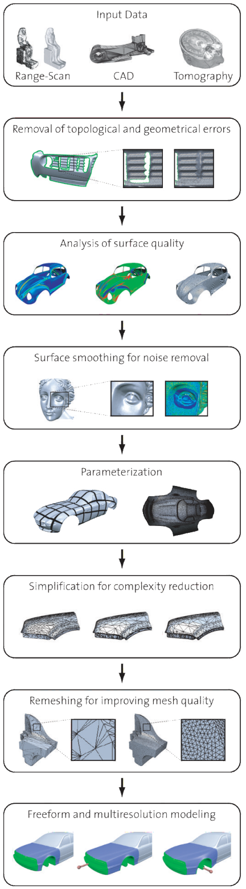

# 《多边形网格处理》前言(Perface)

&emsp;三维采集技术的最新创新,如计算机断层摄影,磁共振成像,三维激光扫描,超声,雷达和显微技术,使复杂三维物体的高精度数字化成为可能.许多科学学科,如神经科学,机械工程和天体物理学,都依靠对这些几何数据的分析和处理来理解复杂的几何结构,促进新的科学发现.同样,丰富的数字3D内容也可以在其他领域和行业中看到,包括娱乐,文化遗产,地质勘探,建筑和城市建模.与3D传感技术的这些进步同时,我们正在经历一场数字制造技术的革命(例如,在生物医学,商品产品设计和建筑).新型材料和机器人生产将很快允许从数字设计计划中自动创建复杂的,全功能的物理工件.

&emsp;在采集和生产之间是   **数字几何图形处理(Digital Geometry Processing)** 的学科,这是计算机科学中一个相对较新的领域,涉及分析和处理几何数据的数学模型和算法.典型的操作包括点样本的表面重建,去除噪声的滤波操作,几何分析,形状简化,几何建模和交互设计.丰富的数据来源,加工操作和制造技术为几何数据提供了丰富的数学表示.在这种背景下,多边形网格近年来变得越来越流行,并且在计算机图形学和几何处理的许多不同领域中得到了广泛的应用.在计算机辅助集合设计中(CAGD),三角形和多边形网格已经发展成为一种有价值的,可替代传统的样条表面,因为他们的概念简单,允许灵活和高效的处理.此外,后续使用多边形网格作为表面表示避免了容易出错的转换(例如,从CAD表面到基于网格的数值模拟输入数据).除了经典的几何建模,其他经常使用多边形网格的主要领域是电脑游戏和电影制作.在这种情况下,通过三维扫描技术获得的几何模型通常必须经过后处理和形状优化技术后才能用于生产.

&emsp;本书讨论了基于多边形网格的几何处理管道的主要组成部分,如下图所示.出于本书的指导目的,描述主题的顺序与图中所示的典型处理顺序有些不同.第一章中,我们首先讨论了表面表示的一般概念,并强调了多边形网格在数字几何处理中的优势.第二章给出了实现多边形网格的有效数据结构.第三章介绍了微分几何的基本概念,并推导了它们的离散分析的派生.这些是网格平滑算法的基础(第四章),通过将信号处理技术推广到正则多边形网格来降低扫描表面的噪声.第5章介绍了计算表面参数化的不同方法,表面参数化在许多几何处理任务中是必不可少的.一般的重网格方法(第6章)允许优化三角形或多边形元素的形状,这对于数值模拟和进一步处理操作的稳健性是重要的.网格化简和近似化技术(第7章)是对三维扫描获取的或沿加工流水线自动生成的高度复杂网格进行误差控制化简的常用技术.第8章描述了输入数据的不同来源,并介绍了几何和拓扑退化和不一致性的不同类型.我们讨论了去除这些伪影的方法,从而得到适合进一步处理的无缺陷2流形网格.第9章介绍了直观和交互式形状变形的技术.由于线性系统出现在许多提出的网格处理算法中,在附录中我们描述了求解线性系统的有效算法,并比较了几个现有的库.

    
     
    
图1.几何处理管线(图片来自[Botsch et al. 06b])

&emsp;这本书的想法源于网格处理和几何建模的一系列教程和课程.2006年,Mario和Mark在苏黎世联邦理工学院组织并教授了一门关于多边形网格处理的课程.同年,Leif,Christian Rössl和Stephan Bischoff加入了他们,分别在ACM SIGGRAPH和Eurographics上进行了两个全天的教程.2007年SIGGRAPH和2008年eurographic的课程大纲被重新调整,Pierre和Bruno取代了Christian和Stephan作为主持人.

&emsp;感谢Christian Rössl和Stephan Bischoff对课程早期版本的贡献,感谢Henrik Zimmer对书籍封面模型的帮助,感谢Silke Kölsch对文本的校对.我们非常感谢A K Peters的Alice Peters的鼓励,建议和耐心,感谢Sarah Cutler的优秀编辑,以及整个A K Peters团队的支持.如果没有我们众多的科学合作者和同事的贡献,这本书是不可能的,他们帮助塑造了多边形网格处理领域.最后,非常感谢我们的学生.他们的问题和反馈对完善这本书的材料非常有价值,他们的热情是这个项目的最终动力来源.