# 《多边形网格处理》第一章:表面表示(Surface Representations)

&emsp;几何处理主要是将算法应用于几何模型.如果算法表示 **动作(Action)** ,则几何体为 **对象(Object)** .本节中我们将讨论几何对象的各种数学表示.虽然这些数学表示可以是2D或3D,但我们实际上处理的几何图形总是处于3D实体上的2D表面.正如我们将在本书中看到的,对于几何处理中的每一个具体问题,我们都可以识别出计算为主的一组特征运算集，因此我们必须选择一个适当的表示来支持这些运算的有效实现.

&emsp;从高层次的观点来看,有两大类表面表示: **参数(Parametric)** 表示和 **隐式(Implicit)** 表示.参数表面是由一个向量值参数化函数 $\rm f:\Omega\rightarrow S$ 定义的,其将2D参数域 $\Omega\subset  {\rm I \!R}^2$ 映射到表面 $\rm S=f(\Omega)\subset  {\rm I \!R}^3$ 上.相比之下,隐式(或体积)表面表示被定义为标量值函数 $F$ 的零集,其中 $\rm F:{\rm I\!R}^3\rightarrow {\rm I\!R}$ ,也就是, $\rm S = \{x ∈ {\rm I \!R}^3 | F(x) = 0\}$ .

&emsp;为了说明问题,我们可以用函数的参数方式来类似地定义曲线, $\rm f:\Omega \rightarrow C$ ,而 $\Omega=[a,b]\subset {\rm I \!R}$ .对应的隐式定义仅仅适用于 **平面(Planar)** 曲线,即, $\rm C=\{ x\in {\rm I\!R}^2|F(x)=0\}$ ,其中 $\rm F:{\rm I \!R}^2\rightarrow {\rm I \!R}$ .一个简单的2D例子是单位圆,其可以由参数函数的范围来定义:

$$
\begin{aligned} 
\rm  f:[0,2\pi] \rightarrow {\rm I\!R}^2,t\longmapsto   
\left(  
    \begin{matrix}    
        \cos t \\ \sin t   
    \end{matrix}   
\right)  
\end{aligned}  
$$

也可以由隐式函数的核心来定义:

$$
\rm F:{\rm I \!R}^2\rightarrow {\rm I \!R},(x,y)\longmapsto \sqrt{x^2+y^2}-1
$$

同样,在3D中,球体可以由参数方程或者隐式方程来表示(更多细节详见3.2小节).

&emsp;对于更复杂的形状,用一个函数来显式,精确地近似一个给定形状通常是不可行的.因此,函数域通常被分割成更小的子区域,并为每个部分定义一个独立的函数( **面片,Surface Patch** ).在这种 **分段(Piecewise)** 定义中,每个函数只需要局部近似给定形状,而全局近似公差由分段的大小和数量控制.数学上的挑战是是要保证每一个面片到其相邻面片的一致性转换.在参数化情况下,最常用的分段表面定义是将 $\Omega$ 分割成三角形或者四边形.对于隐式表面定义来说,内嵌空间通常分为六面体(体素)或者四面体单元.

&emsp;参数表示和隐式表示都有其独特的优点和缺点,因此对于每个几何问题都应该选择更适合的方法.为了分析几何操作及其对表面表示的要求,可以将其分为以下三类[Kobbelt 03](https://www.researchgate.net/publication/220506792_Freeform_Shape_Representations_for_Efficient_Geometry_Processing):  
●  **评估(Evaluation)** .这需要表面几何或其他表面属性的采样,例如表面法线场.一个典型的应用例子是表面渲染.    
●  **查询(Query)** .空间查询用于决定一个点 $\rm p\in {\rm I\!R}^3$ 在由表面 $S$ 构成的固体的里面还是外面,这是实体建模操作的关键组件.另一个典型的查询是计算点到表面的距离.  
●  **修改(Modification)** .一个表面可以根据 **几何形状(Geometry)** (表面变形)或 **拓扑(Topology)** 结构(如,当表面的不同部分被合并,切割或删除时)进行修改.  

&emsp;我们将看到,参数表面表示和隐式表面表示相对于这三种几何操作具有互补的优势,即,一种方法在效率或鲁棒性方面的优势往往是另一种方法的缺点.因此对于每一个特定的几何问题,都应该选择更合适的表示方式,这反过来又需要两种表示方式之间的高效转换程序(见1.5节).在第1.6节中,我们对结合这两种表示的方法进行了展望,以设计既高效又健壮的算法.

## 1.1 表面定义和属性(Surface Definition and Properties)

&emsp;在计算机图形程序的环境中 **表面(Surface)** 的常见定义是"嵌入在 ${\rm I \!R}^3$ 中的可定向连续2D流形".直观上,这可以被理解为非退化三维固体的边界面, **非退化(Non-Degenerate)** 意味着固体不具有任何无限薄的部分或特征,这样表面就可以适当地将固体的内外分开(见图1.1).具有边界的表面是指通过填充孔洞可以扩展成适当的流形表面的表面.

    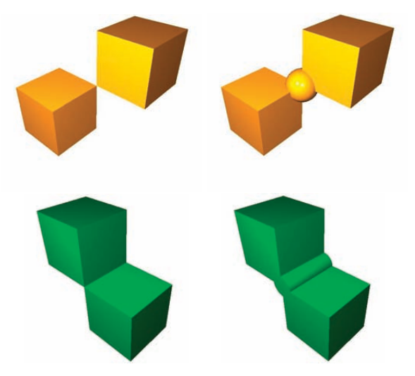
     
    
图1.1.可定向连续2流形描述了退化固体的表面.左上角的退化/非流形顶点的修复如右上角所示.左下角的带退化/非流形的边的固体的修复如右下图所示.

&emsp;因为在大多数应用程序中的输入表面的原始信息是通过离散采样获得的(即,通过评估是否存在一个数字表示,或者 **探查(Probing)** 输入表面是否来自于真实对象),因此生成一个数学表面表示的第一步是建立 **连续性(Continuity)** .这需要在样本之间建立一个一致的邻域关系.在这种情况下, **一致性(Consistency)** 指的是样本绘制的流形表面的存在.

&emsp;虽然这所谓的 **测地线(Geodesic)** 邻近关系(与 **空间(Spatial)** 邻近关系相反)很难进入隐式表示,但如果 $\Omega$ 中对应的原像相互接近的话,则很容易从参数表示中提取表面上两个点的测地线距离(见图1.2).从这个观察中我们可以推导出 **局部流形(Local Manifoldness)** 的另一个表征:如果对于在一个半径为 $δ$ 的足够小的球内的其他表面点 $q$ ,相应的原像被包含在一个半径为 $ε = O(δ)$ 的圆内围绕着 $p$ 的原像,则一个连续参数表面是在一个表面点 $p$ 的局部流形.表示这个条件的一种更直观的方法是假设位于 $p$ 周围足够小的 $δ$ 球内的面片在拓扑上与圆盘等价(同胚).由于第二个定义不需要参数化,所以它也适用于隐式表示.

    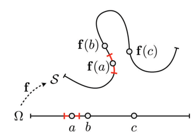
     
    
图 1.2. 一个流形曲线.点 $f(a)$ $f(b)$ 和 $f(c)$ 都是空间上接近的,只有 $f(a)$ 和 $f(b)$ 是测地线近邻,因为它们的原像 $a$ 和 $b$ 也是相邻的.红色表示在 ${\rm I \!R}^2$ 的 $f(a)$ 的充分小的 $δ$ 邻居的原像位列于一个在 ${\rm I \!R}$ 的 $𝑎$ 的 $𝜀$ 邻居.

&emsp;当在一组离散样本中生成一个连续的表面时,我们要求该表面可以对样本进行 **插值(Interpolate)** ,或者要求该表面可以在一定的公差内对样本进行 **近似(Approximate)** .后者在实际应用中更有意义,因为由于样本通常受到位置噪声的影响,而且样本之间的表面是一个近似.在下一小节中我们将会更详细地考虑近似的问题.

&emsp;除了一组明确的特征曲线和特征角角,表面通常应该是光滑(Smooth)的.数学上这是由函数 $f$ 或 $F$ 所拥有的连续导数的 $k$ 个数来衡量的.注意,只有当 $f$ 的偏导或 $F$ 的梯度在局部不消失(规律性)时, $C^k$ 光滑性的解析定义才符合直观的光滑性几何理解.

&emsp;对表面更严格的要求是光顺度(Fairness),不仅要考虑表面导数的连续性,而且还要考虑其大小和变化.光顺度这个美学概念并没有一个通用的正式定义,但如果一个表面的曲率或其变化是全局最小的,则该表面则可以认为是光顺的(见图1.3).

    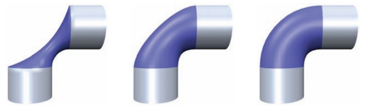
     
    
图 1.3.三个光顺表面的例子,定义了两个圆柱体之间的混合:一个使表面积最小(左)的膜表面,一个使总曲率最小(中)的薄板表面,和一个使平均曲率的变化最小的表面(右).图片来自[Botsch and Kobbelt 04a].2004 ACM公司.经允许在此列出.

&emsp;在第三章中,我们将解释如何将曲率的概念推广到多边形网格中,这样光滑性和光顺性等属性也可以应用到网格中(见第四章).

## 1.2 近似幂(Approximation Power)

&emsp;对真实物体或其边界进行精确的数学建模通常是很困难的.因此,数字表面表示法一般只能是一种近似.正如在介绍中提到的,为了简化近似任务,表示域通常被分割成小段,对于每个段定义一个函数(面片),该函数在局部近似该段的输入部分.

&emsp;既然我们的表面表示法被假定支持有效的处理,一个自然而然的选择是将函数限制在 **多项式(Polynomoals)** 类中,因为这些多项式可以通过初等算术运算来求值.对多项式限制的另一个证明是著名的 **维尔斯特拉斯定理(Weierstrass Theorem)** ,它保证每个光滑函数可以用一个多项式逼近,达到任何期望的精度[Ross 80](https://www.springer.com/gp/book/9781475739718#:~:text=Elementary%20Analysis.%20The%20Theory%20of%20Calculus%20%22This%20book,and%20convergence%20of%20sequences%20and%20series%20of%20).

&emsp;从微积分学上我们可以知道导数有界的 $C^\infty$ 的函数 $g$ 可以通过 $p$ 次多项式在长度为 $h$ 的区间上来逼近,以致近似误差表现为 $O(h^p+1)$ (例如:泰勒定理或广义中值定理)[Rudin 02](https://book.douban.com/subject/1230095/).因此,原则上有两种可能性来提高分段多项式逼近的准确性.我们可以提高多项式的次数( **p-细化,p-refinement** ),也可以减少单个片段的大小,并使用更多的片段进行近似( **h-细化,h-refinement** ).

&emsp;在几何处理应用中,由于我们不能对一个离散采样的输入表面的高阶导数的有界性做出合理的假设,所以h细化通常比p细化更可取.而且对于更高次的分段多项式,分段段之间的 $C^k$ 平滑条件有时很难满足.最后，在当今的计算机架构下,处理大量非常简单的对象通常比处理少量更复杂的对象更有效率.这就是为什么 $C^0$ 分段线性表面表示的部分极端选择,如多边形网格,已经成为几何处理中广泛建立的标准.

&emsp;然而,对于参数表面, $O(h^p+1)$ 近似误差估计以一种直接的方式遵循中值定理,而对于隐式表示则需要更仔细的考虑.广义中值定理表明如果在区间 $[a,a+h]$ 上,一个足够光滑的函数 $g$ 被一个 $f$ 的 $p$ 次多项式在横坐标 $t_0$,...,$t_p$ 进行插值的话,则误差有界.
$$
|f(t)-g(t)|\leq \frac{1}{(p+1)!}\max f^(p+1)\prod_{i=0}^{p}(t_i-t)=O(h^p+1) \\
$$
对于隐式表示 $G:{\rm I \!R}^3\rightarrow {\rm I\!R}$ 以及对应多项式近似 $F$ ,这个定理依然有效;然而,这里的实际表面几何不是由函数值 $G(x)$ 定义的,这个定理为其给出了一个误差估计,而是由 $G$ 的零水平集定义的,即由 $S=\{x\in{\rm I\!R}^3|G(x)=0\}$ 定义的.

&emsp;考虑由近似多项式 $F$ 定义的隐式表面上的点 $x$ ,,即在某些体素中 $F(x) = 0$ .我们可以通过在 $F$ 的法线方向对 $F$ 射出一条射线,即 $d = d ∇F/∥∇F∥$  ,来找到一个在隐式表面上由 $G$ 定义的一个点 $x+d$ ,即 $G(x+d)=0$ 对于一个非常小的体素尺寸 $h$ ,我们获得
$$
|F(x+d)|\approx|d| ∥∇F(x)∥\Rightarrow |d|\approx\frac{|F(x+d)}{∥∇F(x)∥} \\
$$
根据中值定理,我们得到
$$
|F(x + d) − G(x + d)| = |F(x + d)| = O(h^{p+1}) \\
$$
,
如果梯度 $∥∇F(x)∥$ 的大小有 $\varepsilon>0$ 的以下界则得到 $|d|=O(h^{p+1})$ .在实践中,为了使近似误差均匀分布,人们试图找到一个梯度大小变化小的近似多项式 $F$ .

## 1.3 参数表面表示(Parametric Surface Representations)

&emsp;参数表面表示的优点是函数 $\rm f:\Omega\rightarrow S$ 可以将表面 $S$ 上的许多三维问题简化为参数域 $\Omega$ 中的二维问题.例如,通过对域 $Ω$ 进行采样并对函数 $𝑓$ 求值,可以很容易地生成表面上的样本点.同理,通过考虑参数域 $Ω$ 中的邻点,可以很容易地找到测地线近邻,即表面 $𝑆$ 上的近邻. $𝑓$ 和变形函数 $d:{\rm I \!R}^3\rightarrow {\rm I \!R}$ 的简单组合可以有效地修改表面的几何形状.

&emsp;另一方面,生成参数表面参数化 $f$ 可能非常复杂,因为参数域必须匹配表面 $𝑆$ 的拓扑结构和度量结构(第五章).当改变 $𝑆$ 的形状时,可能有必要相应地更新参数,以反映基本几何的各自变化:低失真的参数化需要 $𝑆$ 和 $Ω$ 的度量是相似的,因此我们必须避免或适应过度拉伸.

由于流形表面 $𝑆$ 被定义为参数 $𝑓$ 的范围,因此如果 $𝑓$是连续且单射的,则其拓扑等价于 $Ω$ 的拓扑.这意味着改变一个参数表面的拓扑结构是非常复杂的,因为不仅参数化,而且域也需要相应地调整.通常,典型的内/外或签名距离查询在参数化表面上也是非常昂贵的，因为它们通常需要找到 $𝑆$ 上离查询点(足点)最近的点.这同样适用于自我碰撞检测(即,非单射性).因此,拓扑修改和空间查询是参数表面的弱点.

### 1.3.1 样条表面(Spline Surface)

&emsp;张量积样条表面通常被称为NURBS,是当今CAD系统的标准表面表示形式.它们被用于构建高质量的表面(A类)以及自由表面编辑任务.样条表面可以通过分段多项式或者有理B样条基函数 $N_{n}^{i}(\cdot)$ 来很方便地描述.更多细节见例[[Farin 97](http://www.gbv.de/dms/goettingen/213721651.pdf),[Piegl and Tiller 97](https://book.douban.com/subject/3989660/),[Prautzsch et al. 02](https://geom.ivd.kit.edu/downloads/pubs/pub-boehm-prautzsch_2002_preview.pdf)].

&emsp;二次幂张量积样条表面 $𝑓$ 是一个分段多项式表面,其由几个多项式块以光滑的 $C^{n-1}$ 方式连接而成的.矩形线段由两个结向量 $\{u_0,…,u_{m+n}\}$ 和 $\{v_0,…, v_{k+n}\}$ 定义,且整个表面由以下公式获得:
$$
f:[u_n, u_m] × [v_n, v_k]→{\rm I \!R}^3  \tag{1.1}
$$
$$
(u,v)  \longmapsto  \sum_{i=0}^{m} \sum_{j=0}^{k} c_{ij}N_{i}^{n} (u) N_{j}^{n}(v) \tag{1.2}
$$

 **控制点** $c_{ij}\in {\rm I\! R}^3$ 定义了所谓的样条表面的 **控制网格** .由于 $N_{i}^{n}\geq 0$ 且 $\sum \ _{i} N_{i}^{n}\geq 0\equiv1$ ,因此每个表面点 $f(u, v)$ 是控制点 $c_{ij}$ 的凸组合;即该表面位于控制网格的凸壳内.由于基函数的支持最小,每个控制点只具有局部影响.这两个属性使样条表面紧紧跟随控制网格,从而提供了一个几何上直观的隐喻,通过调整它们的控制点来建模表的形状.

&emsp;一个张量积表面作为参数化 $f$ 下的矩形域的像,总是表示一个嵌入在 ${\rm I\!R}^3$ 中的矩形面片.如果要用样条表面来表示更复杂的拓扑结构形状,则必须将模型分解为若干个(可能修剪过的)张量积面片.

&emsp;由于这些 **拓扑约束(Topological Constraint)** ,典型的CAD模型通常由大量的面片组成.为了代表一个高质量的,全局光滑的表面,这些面片必须以光滑的方式连接,这导致额外的 **几何约束(Geometry Constraint)** ,因此必须在所有表面处理阶段都要小心留意.大量的面片和由此产生的拓扑和几何约束极大地复杂化了表面构造,特别是后期的表面建模任务.

&emsp;经典张量积样条表示的另一个缺点是只能通过分割参数区间 $[u_i,u_{i+1}]$ 或 $[v_j,v_{j+1}]$ 来添加更多的控制顶点(细化),它们分别影响控制网格的整行或整列.在这里,用T样条的替代表示可以改善这种情况,因为它们可以对控制网格进行局部细化[Sederberg et al. 03](http://www.13thmonkey.org/documentation/CAD/Tspline.pdf).

### 1.3.2 细分表面(Subdivision Surfaces)

&emsp;细分表面[Zorin et al. 00](https://mrl.cs.nyu.edu/publications/subdiv-course2000/)可以被认为是样条表面的一种概括,因为它们也由一个粗粒度的控制网格控制,但与样条表面不同的是,它们可以表示任意拓扑的表面.细分表面是通过控制网格的反复细化生成的:在每一步拓扑细化后,根据一组局部平均规则调整顶点(旧顶点和新顶点)的位置(见图1.4).对这些规则的仔细分析表明,在极限情况下,这一过程会产生一个可证明的光滑表面[Peters and Reif 08](https://www.amazon.com/Subdivision-Surfaces-Geometry-Computing-Peters/dp/3540764054).

    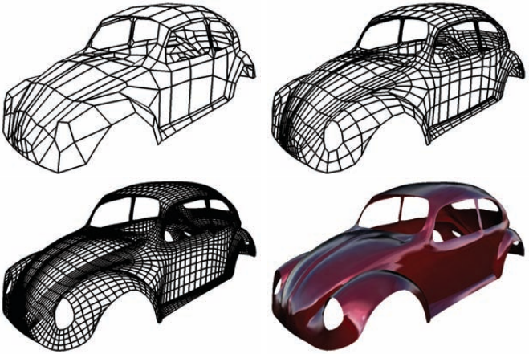
     
    
图1.4.对粗粒度控制网格进行迭代均匀细化,生成细分表面.(图片来自于[Botsch 05].)

&emsp;因此,细分表面既不受拓扑(除了流形)的限制,也不像样条表面那样受几何约束,并且它们固有的层次结构允许高效的算法实现.然而,细分技术仅限于产生所谓的半规则 **细分连通性(Subdivision Connectivity)** 网格,即那些网格的三角剖分是对粗粒度控制网格重复均匀细化的结果.由于任意网格都不满足这一约束,因此必须在预处理步骤中将这些网格重新划分为细分连通性网格[Eck et al. 95,Lee et al. 98, Kobbelt et al. 99a, Guskov et al.50].但是,由于这种重新划分的网格对应于表面的重采样,所以它通常会导致采样伪影和信息的丢失.为了避免这些连通性约束造成的限制,我们用于任意三角形网格上,因为它们提供了更高的灵活性,并且仍然允许有效的表面处理.

### 1.3.3 三角形网格(Triangle Meshes)

&emsp;在许多几何处理算法中,三角形网格被认为是没有任何特定数学结构的三角形集合.但是原则上,每个三角形都通过其重心参数定义了一个分段线性表面表示的一部分.

三角形 $[𝑎,𝑏,𝑐]$ 内部的每个点 $𝑝$ 都可以用一种独特的方式写成角点的重心组合:
$$
p = α \rm a + β \rm b + γ \rm c,α + β + γ = 1, α, β , γ ≥ 0. \tag{1.3}
$$
通过在参数域中选择一个任意的三角形 $[𝑢,𝑣,𝑤]$ ,我们可以定义一个线性映射 $\rm f:{\rm I \!R}^2\rightarrow {\rm I \!R}^3$ ,其中:
$$
α \rm u + β \rm v + γ \rm w \leftrightarrow α \rm a + β \rm b + γ \rm c  \tag{1.4}
$$
基于这个逐三角形的映射,为每个顶点定义一个二维位置就足够了,以便推导出整个三角形网格的全局参数化.在第五章中,我们将讨论如何在参数域中选择这种三角剖分方法,从而使从 ${\rm I \!R}^2$ 到 ${\rm I \!R}^3$ 的分段线性映射所造成的失真最小化.

三角形网格 $\mathcal{M}$ 由几何和拓扑组成,后者可以用一组顶点的图结构(单体复形) $\mathcal{V = \{v_1,...,v_V \}}$ ,和一组用于连接顶点的三角面 $\mathcal{F = \{f_1,...,f_F \} , f_i ∈ V × V × V}$ 来表示.然而,正如我们将在第二章中看到的,有时用各自的图的边来表示三角形网格的连通性更有效, $\mathcal{E = \{e_1, . . . , e_E\} , e_i ∈ V × V}$ ..将三角形网格嵌入到 ${\rm I \!R}^3$ 中的几何嵌入操作是通过将一个三维位置 $\rm p_i$ 与每个顶点 $v_i\in \mathcal{V}$ 关联来指定:
$\mathcal{P = {p1, . . . , pV } ,p_i := p(v_i) = \left (  \begin{matrix}    x(v_i) \\ y(v_i) \\ z(v_i)  \end{matrix}   \right  ) \in{\rm I\!R}^3}$ .这样一来,每一个面$f\in \mathcal{F}$ 实际上对应一个由3个顶点位置构成的三维空间三角形.注意,即使几何嵌入是通过分配三维位置到离散的顶点来定义的,但得到的多边形表面仍然是一个连续的表面，其由带有线性参数化函数的三角形片组成(公式(1.4)).

&emsp;如果一个足够光滑的表面可以由这样的分段线性函数近似的话,则其近似误差为 $O(h^2)$ 阶,而 $h$ 表示最大边长.由于这种二次逼近能力,当边缘长度减半时,误差减少了约1/4.当这种细化将每个三角形分成四个子三角形时,三角形的数量从F增加到4F(见图1.5).因此,三角形网格的逼近误差与它的面数成负相关.近似误差的实际大小取决于泰勒展开式的二阶项,即下面光滑表面的曲率.由此我们可以得出这样的结论:只要网格复杂度适中,就可以得到一个足够的近似:顶点密度必须局部适应表面曲率,例如平坦区域的采样稀疏,而在弯曲区域的采样密度较高.

    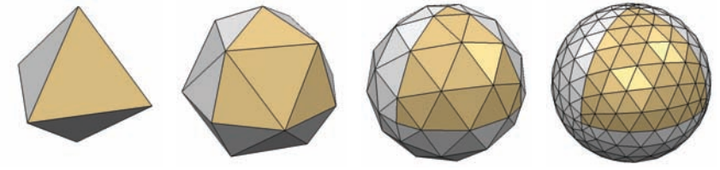
     
    
图 1.5. 每个细分步骤将边长减半,面数增加4倍,并且减少了约 $\frac{1}{4}$ 的近似误差.(图片来源于[Botsch et al. 06b].)

&emsp;如前面所述,一个表面的重要拓扑性质是它是否为2流形(二维流形的简称),也就是说,对于每个点,表面局部同胚于一个圆盘(或边界处的半圆盘).如果三角形网格既不包含非流形边,也不包含非流形顶点或自交点,那么它就是一个2流形网格.一个非流形边有两个以上的关联三角形,一个非流形顶点是通过将两个面片夹在一起产生的,这样顶点就关联到多个扇形三角形(见图1.6).对于大多数算法来说,非流形网格是有问题的,因为在非流形结构周围不存在定义良好的局部测地线邻域.

    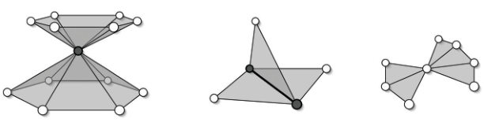
     
    
图 1.6.两个面片在一个人非流行顶点相遇(左).一个非流形边有大于两个关联面(中).右图中,虽然严格来说是非流形的,但可以由大多数数据结构处理(图片来源于[Botsch 05].)

&emsp;著名的欧拉公式[Coxeter 89]阐述了在一个封闭和连通(但非结构化)网格中顶点 $𝑉$ ,边 
$𝐸$ 和面 $𝐹$ 的数量之间的有趣关系:
$$
V-E+F=2(1-g) \tag{1.5}
$$
其中 $𝑔$是表面的亏格(Genus)并且可以直观地数出一个物体的句柄(见图1.7).由于在大多数实际应用程序中,亏格与网格元素的数量相比是很小的,因此公式(1.5)的右边可以忽略不计.考虑到这一点,并且每个三角形都有三条边,每个内部流形边都与两个三角形相关,我们可以得出以下有趣的网格统计数据:  

● 三角形的数目是顶点数目的两倍:$F\approx 2V$ .  
● 边的数量是顶点数量的三倍: $E\approx 3V$ .  
● 平均顶点价(入射边数)为6.  

在第2章中,当评估网格处理算法的运行时复杂性和分析三角网格的数据结构或文件格式时,这些关系将变得相当重要.

    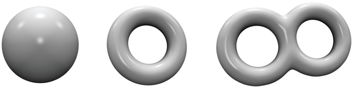
     
    
图 1.7. 亏格为0的球体(左),亏格为1的环面(中),以及亏格为2的双环面(右).(图片来自于[Botsch et al. 06b].)

## 1.4 隐式表面表示(Implicit Surface Representations)

&emsp;几何模型的 **隐式(Implicit)** 或 **体(Volumetric)** 表示的基本概念是通过对每个三维点进行分类来表征一个对象的整个嵌入空间,这些点要么在内部,要么在外部,要么恰好在一个固体对象 $𝑆$ 的边界表面上.

&emsp;隐式函数有几种不同的表示方式,如 **代数表面(Algebraic Surface)** , **径向基函数(Radial Basis Function)** 或 **离散体素化(Discrete Voxelization)** .不管怎样,表面 $S$ 被定义为标量值函数 $F:{\rm I\!R}^3\rightarrow {\rm I\!R}$ 的零级等值面.按照惯例, $𝐹$ 的负函数值表示物体内部的点,正函数值表示物体外部的点.零级等值面 $𝑆$ 包含表面上的点,将内外分开.隐式表面只要定义函数 $𝐹$ 是连续的则不会有任何孔洞.此外,由于隐式表面是势能函数的水平集,不可能发生几何自交.这稍后将被用于网格修复(第八章).

&emsp;因此,几何内外查询可以简化为检查 $𝐹$ 的函数结果值的符号.这使得隐式表示非常适用于构造立体几何(CSG),其中复杂的对象是通过对几何图元应用布尔运算来构造的(见图1.8).不同的布尔操作可以很容易地由单个图元的隐式函数的最小和最大组合来计算.

    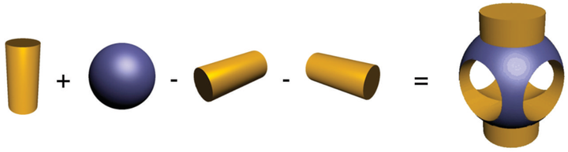
     
    
图 1.8.由布尔运算构造的复杂对象.(图片来自于[Botsch et al. 06b].)

&emsp;隐式曲面可以通过局部减少(增长)或增加(收缩) $𝐹$ 的函数值来变形.因为 $𝐹$ 的结构(如体素网格)是独立于水平集表面的拓扑结构的,所以我们可以很容易地改变表面的拓扑和连通性.

&emsp;对于一个给定的表面 $𝑆$ 的隐式函数 $𝐹$ 并不是唯一确定的,因为任意标量乘以 $𝜆𝐹$ 都会产生相同的零集.然而最常见和最自然的表示方式是所谓的符号距离函数(Signed Distance Function),其映射每一个3D点 $𝑥$ 到它从表面 $𝑆$ 的带符号距离 $𝑑(𝑥)$ :绝对值 $|𝑑(𝑥)|$测量 $𝑥$ 到 $𝑆$ 的距离;符号表示点 $𝑥$ 是在以 $𝑆$ 为界的的里面还是外面.除了内部/外部查询之外,这种表示还将距离计算简化为简单的函数计算,可以用于计算和控制网格处理算法的全局误差[Wu and Kobbelt 03,Botsch et al. 04]或碰撞检测计算.

&emsp;另一方面,在隐式表面上生成样本点,寻找测地线邻域,甚至只是渲染表面都是相当困难的.此外,隐式表面不提供任何参数化的方法,这就是为什么实现一致地将纹理粘贴到展开的隐式表面上是非常困难的.

&emsp;用于隐式表面表示的最常见的空间数据结构是规则网格和自适应数据结构(下面将讨论).

### 1.4.1 规则网格(Regular Grids)

&emsp;为了高效地处理隐式表示,连续标量场 $𝐹$ 通常使用一个足够浓密的,节点为 $g_{ijk}\in {\rm I \!R}^3$ 的网格来离散在对象周围的一些边界框中.因此,最基本的表示是一个由采样值 $F_{ijk}:= F(g_{ijk})$ 成的统一标量网格以及体素内的函数值通过三线性插值得到,从而提供了二次逼近阶.然而,如果通过减少网格体素的边缘长度来提高精度,那么这种原始数据结构的内存消耗将呈三次方增长.

### 1.4.2 自适应数据结构(Adaptive Data Structures)

&emsp;为了更高的存储效率,采样密度往往适应标量场 $𝐹$ 中的局部几何显著性:由于精确的符号距离值在表面附近最重要,所以只有在这些区域才需要使用更高的采样率.因此使用一个层次8叉树而不是一个统一3D网格来存储采样值[Samet 94].对完全位于物体内部(黑色)或外部(白色)的八叉树单元格的进一步细化并不能改善表面 $𝑆$ 的近似.只自适应地细化那些与表面相交的单元格(灰色),在表面周围形成均匀细化的叶单元格外壳,并将存储复杂度从三次方降低到二次方(见图1.9(左)).由于这种结构由黑色,白色和灰色的单元格组成,因此这种结构被称为 **三色八叉树(Three-Color Octree)** .

    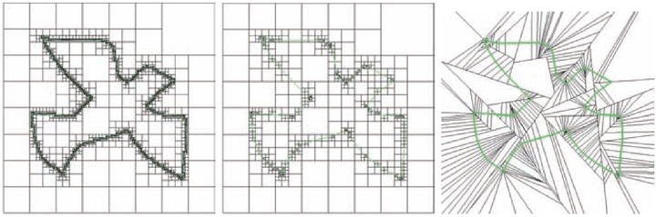
     
    
图1.9 一个相同精度的符号距离长的不同自适应精度:三色八叉树(左,12040个单元),自适应采样距离场(ADF)[Frisken et al. 00](中,895个单元),以及二元空间分割(BSP)树[Wu and Kobbelt 03](右,254个单元).(图片来自于[Wu and Kobbelt 03].)

&emsp;如果局部细化额外受限于那些三线性插值偏离实际距离场超过规定的公差的单元的话,所得到的逼近则适应于表面的局部以及其局部形状的复杂性[Frisken et al. 00] (见图1.9(中)).由于极端的细化只在高表面曲率区域是必要的,这种方法甚至进一步降低了存储复杂度,并导致内存消耗量网格表示相当.

&emsp;类似地,可以在叶节点上使用线性(而不是三线性)插值的自适应二元空间分解[Wu and Kobbelt 03],尽管渐近复杂度和近似能力是相同的,后一种方法能以较少紧凑的单元为代价提供稍微更好的内存效率(图1.9(右)).

## 1.5 转换方法(Conversion Methods)

&emsp;为了充分利用参数表面表示和隐式表面表示的独特优势,因此需要在这两种表示之间找到一种高效的转换方法是必需的.然而请注意,这两种表示通常都是有限采样(例如,参数情况下的三角形网格,隐式情况下的均匀/自适应网格),并且每个转换都对应于一个重采样步骤.因此,必须特别注意在这些转换程序中尽量减少信息的损失.

### 1.5.1 参数到隐式(Parametric to Implicit)

&emsp;参数表面表示法转换为隐式表示法相当于对其符号距离场的计算或近似.这可以通过体素化或3D扫描转换技术非常有效地完成[Kaufman 87],但得到的近似只是分段常数.由于表面的距离场一般不是处处光滑的,因此分段线性或分段三线性逼近似乎是逼近精度和计算效率之间的最佳折衷.

&emsp;因为在本书中我们专注于将多边形网格作为参数表示,转换为隐式表示基本上需要计算(统一或自适应)三维网格节点上的三角形网格的符号距离.

计算网格节点到给定网格的精确距离需要计算到最近的三角形的距离,这可以通过使用空间数据结构,如kd树(Kd-Trees)[Samet 94]有效地找到.请注意,为了计算带符号的距离场,必须另外确定网格节点是位于对象内部还是外部.如果 $𝑔$ 表示网格节点, $𝑐$ 表示其在表面上最近的点,则符号可以从向量 $𝑔−𝑐$ 以及外法线 $𝑛(𝑐)$ 之间的夹角推导出来:如果 $(g-c)^Tn(c)<0$ 则点 $𝑔$ 被认为在里面.该测试的健壮性和可靠性强烈依赖于法线 $𝑛(𝑐)$ 的计算方式.对面,边和顶点使用角度加权的伪法线可以得到正确的结果[Bærentzen和Aanæs 05].

### 1.5.2 隐式到参数(Implicit to Parametric)

&emsp;从隐式或者体素化表示到三角形网格,即所谓的 **等值面提取(Isosurface Extraction)** ,例如在CSG建模以及医疗应用中的从CT头部扫描中提取骷髅表面.等值面提取事实上的标准算法是 **立方步进(Marching Cubes)** [Lorensen and Cline 87].这种基于网格的方法在一个规则网格上采样隐式函数,并分别处理离散距离场的每个单元,从而允许琐碎的并行化.对于每个与等值面 $𝑆$ 相交的单元格,根据局部准则生成一个表面面片.所有这些小块的集合最终得到一个完整等值面 $𝑆$ 的三角形网格近似.对于每条与表面 $𝑆$ 相交的网格边,立方步进算法会计算一个近似于此相交的样本点.

&emsp;对于每一个与表面 $𝑆$ 相交的网格边,立方步进算法计算一个与此相交接近的样本点.对于标量场 $𝐹$ ,这表示 $𝐹$ 的符号与网格边的端点 $𝑝_1$ 和 $𝑝_2$ 处是不同的.由于三线性近似 $𝐹$ 实际上是沿网格边缘线性的,因此交点 $𝑠$ 可以通过在边缘端点处的距离值 $d_1:= F(p_1)$ 和 $d_2:= F(p_2)$ 的线性插值得到:

$$
s=\frac{|d_2|}{|d_1|+|d_2|}p_1+\frac{|d_1|}{|d_1|+|d_2|}p_2 \\
$$

然后,每个单元格的结果样本点连接到一个三角剖分表面面片,该面片基于一个包含所有可能的边缘相交构型的三角剖分查找表得到(见图1.10).由于可能的组合构型是由单元格角落的符号决定的,因此它们的数量,也就是表的大小,是 $2^8=256$ .

    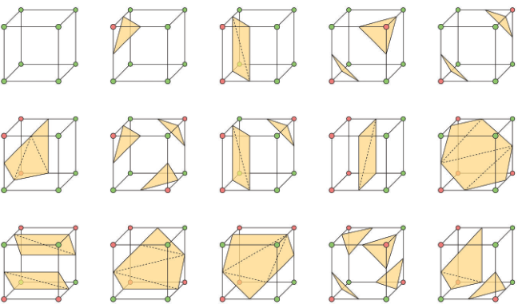
     
    
图1.10.立方步进三角剖分表的15个基本配置.其余241个可通过旋转,反射或倒置找到图片来自于[Botsch 05].

&emsp;请注意,一些单元格配置是不明确的,这可能导致提取的表面出现裂缝.一个适当改进过的查找表可以得到一个简单而有效的解,但是代价是牺牲 $𝐹$ 符号反转的对称性[Montani et al. 94].由此得到的等值面是一个致密的2流形,这是利用了许多网格修复技术做到的(第8章).

&emsp;立方体步进只计算规则网格边缘上的交点,这会导致尖锐的边缘或角被切掉.准确地重建尖锐的特征需要包含这些特征的单元格内的额外样本点.因此,扩展立方步进算法[Kobbelt et al. 01]检查距离函数的梯度 $∇𝐹$ 以检测那些包含尖锐特征的单元格,并通过在体素的边缘交点处与预估的切平面相交来寻找额外的样本点.

&emsp;图1.11用2D的视角描述了这一原则,而图1.12给出了一个著名的fandisk数据集的3D例子.图一个基于OpenMesh数据结构的扩展立方步进的示例实现[Botsch et al. 02]可以从[Kobbelt et al. 05]下载.

    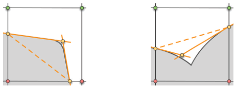
     
    
图1.11.利用尖锐特征两侧的点信息和法线信息,可以很好地估计出切线元素交点处的特征点.虚线是标准立方步进算法产生的结果,粗体线是扩展立方步进算法中使用的切线.(图片来自[Botsch 05].)

    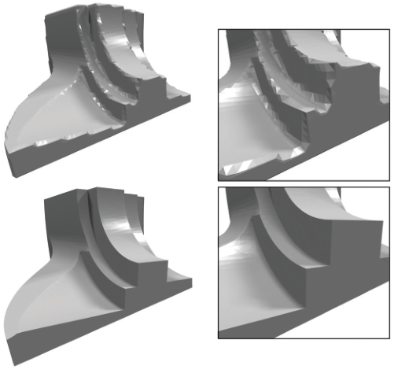
     
    
图 1.12.两个从65×65×65采样的fandisk数据集符号距离场的重建.标准的立方步进算法会导致尖锐特征附近严重的走样效应(上),而特征敏感的等值面提取会如实地重建(下).

&emsp;提取的等值面的高三角形复杂性仍然是类立方步进方法的主要问题,与其在后处理中抽取生成的网格(见第7章),该算法可以修改为直接在自适应改进的八叉树上工作[Westermann et al. 99].

&emsp;Ju等人[Ju et al.02]提出了对偶轮廓(Dual Contouring)法,该方法也直接从自适应八叉树中提取网格.与立方步进法相比,对偶轮廓法生成体素内部的顶点,并为每条与等值面相交的体素边构造一个多边形.然而对偶轮廓法的缺点是，对于包含多个表面的单元格配置会产生非流形网格.这可以通过[Bischoff et al. 05]中描述的技术来修复.另一种有前途的方法是三次步进平方算法[Ho et al. 05],它也提供了自适应和特征敏感的等值面提取.

&emsp;最后,一个可替代立方步进及其变体的方法是细化和过滤3D Delaunay三角剖分[Boissonnat and Oudot 05].结果显示,表面网格只包含良好形状的三角形,并在拓扑和几何方面如实地逼近输入表面.一个Delaunay改进方法的示例实现可以从计算几何算法库(CGAL)的网站上下载[CGAL 09].

## 1.6 总结和延伸阅读

&emsp;在本章中,我们讨论了各种数学几何表示的优缺点.参数表示和隐式表示这两个主要概念几乎具有互补的优点和缺点.参数表面可以捕获甚至最细微的细节,易于取样,并且可以直观地修改，但是很难确定距离查询,以及拓扑一旦发生变化变化需要进行重大重构.另一方面,隐式曲面的拓扑变化和距离查询很容易,但采样和形状编辑并不简单,几何细节分辨率取决于体素大小.

&emsp;有一种混合表示的方法[Bischoff and Kobbelt 05,Bischoff et al. 05],它将这两个概念合并,使两者的优点可以结合起来.例如,在每个体素单元格中存储一组三角形的自适应八叉树可以支持有效的距离查询和高细节分辨率.

&emsp;还有许多其他的转换技巧供进一步阅读.例如,Shen等人[Shen et al .04]提出了一种将多边形汤转换为隐式曲面的方法,从插值到具有可调平滑度和公差的逼近都适用.

&emsp;除了在这里描述的,与本书中介绍的技术最相关的方法之外,还有很多其他高效几何处理适用的表示方式.径向基函数[Light 92]就是一个突出的例子,其他例如统一隐式分割[Ohtake et al. 03]和基于点的表示[Pauly 03,Kobbelt and Botsch 04]也是另外的表示方式.