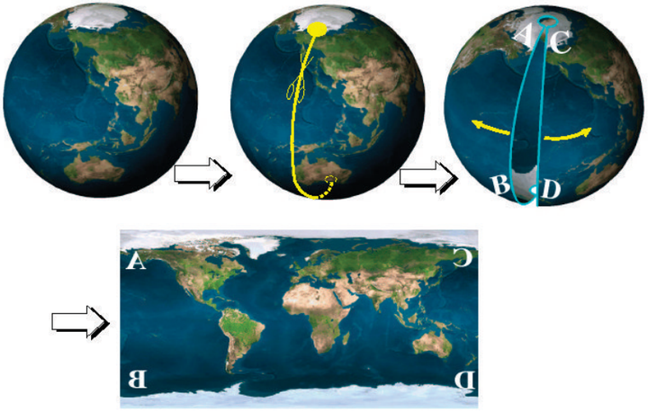
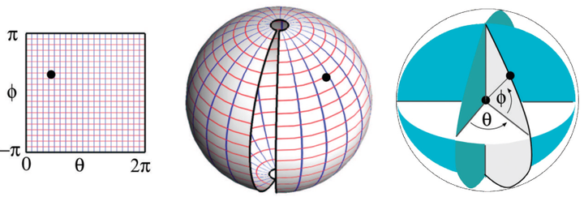
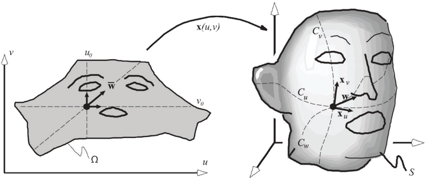
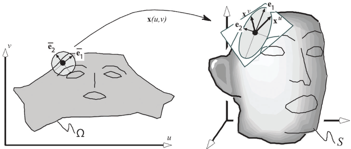
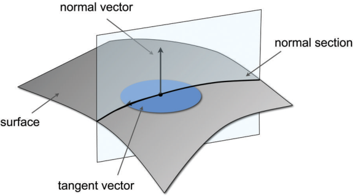
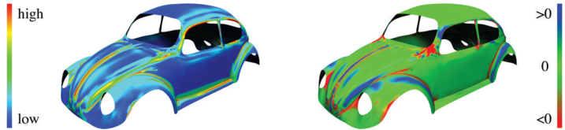
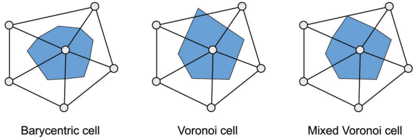
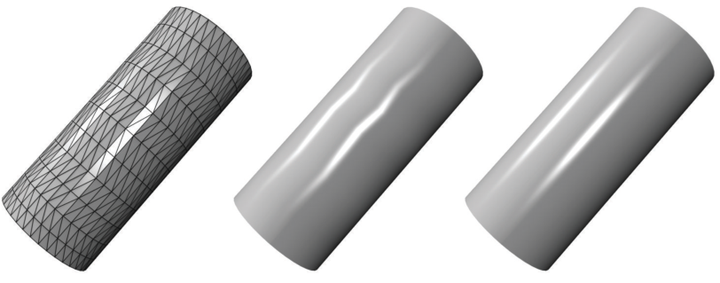
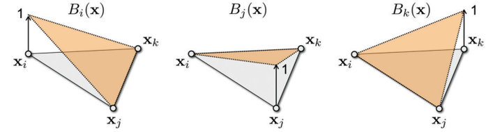
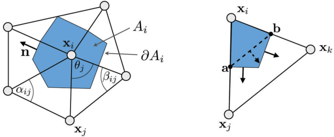

# 《多边形网格处理》第三章:微分几何(Differential Geometry)

&emsp;本章介绍微分几何的一些基础概念.我们关注的是与后续章节描述的几何处理算法相关的属性,并参考诸如[Carmo 76]等标准教科书的证明和深入的讨论.微分几何采用微分学的方法来描述光滑曲线和曲面的局部性质.在回顾光滑2流形曲面的基本微分几何概念之前,我们将从平面曲线开始,以提供一些几何直观.本章的其余部分将讨论对多边形曲面的扩展.特别地,我们将提出离散曲率测度,并给出三角网格拉普拉斯-贝尔特拉米算子的标准离散近似的一个推导.

## 3.1 曲线(Curves)

&emsp;我们考虑一个光滑的平面曲线,即嵌入在 ${\rm I \!R}^2$ 中的可微1流形.这样一个曲线可以用参数化形式通过一个向量值函数 ${\rm x}:[a,b]\rightarrow {\rm I \!R}^2$ 的形式表示, ${\rm x}(u)=(x(u),y(u))^T,u\in[a,b]\subset {\rm I \!R}^2$ (见第一章).坐标 $𝑥$ 和 $𝑦$ 假设是函数 $𝑢$ 的可微函数.曲线在点 ${\rm x}(u)$ 处的切向量 ${\rm x'}(u)$ 为坐标函数的一阶导数,即 ${\rm x'}(u)=(x'(u),y'(u))^T$ .例如,在点力学中,点的轨迹是一条由时间 $(u = t)$ 参数化的曲线,切向量 $x'(t)$ 对应于时间 $t$ 时的速度向量.我们假设参数化是规则的,对于所有 $x'(u)\ne 0$ .则在 ${\rm x}(u)$ 处的法向量 $n(u)$ 可以计算为 $n(u)={\rm x'}(u)^\bot/||{\rm x'}(u)^\bot||$ ,其中 $⊥$ 表示旋转90度.

&emsp;因为曲线定义为函数 ${\rm x}$ 的图像,因此可以通过不同的参数化得到相同的曲线.例如, ${\rm x}_1(u)=(u,u)^T$ 描述 $u\in[0,1]$ ,即点 $(0,0)^T$ 和 $(1,1)^T$ 之间的直线段.然而,它们的参数化不同,因此对于一个固定 $𝑢$ ,通常 ${\rm x}_1(u)\ne {\rm x}_2(u)$ 正如这个例子所说明的,我们可以在不改变曲线形状的情况下改变参数化.利用重参数化(Reparameterization) $v(u)=u^2$ 我们获得 ${\rm x}_1(v(u))={\rm x}_1(u^2)={\rm x}_2(u)$ .曲线的微分几何涉及曲线的特性,这些特性与特定的参数无关,如长度或曲率.
 
### 3.1.1 弧长(Arc Length)

$emsp;在区间 $[c,d]\subseteq[a,b]$ 内定义的任意曲线的长度 $l(c,d)$ 可以通过切向量的积分计算得到,即 $l(c,d)=\int_{c}^{d}||{\rm x'}(u)||{\rm d}u$ .因此,切向量 ${\rm x'}$ 编码了曲线的 **度量(Metric)** .参数曲线允许一个唯一的参数化,以便在参数区间和曲线之间通过使用重参数化来定义一个保持长度的映射,即 **等距(Isometry)** ,重参数化公式为:
$$
s=s(u)=\int_{a}^{u}||{\rm x}'|| {\rm d} \tag{3.1} 
$$
此 **弧长参数化(Arc length Parameterization)** 与具体的曲线表示无关,并将参数区间 $[a,b]$ 映射到 $[0,L]$,其中 $L=l(a,b)=\int_{a}^{b}||{\rm x}'(u)||{\rm d}u$ 是曲线的总长度.这个名称源于一个重要的性质:对于曲线上的任意点 ${\rm x}(s)$ ,曲线从 $x(0)$ 到 $x(𝑠)$ 的长度等于 $𝑠$ .虽然任何正则曲线都可以用弧长参数化,但我们将在第5章中看到,这种标准参数化一般不能用于表面.

### 3.1.2 曲率(Curvature)

&emsp;假设一个正则曲线使用弧长参数化的话,我们可以定义一个点 ${\rm x}(s)$ 为
$$
κ(s):=||{\rm x}''(s)|| 
$$
对于任意带参数化 $u$ 的正则曲线来说,我们可以根据弧长 $s(u)$ 重参数化来定义曲率.直觉上,曲率衡量的是曲线偏离直线的强度.换句话说,曲率是曲线切向量的导数和曲线法向量的关系,也可以用 ${\rm x}''(s) = κ(s){\rm n}(s)$ 来定义.注意,在这个定义中,曲率是有符号的,因此当法线的方向颠倒时,曲率的符号就会改变.很容易看出来,一条直线的曲率是消失的,任何处处为零曲率的曲线一定是一条线段.常曲率的平面曲线是圆弧.曲率也可以定义为 **密切圆(Osculation Circle)** 半径的倒数.这个圆在 ${\rm x}(u)$ 点处与曲线的局部最接近,可以这样构造:假设 $c(u_{\_},u,u_{+})$ 为经过曲线上的三个点 ${\rm x}(u_{\_})$,${\rm x}(u)$ 和 ${\rm x}(u_{+})$ 的一个圆,其中 $u_{\_}<u<u_{+}$ .则在点 ${\rm x}(u)$ 处的密切圆 $c(u)$ 定义为 $c=\lim_{u_{\_},u_+ \rightarrow u}{c(u_{\_},u,u_+)}$ .密切圆的半径为 $1/κ(u)$,与曲线在 ${\rm x}(u)$ 处相切.

## 3.2 表面(Surfaces)

&emsp;长度和曲率是曲线的欧几里德不变量;也就是说,它们在刚性运动下不会改变.现在我们来看看嵌入在 ${\rm I \!R}^3$ 中的光滑表面的类似度量和曲率属性.使用表面的参数表示更容易定义这些属性,如下所述.然后,度量性质将从这个参数表示推导出来.将这些微分性质转换为三角形网格的离散化将在第3.3节中描述.

### 3.2.1 表面的参数化表示(Parametric Representation of Surfaces)

&emsp;作为参数化表面表示的一个例子,我们来看看绘制世界地图的问题.如图3.1所示,问题是找到一种方法"展开"世界的表面,以获得一个2D平面.因为世界是封闭的,所以需要一个切口来切开它.例如,它可以沿着子午线切割,也就是一条连接两极的曲线.在展开过程中,请注意两个极点被拉伸成两条曲线.北极点转换为 ${\rm \textbf{AC} }$ 段,南极点转换为 ${\rm \textbf{BD} }$ 段.同时还可以注意到沿着球体的子午线已经被切成对应两段不同的曲线: ${\rm \textbf{AB} }$ 段和 ${\rm \textbf{CD} }$ 段.换句话说,如果一个城市恰好位于子午线上,则它会出现在地图的两侧.

    
     
    
图 3.1.给我开辟一条子午线,我就开辟整个世界!(图片来自于[Hormann et al. 07].)

&emsp;如图3.2所示,图上的每个点都可以提供两个坐标 $(θ,φ)$ .在图3.1所示的映射中,3D空间中的 $(x,y,z)$ 坐标以及图中的 $(θ,φ)$ 坐标通过以下方程连接起来,该方程称为球面参数方程:
$$
{\rm x}(\theta,\phi)= 
\left( 
    \begin{array}{c}  
        x(\theta,\phi) \\ 
        y(\theta,\phi) \\ 
        z(\theta,\phi) \\  
    \end{array}    
\right) 
= 
\left( 
    \begin{array}{c}  
    R \cos(\theta) \cos(\phi) \\ 
    R \sin(\theta) \cos(\phi) \\ 
    R \sin(\phi) \\  
    \end{array}    
\right)
$$
其中 $\theta \in [0,2\pi]$, $\phi \in [-\pi/2,\pi/2]$ ,而 $𝑅$ 为球体的半径.对于一般的表面我们将把这一映射表示为 ${\rm x}(u,v)=(x(u,v),y(u,v),z(u,v))^T$ .

    
     
    
图 3.2.球体坐标.(图片来自于[Hormann et al.07]).

&emsp;注意,这个方程不同于球体的隐式方程, $x^2+y^2+z^2=R^2$ .隐式方程提供了一种检验给定点是否在球面上的方法,而参数方程描述了一种将矩形 $[0,2\pi]\times [-\pi/2,\pi/2]$ 转换成球面的方法(参见第1章).

&emsp;对于参数方程,可以给出以下定义:

● 点 ${\rm \textbf{p} }=(x,y,z)$ 处的坐标 $(\theta,\phi)$ 称为点 ${\rm \textbf{p} }$ 的 **球体坐标(Spherical Coordinates)** .  
● 图中每一条由 θ=常数 定义的垂直线,都对应于3D表面上的一条曲线,称为等 θ 曲线.在我们的例子中,等 θ 曲线是横贯球体两极的圆(即地球的子午线).  
● 图中由 φ=常数 定义的每一条水平线都对应着一条等 φ 曲线.在我们的例子中,等 φ 曲线是地球的平行线,等 φ 对应的 φ=0 是赤道.  

&emsp;如图3.2所示,绘制等θ曲线和等φ曲线有助于我们理解一张地图应用到表面上是如何如何变形的.图中,等θ曲线和等φ曲线分别为垂直线和水平线,构成规则的网格.当地图应用到表面上时,可以看到网格在两极附近发生的扭曲.在这些区域上,这些网格的方形是高度扭曲的.在我们将曲率的概念从曲线推广到曲面之前,下一小节介绍一种测量和量化对应扭曲的方法.

### 3.2.2 度量属性(Metric Properties)

&emsp;设连续表面 $S\subset {\rm IR}^3$ 的参数形式如下:
$$
{\rm x}(u,v)
= 
\left( 
    \begin{array}{c}  
        x(u,v) \\ 
        y(u,v) \\ 
        z(u,v) \\  
    \end{array}
\right) ,(u,v)\in\Omega\subset{\rm I \!R}^2
$$
其中 $𝑥$ , $𝑦$ 和 $𝑧$ 是 $𝑢$ 和 $𝑣$ 中的可微函数, $Ω$ 是参数域.标量值 $(𝑢,𝑣)$ 是参数空间的坐标.

&emsp;与曲线类似,表面的度量由函数 ${\rm x}$ 的一阶导数决定.如图3.3所示,在点 ${\rm x}(u_0,v_0)\in S$ 的两个偏导数
$$
x_u(u_0,v_0):=\frac{∂ {\rm x} }{∂u}(u_0,v_0)
$$
与
$$
x_v(u_0,v_0):=\frac{∂ {\rm x} }{∂v}(u_0,v_0)
$$
分别是两个等参数曲线 
$$
{\rm \textbf{C}_\textbf{u} }(t)={\rm x}(u_0+t,v_0)
$$
和
$$
{\rm \textbf{C}_\textbf{v} }(t)={\rm x}(u_0,v_0+t)
$$
的切向量.下面我们去掉 $(u_0,v_0)$ 或 $(u,v)$ 以简化符号.但是要记住重要的一点,所有的量都是点式定义的,并且通常在表面上会变化.

    
     
    
图 3.3.将参数空间的切向量 $\bar{ {\rm w} }$ 转换为表面 $S$ 的切向量 ${\rm w}$ ,表面 $S$ 由参数化 ${\rm x}$ 描述

假设一个 **正则参数化(Regular Parameterization)** ,即 ${\rm x}_u \times {\rm x}_v\ne 0$ ,则 $S$ 的切平面是由两个切向量 ${\rm x}_u$ 和 ${\rm x}_v$ 展开而成的.表面法向量与两个切向量都正交,因此可以计算为

$$
{\rm n} = \frac{ {\rm x}_u\times{\rm x}_v } {||{\rm x}_u\times{\rm x}_v||}
$$

另外,我们可以定义 ${\rm x}$ 的任意方向导数.给定一个在参数空间下的方向向量 $\bar{ {\rm w} }=(u_w,v_w)^T$ ,我们考虑由 $t$ 参数化的直线穿过 $(u_0,v_0)$ 并且方向为 $\bar{ {\rm w} }$ ,这由 $(u,v)=(u_0,v_0)+t\bar{ {\rm w} }$ 给出.穿过 ${\rm x}$ 的直线图像为曲线 

$$
{\rm C_w}(t)={\rm x}(u_0+tu_w,v_0+tv_w) 
$$

${\rm x}$ 在点 $(u_0,v_0)$ 相对于方向 $\bar{ {\rm w} }$ 的方向导数 ${\rm w}$ 定义为 {\rm C_w}(t) 在 $t=0$ 处的切线, ${\rm w}=∂ {\rm C_w}(t)/∂t$ .通过运用链式法则,因此得到 ${\rm w}={\rm J \bar{w} }$ ,其中 ${\rm J}$ 是 ${\rm x}$ 的 **雅可比矩阵(Jacobian Matrix)** ,定义为

$$
{\rm J}= 
\left[
    \begin{array}{c}  
        \frac{∂x}{∂u} \ \ \ \ \frac{∂x}{∂v} \\
        \frac{∂y}{∂u} \ \ \ \ \frac{∂y}{∂v} \\  
        \frac{∂z}{∂u} \ \ \ \ \frac{∂z}{∂v}
    \end{array}    
\right]
=[{\rm x}_u,{\rm x}_v]
$$

**第一基本形式(First Fundamental Form)** .参数化函数 ${\rm x}$ 的雅可比矩阵对应于将参数空间中的向量 $\bar{ {\rm w} }$ 变换为表面上的切向量 ${\rm w}$ 的线性映射.更通俗地说,雅可比矩阵编码了表面的度量,它允许测量角度,距离和面积是如何从参数域到曲面的映射进行变换的.设 $\bar{ {\rm w} }_1$ 和 $\bar{ {\rm w} }_2$ 是参数空间下的两个单位方向向量.这两个向量的夹角的余弦值可通过标量积 ${ {\rm \bar{w} }_1}^T{\rm \bar{w} }_2$ 得到.对应到表面的切线之间标量积为

$$
{ {\rm w_1} }^T{\rm w}_2=({ {\rm J\bar{w} }_1})^T({\rm   J\bar{w} }_2)={ {\rm \bar{w} }_1}^T({\rm J}^T{\rm J}){\rm \bar{w} }_2 
$$

矩阵 ${\rm J}^T{\rm J}$ 也叫做 ${\rm x}$ 的 **第一基本形式(First Fundamental Form)** ,通常写成

$$
{\rm I}
=
{\rm J}^T{\rm J}=
\left[ 
    \begin{array}{c}  
        E \ \ \ \ F \\ 
        F\ \ \ \ G  
    \end{array}    
\right]
:=
\left[ 
    \begin{array}{c}  
        {\rm x}_u^T{\rm x}_u  \ \ \ \  {\rm x}_u^T{\rm x}_v \\  
        {\rm x}_u^T{\rm x}_v  \ \ \ \  {\rm x}_v^T{\rm x}_v  
    \end{array}    
\right] \tag{3.2}
$$

第一基本形式 ${\rm I}$ 定义了在 $S$ 的切线空间下的一个内积.除了测量角度,我们还可以使用这一个内积来决定切线向量 ${\rm w}$ 的平方长度为 $||{\rm w}||^2={ {\rm \bar{w} } }^T{\rm I}{\rm \bar{w} }$.

&emsp;这可以用来测量曲线 ${\rm x}(t)={\rm x}({\rm u}(t))$ 的长度,曲线定义为在参数域中的正则曲线 ${\rm u}(t)=(u(t),v(t))$ 图像.曲线的切向量可以通过链式法则得出:

$$
\frac{ {\rm{d} }{\rm x}({\rm u}(t))}{ {\rm d}t}
=
\frac{∂{\rm x} }{∂u}\frac{ {\rm d}u}{ {\rm d}t}+\frac{∂{\rm x} }{∂v}\frac{ {\rm d}v } { {\rm d} t}
=
{\rm x}_uu_t+{\rm x}_vv_t  
$$

因此,对于参数区间[a, b],我们可以使用方程(3.1)确定 ${\rm x}({\rm u}(t))$ 的长度 $l(a, b)$ ,为

$$
l(a, b)
=
\int_{a}^{b}\sqrt{(u_t,v_t){\rm I}(u_t,v_t)^T}{\rm d}t  
=
\int_{a}^{b}\sqrt{Eu_t^2+2Fu_tv_t+Gv_t^2\rm dt}
$$

同理,我们可以测量特定参数区域 $U\subseteq \Omega$ 对应的表面面积 $A$:

$$
A
=
\int\int_{U}^{}\sqrt{ {\rm det}({\rm I})}{\rm d}u{\rm d}v 
=
\int\int_{U}^{}\sqrt{EG-F^2}{\rm d}v{\rm d}v tag{3.3} 
$$

因为第一基本形式 ${\rm I}$ 可以测量角度,距离和面积,因此它可以作为一个几何工具,有时也用 ${\rm G}$ 表示,称作 **度量张量(Metric Tensor)** .

 **各向异性(Anisotropy)** .利用雅可比矩阵,从参数空间位置 $(u_0,v_0)$ 传出的方向 $\bar{ {\rm w} }$ 可以通过参数化转换为切向量 ${\rm w}$ 如图3.4所示,也可以通过参数化 ${\rm x}$ 对一个小圆进行变换,得到一个小椭圆,称为 **各向异性椭圆(Anisotropy Ellipse)** .考虑第一基本形式 ${\rm I}$ 的特征向量 $\bar{ {\rm e} }_1$ 和 $\bar{ {\rm e} }_2$  ,以及与之相关的特征值 $\lambda_1$ 和 $\lambda_2$ ,各向异性椭圆可表示为:

● 各向异性椭圆的轴分别为 ${\rm e}_1={\rm J}\bar{\rm e}_1$ 以及 ${\rm e}_2={\rm J}\bar{\rm e}_2$  
● 轴的长度分别为 $\sigma_1=\sqrt{\lambda_1}$ 以及 $\sigma_2=\sqrt{\lambda_2}$  

注意,轴的长度 $σ_1$ 和 $σ_2$ 也对应于雅可比矩阵 ${\rm J}$ 的奇异值.

&emsp;它们的表达式可以通过计算特征多项式的零值的平方根 $p(σ) = {\rm det}({\rm I}- σ {\rm Id})$ 得到,其中 ${\rm Id}$ 表示为如下的单位矩阵:

$$
\begin{aligned}
\sigma_1 &= \sqrt{1/2(E+G)+\sqrt{(E-G)^2+4F^2} } \\
\sigma_2 &= \sqrt{1/2(E+G)-\sqrt{(E-G)^2+4F^2} } 
\end{aligned}
$$

其中 $𝐸$ , $𝐹$ , $𝐺$ 表示第一基本形式 ${\rm I}$ 的系数(方程(3.2)).

    
     
    
图 3.4各向异性:参数空间下的小圆变换为笛卡尔空间下的小椭圆(图片来自于[Hormann et al. 07].)

### 3.2.3 表面曲率(Surface Curvature)

&emsp;为了将曲率的概念从曲线扩展到曲面,我们来看看嵌在曲面中的曲线的曲率.设 ${\rm t}=u_t{\rm x}_u+v_t{\rm x}_v$ 为表面点 ${\rm \textbf p}\in S$ 的切向量,在参数空间下表示为 $\bar{\rm t}=(u_t,v_t)^T$ .在 ${\rm \bf p}$ 点的法曲率(Normal Curvature)为平面曲线的曲率,平面曲线是通过在 ${\rm \bf p}$ 点创建一个跨过 ${\rm \bf t}$ 和表面法线 ${\rm \bf n}$ 且与表面相交的平面(见图3.5).我们可以将法曲率在 $\bar{\rm \bf t}$ 方向上表示为

$$
κ_n(\bar{\rm \bf t})
=
\frac{
    \bar{\rm \bf t}^T{\rm \bf II}{\rm \bf t} }{\bar{\rm \bf t}^T{\rm \bf I}{\rm \bf t} } 
=\frac{eu_t^2+2fu_tv_t+gv_t^2}{Eu_t^2+2Fu_tv_t+Gv_t^2} \tag{3.4} 
$$

其中 ${\rm \bf II}$ 为 **第二基本形式(Second Fundamental Form)** ,表示为 

$$
{\rm \bf II}
=
\left[ 
    \begin{array}{c}  
    e \ \ \ \ f \\
    f\ \ \ \ g  
    \end{array}    
\right]
:=
\left[ 
    \begin{array}{c}  
    {\rm \bf x}^T_{uu}{\rm \bf n} \ \ \ \   {\rm \bf x}^T_{uv}{\rm \bf n} \\ 
    {\rm \bf x}^T_{uv}{\rm \bf n} \ \ \ \   {\rm \bf x}^T_{vv}{\rm \bf n}  
    \end{array}    
\right] 
$$
这里,${\rm \bf x}$ 的二阶偏导表示为

$$
{\rm \bf x}_{uu}
:=
\frac{∂^2{\rm \bf x} }{∂u^2},{\rm \bf x}_{uv}
:=
\frac{∂^2{\rm \bf x} }{∂u∂v},{\rm \bf x}_{vv}
:=
\frac{∂^2{\rm \bf x} }{∂v^2} 
$$

    
     
    
图 3.5.表面与由跨过交点切向量和法向量的平面定义了一个法截面:嵌入在表面中的平面曲线.通过分析这一无限的曲率,我们可以定义表面的曲率.

&emsp;表面的曲率特性可以通过考虑所有在 ${\rm \bf p}$ 处法向截面的曲率来表示,即通过将切向量 ${\rm \bf t}$ 绕表面法向旋转来表示.假设 $κ_n(\bar{\rm \bf t})$ 随 $\bar{\rm \bf t}$ 的变化而变化,可以证明方程(3.4)的有理二次函数有两个显著的极值,称作 **主曲率(Principal Curvatures)** .我们用 $κ_1$ 表示最大曲率, $κ_2$ 表示最小曲率.

&emsp;如果 $κ_1\neκ_2$ ,我们可以确定两个唯一的单位切向量 ${\rm \bf t}_1$ 和 ${\rm \bf t}_2$ 叫 **主方向(Principal Directions)** ,它们分别与两个主曲率 $κ_1$ 和 $κ_2$ 有关. $κ_1=κ_2$ 的表面点称为 **脐点(Umbilical)** 或 **局部球(Locally Spherical)** .对于这样的点,其左右的切向量都可以认为是主方向,且曲率属性是各向同性的.例如,球面或平面上的每个点都是脐点,而由脐点组成的每一个连通面都一定包含在球面或平面中.

 **欧拉定理(Euler Theorem)** .欧拉定理将法向曲线与主曲率联系起来:

$$
κ_n(\bar{\rm \bf t}) = κ_1\cos^2ψ+κ_2\sin^2ψ
$$

其中 $ψ$ 是 ${\rm \bf t}$ 和 ${\rm \bf t}_1$ 的夹角.这一关系表明,表面的曲率完全由两个主曲率决定;任何法曲率都是最小曲率和最大曲率的凸组合.欧拉定理还表明,主方向总是互相正交的.这个性质可以用于如在四优重网格中计算曲率线网络(如第6章所述).对于所有的非脐点,这些曲线与两个唯一的主方向相切,因此在曲面上相交成直角.

 **曲率张量(Curvature Tensor)** .曲面的局部性质可以用曲率张量 ${\rm C}$ 来描述,曲率张量 ${\rm C}$ 为一个具有特征值 $κ_1$ , $κ_2$ , 0和相应特征向量 ${\rm \bf t}_1$ , ${\rm \bf t}_2$ , ${\rm \bf n}$ 的对称3 × 3矩阵.曲率张量可以构造为 ${\rm \bf C=PDP^{-1} }$ ,其中 ${\rm \bf P=[t_1,t_2,n}]$ , ${\rm \bf D}={\rm diag}(κ_1,κ_2,0)$ .

&emsp;在本书中还广泛使用另外两种曲率测量方法:  

●  **平均曲率(Mean Curvature)**  $H$ ,定义为主曲率的平均值:

$$
H=\frac{κ_1+κ_2}{2} \tag{3.5} 
$$

●  **高斯曲率(Gaussian Curvature)**  $K$, 定义为主曲率的乘积:

$$
K=κ_1κ_2 \tag{3.6} 
$$

高斯曲率可以将表面点分为三个不同的种类: **椭圆(Elliptical)** 点( $𝐾>0$ ), **双曲(Hyperbolic)** 点( $𝐾<0$ ),和 **抛物(Parabolic)** 点( $𝐾=0$ ).双曲点处的表面局部呈鞍形,椭圆点处的表面局部呈凸形.抛物点通常位于分离椭圆和双曲区域的曲上.高斯曲率和平均曲率通常用于表面的目视检查,如图3.6所示.

    
     
    
图 3.6.彩色编码的曲率值,平均曲率(左)和高斯曲率(右).(图片来自于[Botsch et al. 06b]).

 **内蕴几何(Intrinsic Geometry)** .在微分几何中,仅依赖于第一基本形式的性质(方程(3.2))称为内蕴性质.直观地说,一个表面的内在几何形状可以被生活在表面的2D生物感知到,而不需要知道第三维的信息.例子包括曲面上曲线的长度和角度.高斯著名的 **绝妙定理(Egregium Theorema)** 表明高斯曲率在局部等距下是不变的,因此对于表面来说也是独立的.因此高斯曲率可以直接从第一个基本形式确定.相反,平均曲率在等距下不是不变的,其变化取决于嵌入程度.注意,术语intrinsic也经常用来表示特定参数化的独立性.

 **拉普拉斯算子(Laplace Operator)** .接下来的章节将广泛地使用 **拉普拉斯算子(Laplace Operator)**  $Δ$ 和 **拉普拉斯-贝尔特拉米(Laplace-Beltrami)** 算子 $\Delta_S$ .一般来说,拉普拉斯算子定义为梯度散度,即, $\Delta=∇^2=∇ \cdot ∇$ .对于欧几里得空间中的双参数函数 $f(u, v)$ ,这个二阶微分算子可以写成二阶偏导数的和:

$$
\Delta f
=
{\rm div }∇ f
=
{\rm div} 
\left( 
    \begin{array}{c}  f_u \\ f_v   
    \end{array}    
\right)
=
f_{uu}+f_{vv} 
$$

拉普拉斯-贝尔特拉米算子将这个概念扩展到定义在表面上的函数.对于定义在流形表面 $𝑆$ 上的给定函数 $𝑓$ ,拉普拉斯-贝尔特拉米定义为

$$
\Delta_S f={\rm div}_S∇_Sf 
$$

其中需要在流形上定义合适的散度算子和梯度算子(详见[do Carmo 76]).将拉普拉斯-贝尔特拉米算子应用到表面的坐标函数 ${\rm \bf x}$ 上,得到 **平均曲率法向量(Mean Curvature Normal)** :

$$
\Delta_S{\rm \bf x}=-2H{\rm \bf n} \tag{3.7} 
$$

注意,尽管这个方程将拉普拉斯-贝尔特拉米算子与表面的(非内在)平均曲率联系起来,但算子本身是一种内蕴性质,只依赖于曲面的度规,即第一基本形式.为了简单起见,我们经常去掉下标,在上下文清晰的情况下,简单地使用符号 $Δ$ 来表示拉普拉斯-贝尔特拉米运算子.

## 3.3 离散微分算子(Discrete Differential Operators)

&emsp;在前一节中定义的微分性质要求曲面充分可微,例如,曲率的定义要求二阶导数的存在.由于多边形网格是分段线性曲面,上述概念不能直接应用.以下离散微分算子的定义是基于网格可以被解释为光滑表面的分段线性逼近的假设作为前提的.目标是直接从网格数据中计算出这个底层表面的微分特性的近似.近年来,人们提出了不同的方法.我们将关注拉普拉斯-贝尔特拉米算子事实上的标准离散化,并提供一个简短的推导结果公式,紧跟[Meyer et al.03].在[Pinkall and Polthier 93, Desbrun et al. 99]中提出了相同结果的替代推导.要了解更多细节,请参阅3.4节提供的参考文献和调查[Petitjean 02].

### 3.3.1 局部平均域(Local Averaging Region)

&emsp;一般的想法是计算离散微分特性作为网格上点 ${\rm \bf x}$ 的局部邻域 ${\rm \mathcal N} ({\rm \bf x})$ 的空间平均.通常 ${\rm \bf x}$ 与网格顶点 ${\rm \it v_i}$ 重合, ${\rm \it n}$ -环邻域 ${\rm \mathcal N}_n ({\rm \it v_i})$ 或局部测地线球作为平均域. 局部邻域的大小直接影响离散算子的稳定性和精度.邻域越大,平均运算引入的平滑程度越高,使得计算在有噪声的情况下更加稳定.对于干净的数据集,通常可选择较小的邻域,因为它们更准确地捕捉不同属性的细微变化.图3.7显示了顶点单环邻域上定义的三种平均域的变体.重心单元连接三角形重心与边缘中点.或者,我们可以定义一个局部Voronoi单元,将三角形重心替换为三角形的外圆心.Voronoi单元的紧密性导致了离散算子的严格误差边界,如[Meyer et al. 03]所示.然而,如图所示,外圆心可以在三角形的外面.虽然这并没有使下面的离散化失效,但通过确保局部平均区域建立一个完美的网格表面平铺,可以获得稍好的近似特性.这可以通过将钝角三角形的外圆心替换为与中心顶点相对的边的中点来实现.得到的平均面积表示为 **混合Voronoi(Mixed Voronoi)** 单元.

    
     
    
图3.7.蓝色表示用于计算与单环邻域的中心顶点相关联的离散微分算子的局部平均区域.

### 3.3.2 法向量(Normal Vectors)

&emsp;几何处理和计算机图形学中的许多操作都需要法线,无论是每个面还是每个顶点;如Phong着色.单一三角形 ${\rm \it T}=({\rm \bf x}_i,{\rm \bf x}_j,{\rm \bf x}_k)$ 的法向量可以通过计算两条三角形边归一化的叉乘得到:

$$
{\rm \bf n}(T)
=
\frac{({\rm \bf x}_j-{\rm \bf x}_i)\times({\rm \bf x}_k-{\rm \bf x}_i)}{||({\rm \bf x}_j-{\rm \bf x}_i)\times({\rm \bf x}_k-{\rm \bf x}_i)||}
$$

&emsp;将顶点法线计算为局部单环邻域法向量的空间平均值,可以得到附属三角形(常数)法向量的归一化加权平均值:
$$
{\rm \bf n}(v)
=
\frac{\sum_{T\in {\rm \mathcal N}_1(v)}^{}{\alpha_T{\rm \bf n(T)} } }{||\sum_{T\in {\rm \mathcal N}_1(v)}^{}{\alpha_T{\rm \bf n(T)} }||}
$$

&emsp;对于权重 $\alpha_T$ ,有多种可选方向.以下我们描述最常用的方法,并在图3.8中对它们进行比较:  

● 常数权重 $\alpha_T=1$ 便于计算,但是没有考虑边长,三角形面积或者角度,因此对于不规则的网格,其结果是反直觉的.  
● 图3.7所示的局部平均域建议基于三角形面积的加权,即 $\alpha_T=|T|$ .这种计算方法特别高效,因为基于面积加权的面法线仅仅是两条三角形边的叉乘(非归一化).但是同样也会出现反直觉的结果.  
● 在足够小的测地线圆盘上进行平均,相当于通过附属三角形角 $\alpha_T=\theta_T$ 来加权(见图3.10).由于引入了三角函数,使得这种方法计算成本更高,但一般来说,它可以给出更好的结果.

&emsp;对于大多数应用,基于角加权的面法线提供了计算效率和准确性之间的一个很好的权衡.更多的细节和不同方法的比较可以在[Max 99,Jin et al. 05]中找到.

    
     
    
图 3.8. 在同一个均匀细分圆柱上计算逐顶点法线的不同方法:中间为常数权重和面积权重的结果,右边为角权重.

### 3.3.3 梯度(Gradients)

&emsp;由于拉普拉斯-贝尔特拉米算子定义为梯度的散度,我们首先来看看一个分段线性三角形网格的函数梯度的合适定义.梯度在网格参数化(第五章)和变形(第九章)中也起着重要的作用.

我们假设分段线性函数 $𝑓$ 在每一个网格顶点处为 $f(v_i)=f({\rm \bf x}_i)=f({\rm \bf u}_i)=f_i$ ,且每一个三角形 $({\rm \bf x}_i,{\rm \bf x}_j,{\rm \bf x}_k)$ 内线性插值:

$$
f({\rm \bf u})=f_iB_i({\rm \bf u})+f_jB_j({\rm \bf u})+f_kB_k({\rm \bf u})
$$

其中 ${\rm \bf u}=(u,v)$ 为在三角形中2D保角参数化的表面点 ${\rm \bf x}$ 的参数对(见第五章).图3.9给出了用于插值的线性重心基函数.
$f$ 的梯度为

$$
∇f({\rm \bf u})=f_i∇B_i({\rm \bf u})+f_j∇B_j({\rm \bf u})+f_k∇B_k({\rm \bf u})
$$

由于基函数满足单位分割的重心条件,即对于所有的 ${\rm \bf u}$ 满足 $∇B_i({\rm \bf u})+∇B_j({\rm \bf u})+∇B_k({\rm \bf u}) =1$ ,,所以基函数的和为0,即 $∇B_i({\rm \bf u})+∇B_j({\rm \bf u})+∇B_k({\rm \bf u})=0$ .因此上述方程可以写成

$$
∇f({\rm \bf u})=(f_j-f_i)∇B_j({\rm \bf u})+(f_k-f_i)∇B_k({\rm \bf u})
$$

如图3.9所述,基函数最陡的上升方向与对应顶点的对边正交.通过适当的归一化, $B_i$ 的梯度为

$$
∇B_i({\rm \bf u})=\frac{({\rm \bf x}_k-{\rm \bf x}_j)^\bot}{2A_T} \tag{3.8} 
$$

其中 $⊥$ 表示在三角形平面内逆时针旋转90度, $A_T$ 为三角形 $T$ 的面积.因此,在三角形 $T$ 内分段线性函数 $f$ 的梯度值为常数

$$
∇f({\rm \bf u})
=
(f_j-f_i)\frac{({\rm \bf x}_i-{\rm \bf x}_k)^\bot}{2A_T}+(f_k-f_i)\frac{({\rm \bf x}_j-{\rm \bf x}_i)^\bot}{2A_T} \tag{3.9} 
$$

    
     
    
图 3.9. 三角形上重心插值的线性基函数

### 3.3.4 离散拉普拉斯-贝尔特拉米算子(Discrete Laplace-Beltrami Operator)

&emsp;我们讨论拉普拉斯-贝尔特拉米算子的两种离散:均匀图拉普拉斯和广泛使用的余切公式.

 **均匀拉普拉斯(Uniform Laplacian)** .Taubin [Taubin 95]提出了拉普拉斯-贝尔特拉米算子的均匀离散化

$$
\Delta f(v_i)
=
\frac{1}{|{\rm \mathcal N}_1(v_i)|}\sum_{v_j\in{\rm \mathcal N}_1(v_i)}^{ }{(f_j-f_i)} \tag{3.10} 
$$

其中总数是所有单环邻域 $v_j\in {\rm \mathcal N}_1(v_i)$ 的总和.应用到坐标函数 ${\rm \bf x}$ 中,均匀图拉普拉斯 $\Delta {\rm \bf x}_i$ 求出从中心顶点 ${\rm \bf x}_i$ 到单环顶点 ${\rm \bf x}_j$ 的平均值的向量.虽然计算简单且高效,但得到的向量即使对于顶点的平面构型也可以是非零的.然而,在这种情况下,我们期望拉普拉斯函数为零,因为整个网格区域的平均曲率为零(c.f. Equation(3.7)).这表明对于非均匀网格,均匀拉普拉斯算子不是一种合适的离散化方法.事实上,由于均匀拉普拉斯算子的定义只依赖于网格的连通性,所以其完全不适应顶点的空间分布.虽然这在许多应用中是不利的,但我们在第4章和第6章中讨论了如何利用这种嵌入的不变性来改善各向同性网格中顶点的局部分布.

 **余切公式(Cotangent formula)** .拉普拉斯-贝尔特拉米算子可以通过混合有限元/有限体积法得到更精确的离散化[Meyer et al.03].目标是在局部平均域 $A_i = A (v_i)$ 上积分分段线性函数梯度的散度.为了简化积分,我们利用向量值函数 ${\rm \bf F}$ 的散度定理:
$$
\int_{A_i}^{} {\rm div} {\rm \bf F}({\rm \bf u}) {\rm d}A
=
\int_{∂A_i}^{}{\rm \bf F}({\rm \bf u}) \cdot {\rm \bf n}({\rm \bf u}) {\rm d}s
$$

&emsp;这个方程将平均域 $A_i$ 与沿 $A_i$ 的边界 $∂A_i$ 的积分联系起来,其中 ${\rm \bf n}$ 是边界上向外的单位法线(见图3.10).应用到拉普拉斯方程中,得到

$$
\int_{A_i}^{} \Delta f({\rm \bf u}) {\rm d}A
=
\int_{A_i}^{} {\rm div} ∇ f({\rm \bf u}) {\rm d}A=\int_{∂A_i}^{}∇ f({\rm \bf u}) \cdot {\rm \bf n}({\rm \bf u}) {\rm d}s
$$

我们对每个三角形分别进行积分来分割这个积分.由于Voronoi局部区域的边界经过两条三角形边的中点a和b(见图3.10(右)),以及 $ ∇ f({\rm \bf x})$ 在每个三角形内是常数,因此对于一个三角形 $T$ 的积分可以计算为

$$
\begin{aligned}
\int_{∂A_i\cap T}^{}∇ f({\rm \bf u}) \cdot {\rm \bf n}({\rm \bf u}) {\rm d}s
&=∇f({\rm \bf u}) \cdot ({\rm \bf a-b})^\bot \\ 
&= \frac{1}{2} ∇ f({\rm \bf u})  \cdot({\rm \bf x}_j-{\rm \bf x}_k)^\bot
\end{aligned}
$$

代入到方程(3.9)为

$$
\begin{aligned}
\int_{∂A_i\cap T}^{}∇ f({\rm \bf u}) \cdot {\rm \bf n}({\rm \bf u}) {\rm d}s
= (f_j-f_i) \frac{({\rm \bf x}_i-{\rm \bf x}_k)^\bot \cdot ({\rm \bf x}_j-{\rm \bf x}_k)^\bot}{4A_T}
+ (f_k-f_i) \frac{({\rm \bf x}_j-{\rm \bf x}_i)^\bot \cdot ({\rm \bf x}_j-{\rm \bf x}_k)^\bot}{4A_T}
\end{aligned}
$$

    
     
    
图 3.10.在离散拉普拉斯-贝尔特拉米算子和离散高斯曲率算子的推导中使用的量的阐述.

&emsp;设 $γ_j$ , $γ_k$ 分别为三角形顶点 $v_j$ , $v_k$ 的内角.由于 $A_T=\frac{1}{2}\sin γ_j||{\rm\bf x}_j-{\rm \bf x}_i||\ ||{\rm\bf x}_j-{\rm \bf x}_k||=\frac{1}{2} \sin γ_k ||{\rm\bf x}_i-{\rm \bf x}_k||\ ||{\rm\bf x}_j-{\rm \bf x}_k||$ 且 $\cos γ_j=\frac{({\rm \bf x}_j-{\rm \bf x}_i)\cdot({\rm \bf x}_j-{\rm \bf x}_k)}{||{\rm \bf x}_j-{\rm \bf x}_i||\cdot||{\rm \bf x}_j-{\rm \bf x}_k||}$ 以及 $\cos γ_k=\frac{({\rm \bf x}_i-{\rm \bf x}_k)\cdot({\rm \bf x}_j-{\rm \bf x}_k)}{||{\rm \bf x}_i-{\rm \bf x}_k||\cdot||{\rm \bf x}_j-{\rm \bf x}_k||}$ ,所以上述表达式可简化为 

$$
\int_{∂A_i\cap T}^{}∇ f({\rm \bf u}) \cdot {\rm \bf n}({\rm \bf u}) {\rm d}s=\frac{1}{2}(\cot γ_k(f_j-f_i)+\cot γ_j(f_k-f_i))
$$

因此当对整个平均区域 $A_i$ 进行积分时我们就得到

$$
\int_{A_i}^{} \Delta f({\rm \bf u}) {\rm d}A
=
\frac{1}{2} \sum_{v_j\in{\rm \mathcal N}_1(v_i)}^{}{(\cot \alpha_{i,j}+\cot \beta_{i,j})(f_j-f_i)} \tag{3.11} 
$$

方程(3.11)可能是计算机图形学中最广泛使用的拉普拉斯-贝尔特拉米算子的离散化,通常用于各种几何处理任务,如表面平滑(第4章),参数化(第5章)和外形建模(第9章).

&emsp;然而,余切离散化也有一些缺点.如果 $\alpha_{i,j}+\beta_{i,j}>\pi$ 则余切权重 $(\cot \alpha_{i,j}+\cot \beta_{i,j})$ 变成了负数.这可能在某些应用中导致三角形翻转,例如,在计算参数化时就会出现(见第5章).此外,方程(3.11)的离散拉普拉斯-贝尔特拉米也不是纯粹内蕴的,即它的评估会导致不同的结果,即使是对于两个具有不同三角剖分的等值面来说也一样.我们参考3.4节中的一些另外的拉普拉斯-贝尔特拉米的离散定义来解决这些缺点.

&emsp;由于拉普拉斯算子被定义为梯度的散度,为了完整起见,我们简要描述 **散度算子(Divergence Operator)** [Tong et al. 03].假设一个向量场 ${\rm \bf w}:S \rightarrow {\rm I \!R}^3$ 是由每个三角形 $T$ 的恒定向量 ${\rm \bf w}_T$定义的(如,分段线性函数 $𝑓$ 的梯度).离散散度计算从向量场中的每个顶点 $v_i$ 到其附属三角形 $T\in{\rm \mathcal N}(v_i)$ 的标量值 ${\rm div} \ {\rm \bf w}(v_i)$ :

$$
{\rm div} \ {\rm \bf w}(v_i)
=
\frac{1}{A_i}\sum_{T\in {\rm \mathcal N}_1(v_i)}^{}{∇B_i|_T \cdot {\rm \bf w}_TA_T} \tag{3.12} 
$$

其中 $∇B_i|_T$ 为三角形 $T$ 中顶点 $v_i$ 的基函数的(常数)梯度向量(见方程(3.8)).请注意,散度(3.12),梯度(3.9)和拉普拉斯(3.11)的离散性是一致的, $∆f = {\rm div}∇f$ 在离散情况下也成立.

### 3.3.5 离散曲率(Discrete Curvature)

当应用于坐标函数 ${\rm \bf x}$ 时,拉普拉斯-贝尔特拉米算子提供了平均曲率法线的离散近似(见方程(3.17)).因此,我们可以定义在顶点 $v_i$ 处的绝对离散平均曲率为

$$
H(v_i)=\frac{1}{2}||\Delta{\rm \bf x}_i|| \tag{3.13} 
$$

Meyer等人[Meyer et al. 03]也提出了高斯曲率离散算子的推导:

$$
K(v_i)=\frac{1}{A_i}(2\pi -\sum_{v_j\in{\rm \mathcal N}_1(v_i) }^{}{\theta_j}) \tag{3.14} 
$$

其中 $\theta_{j}$ 表示在顶点 $v_i$ 处附属三角形的角度(见图3.10).这个公式是Gauss-Bonnet定理的直接结果[do Carmo 76].根据平均曲率(3.13)和高斯曲率(3.14)的离散近似,主曲率可由方程(3.6)和方程(3.5)求得:

$$
κ_{1,2}(v_i)=H(v_i)\pm\sqrt{H(v_i)^2-K(v_i)}
$$

### 3.3.6 离散曲率张量(Discrete Curvature Tensor)

&emsp;与大量拉普拉斯-贝尔特拉米算子的离散版本类似,市面上也有许多用于直接估计多边形表面上的曲率张量的方法(见3.4节的参考文献).我们简要描述了由Cohen-Steiner和Morvan提出的方法[Cohen-Steiner和Morvan 03],该方法已成功地应用于表面重网格[Alliez et al. 03a]和曲率域形状处理[Eigensatz et al. 08].在[Hilde- brandt和Polthier 04]中提出了一个类似的定义.

&emsp;其基本思想是为每条边定义一个曲率张量,方法是沿着这条边指定一个最小曲率为0,根据这条边的二面角指定一个最大曲率.对局部邻域 $A(v)$ 求平均,得到与 $A(v)$ 相交的边的一个简单的求和公式:

$$
C(v)
=
\frac{1}{A(v)}\sum_{ {\rm \bf e}\in A(v)}^{}{\beta({\rm \bf e})||{\rm \bf e}\cap A(v)||\bar{ {\rm \bf e} }\bar{ {\rm \bf e} }^T}
$$

其中 $\beta({\rm \bf e})$ 为边的两个附属面的法线之间的带符号二面角, $||{\rm \bf e}\cap A(v)||$ 为 $A(v)$ 中包含的 ${\rm \bf e}$ 的部分长度,且 $\bar{ {\rm \bf e} }={\rm \bf e}/||{\rm \bf e}||$ .局部邻域 $A(v)$ 通常可选为顶点 $𝑣$ 的单环或二环,但也可计算为一个局部测地线盘,即网格上所有与v相隔 $𝑣$ 一定(测地线)距离内的点.这可能更适合于非均匀细分表面,其中 $𝑛$-环邻域 ${\rm \mathcal N}_n{(v)}$ 的大小会在网格上显著地变化.正如在[Rusinkiewicz 04]中指出的,张量平均对于低价顶点和小(例如,单环)邻域会产生不准确的结果.

## 3.4 总结和延伸阅读

&emsp;通过离散来模拟光滑表面的微分性质是多年来一个活跃的研究领域.Pinkall和Polthier讨论了离散的最小曲面,并提出了使用网格上Dirichlet能量最小化方程(3.11)的推导[Pinkall和Polthier 93].Bobenko和Springborn [Bobenko and Springborn 07]在模拟表面的内蕴Delaunay三角剖分上评估方程(3.11),这使得评估可以独立于网格的特定类型.Zayer等人[Zayer et al. 05b]将余切权重替换为正平均值坐标[Floater 03],并对圆形区域进行积分,而不是对Voronoi区域进行积分.虽然这导致了拉普拉斯-贝尔特拉米离散化的不精确,但它避免了负权值.在[Hildebrandt et al. 06]中给出了离散几何性质的收敛条件的系统研究.

&emsp;另一种评估局部表面属性的方法是使用局部的高阶重建表面,然后在重建的表面面片上分析评估所需的属性.局部表面面片,通常是低度的二元多项式,被拟合到样本点[Cazals and Pouget 03, Petitjean 02, Welch and Witkin 94]和局部邻域内大概吻合的法线上[Goldfeather and Interrante 04].

&emsp;Rusinkiewicz提出了一种用顶点法线的有限差分逼近曲率的方案[Rusinkiewicz 04].Theisel等人的一种相关方法[Theisel et al.04]考虑了分段线性表面和分段线性法线场.

&emsp;Grinspun等人提供了离散微分几何不同概念和应用的广泛概述.特别是,他们提出了一种基于离散外部微积分来定义离散微分算子的替代方法[Grinspun et al. 08].Wardetzky等人根据一组从光滑设置中得到的理想属性对最常见的离散拉普拉斯算子进行分类[Wardetzky et al. 07].它们表明离散算子不能同时满足所有可识别的性质,如对称性,局部性,线性精度和正性.例如,方程(3.11)的余切公式满足前三个性质,但不满足第四个性质,因为边权值可以设为负值.因此,离散化的算法选择取决于具体的应用场景.