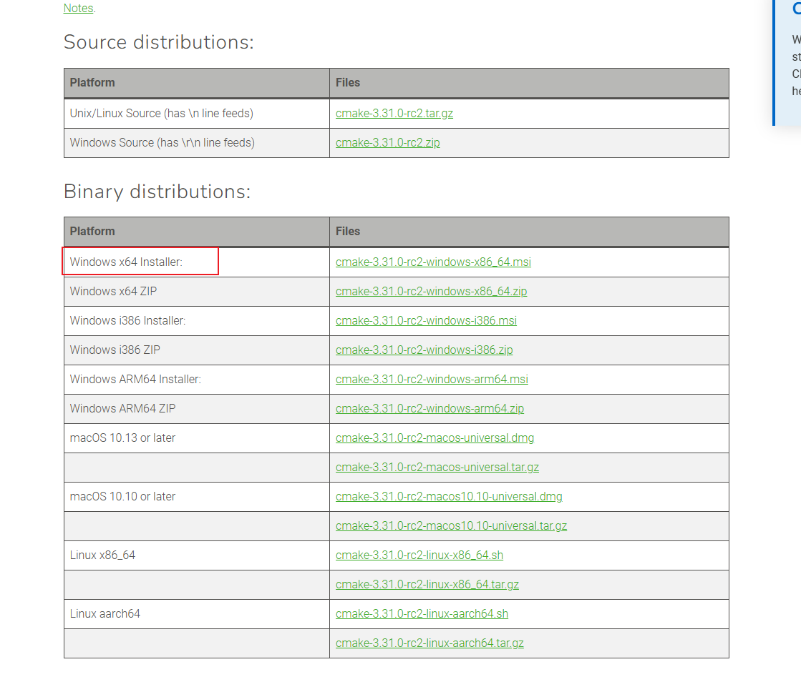
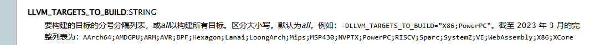
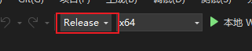
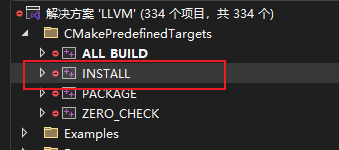
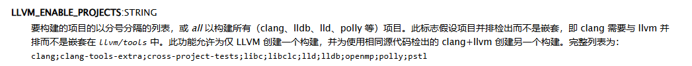
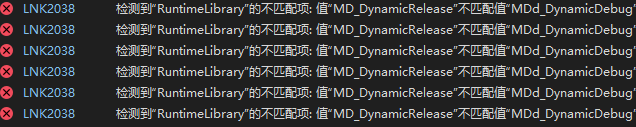
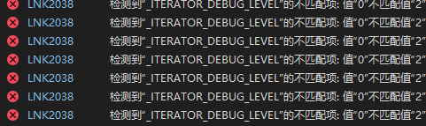
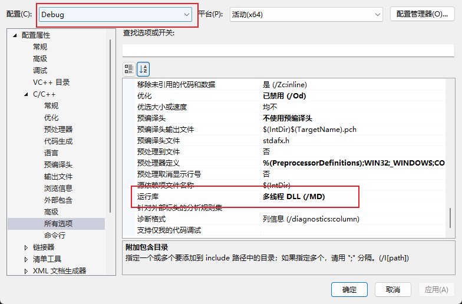
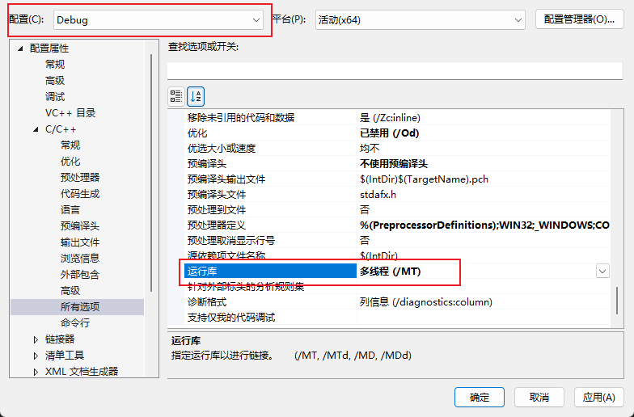

# Windows平台下编译LLVM(以LLVM14为例)

0. 以**管理员**身份运行"适用于 VS 2022 的开发人员命令提示符".此命令提示符提供指向 Visual Studio 和已安装工具的正确路径和环境变量.然后注册 Microsoft 调试接口访问 (DIA) DLL
```sh
regsvr32 "%VSINSTALLDIR%\DIA SDK\bin\msdia140.dll"
regsvr32 "%VSINSTALLDIR%\DIA SDK\bin\amd64\msdia140.dll"
```

1. 克隆llvm仓库到本地目录并选择14版本分支
```sh
git clone https://github.com/llvm/llvm-project.git
git checkout release/14.x
```

2. 安装CMake 版本 >= 3.10
```sh
scoop install cmake(如果已经安装了scoop)
否则去到 https://cmake.org/download/
```
<div align=center>
    
</div>

3. 打开CMake-gui,选择LLVM仓库下的llvm子目录,并设置对应的CMake选项

```sh
LLVM_TARGETS_TO_BUILD=X86(这里仅以X86平台为例)
LLVM_ENABLE_LIBXML2=OFF
LLVM_ENABLE_ZLIB=OFF
CMAKE_INSTALL_REFIX=C:/LLVM14
```
然后点Configure和Generate生成LLVM的VS工程

如果是其他指令集架构参考以下
<div align=center>
    
</div>

4. 打开LLVM.sln,选择Release模式
<div align=center>
    
</div>


5. 生成INSTALL项目会自动安装到C:\LLVM14目录下
<div align=center>
    
</div>

6. 如果需要编译LLVM的其他子项目,则需要指定 LLVM_ENABLE_PROJECTS 来生成其他的项目工程
<div align=center>
    
</div>

[https://llvm.gnu.ac.cn/docs/CMake.html](https://llvm.gnu.ac.cn/docs/CMake.html)

[https://llvm.gnu.ac.cn/docs/GettingStartedVS.html](https://llvm.gnu.ac.cn/docs/GettingStartedVS.html)

7. 在Visual Studio中如果选择Debug模式编译时一般在最后链接阶段会显示LNK2038错误

一个是RuntimeLibrary不匹配

<div align=center>
    
</div>

另一个是_ITERATOR_DEBUG_LEVEL不匹配

<div align=center>
    
</div>

这是由于自己生成的库的Debug模式和LLVM的Release模式下版本不匹配

如果是MD_DynamicRelease不匹配MDd_DynamicDebug,则把运行库修改为 **多线程DLL(/MD)**

<div align=center>
    
</div>

如果是MT_StaticRelease不匹配MDTd_StaticDebug,则把运行库修改为 **多线程(/MT)**

<div align=center>
    
</div>